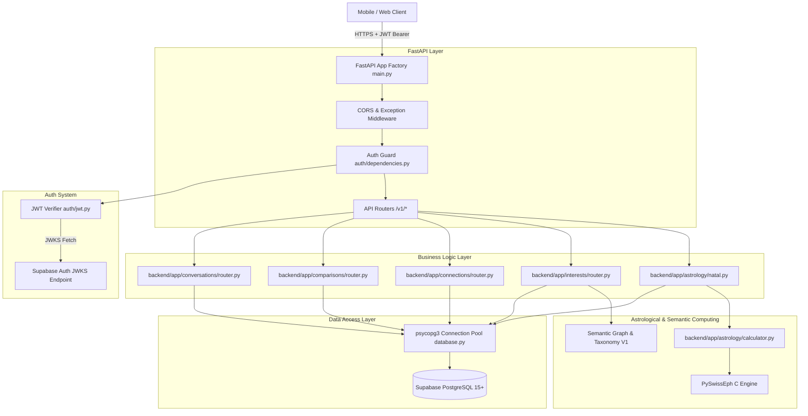

# Jester — Architecture & Request Lifecycle

## 🏛️ System Architecture Overview

Jester uses an asynchronous, layered architecture centered around FastAPI and Supabase PostgreSQL.



---

## 📂 Repository Structure & Component Map

```text
Jester/
├── backend/app/
│   ├── main.py               # Application entrypoint & FastAPI app creation
│   ├── config.py             # Pydantic BaseSettings environment loader
│   ├── api/
│   │   ├── health.py         # System health (/healthz) and API health (/v1/health)
│   │   └── router.py         # Main router aggregator mounting all /v1 endpoints
│   ├── astrology/
│   │   ├── calculator.py     # C-backed Swiss Ephemeris calculations
│   │   ├── constants.py      # Planet IDs, Zodiac signs, element/modality maps
│   │   ├── models.py         # Pydantic schemas for birth input & astro models
│   │   ├── natal.py          # Natal orchestration (atomic DB insert -> calculate -> persist)
│   │   ├── aspects.py        # Angular aspects (Conjunction, Sextile, Square, Trine, Opposition) & orbs
│   │   ├── router.py         # /v1/astrology/* endpoints (POST /v1/astrology/birth-data, recalculate)
│   │   ├── transits.py       # [STUB] Transit calculations
│   │   └── validation.py     # Date, timezone, precision, and coordinate validators
│   ├── auth/
│   │   ├── dependencies.py   # HTTPBearer token extraction & get_current_user guard
│   │   ├── jwt.py            # Dual-mode JWT verifier (JWKS vs HS256)
│   │   └── models.py         # AuthenticatedUser and TokenPayload models
│   ├── comparisons/
│   │   ├── models.py         # Compare schemas
│   │   └── router.py         # /v1/compare and /v1/people/{id}/why endpoints (invokes Synastry V1)
│   ├── compatibility/
│   │   ├── engine.py         # CompatibilityEngine service layer connecting DB & Synastry
│   │   ├── models.py         # Compatibility model schemas
│   │   ├── rules.py          # Weight matrices, orb tables, and dynamic signal rules
│   │   ├── signals.py        # Signal definitions
│   │   └── synastry.py       # Deterministic Synastry V1 engine (synastry-v1.0.0)
│   ├── connections/
│   │   ├── models.py         # Connection schemas
│   │   └── router.py         # /v1/connections endpoints & canonical pair helper
│   ├── conversations/
│   │   ├── models.py         # Conversation & message schemas
│   │   └── router.py         # /v1/conversations endpoints & chat logic
│   ├── core/
│   │   ├── canonical.py      # Authoritative canonical user pair ordering & seed utilities
│   │   ├── database.py       # psycopg3 connection pool singleton
│   │   └── errors.py         # API exceptions and global handler
│   ├── interests/            # [SPEC] Interest System & Interest Graph V1
│   │   ├── models.py         # Taxonomy, user_interests, affinity schemas
│   │   ├── taxonomy.py       # 18-category canonical taxonomy & alias resolver
│   │   ├── graph.py          # Interest relationships, clusters & matching engine
│   │   └── router.py         # /v1/interests/* endpoints
│   ├── interpretation/       # Jester AI interpretation pipeline & contract library
│   ├── jobs/                 # Background energy calculation jobs (stub)
│   ├── lifestyle/            # [SPEC] Lifestyle System & Cadence V1 (/v1/lifestyle/*)
│   ├── notifications/        # User notification endpoints
│   ├── profiles/             # User profile endpoints (/v1/profiles/*)
│   ├── social/               # [SPEC] Social Behavior & Energy Dynamics V1 (/v1/social-behavior/*)
│   ├── users/                # User identity endpoint (/v1/users/me)
│   └── values/               # [SPEC] Values System & Guiding Compass V1 (/v1/values/*)
└── supabase/migrations/      # SQL schema and policy migrations
```

---

## 🔄 Core Request Lifecycles & Flow Maps

### 1. Authentication Lifecycle
1. Client sends request with `Authorization: Bearer <token>`.
2. `get_token_from_header` extracts token string.
3. `verify_supabase_jwt` inspects unverified JWT header for `alg`.
   - **Production (`ENV=production`)**: Enforces asymmetric verification (`RS256`, `ES256`, `EdDSA`) via `PyJWKClient` against Supabase JWKS. HS256 is explicitly rejected.
   - **Dev/Test (`ENV=development` / `ENV=test`)**: Permits `HS256` signed with `SUPABASE_JWT_SECRET`.
4. Decoded claims (`sub`) are converted to `uuid.UUID` and returned as `AuthenticatedUser`.

### 2. Atomic Birth Data Onboarding Flow (`POST /v1/astrology/birth-data`)
1. User identity derived strictly from `JWT.sub`.
2. Request validated in-memory (`validate_birth_data`).
3. Computes 10 planetary longitudes, Placidus houses, and Ascendant in Python memory via Swiss Ephemeris.
4. Derives signs, dominant element, and modality in Python memory.
5. In a single atomic database transaction (`with db.transaction():`):
   - Upserts `public.birth_data` (returning auto-incremented `data_version`).
   - Upserts `public.astro_private` (server-side ONLY).
   - Upserts `public.astro_safe_profile`.
6. Guarantees: If calculation fails, 0 database writes occur; if any write fails, all writes roll back. Returns `SafeDerivedAstrologyResponse`.

### 3. Natal Chart Recalculation Flow (`/v1/astrology/profile/recalculate`)
1. Maintenance and background reprocessing endpoint.
2. Loads existing `public.birth_data` for `user_id`.
3. Runs identical calculation and safe derivation in memory.
4. Persists to `public.astro_private` and `public.astro_safe_profile` inside an atomic transaction.

### 4. Interest Onboarding & Graph Recommendation Flow (`/v1/interests/*`)
*(Architecture Spec: [`docs/INTEREST_SYSTEM_V1_SPEC.md`](file:///c:/Users/fiord/OneDrive/Desktop/Jester/docs/INTEREST_SYSTEM_V1_SPEC.md))*
1. **Onboarding Selection**: User may skip, or must choose exactly 5 / 5 Primary Interests from a candidate pool of ~20.
2. Persists to `public.user_interests` (`type = 'primary'`).
3. Optional follow-up selects 1 Signature Interest (`is_signature = true`).
4. **Graph Traversal & Matching**:
   - `Shared`: Exact mutual canonical interest matching.
   - `Related`: Weighted edge traversal in `public.interest_relations`.
   - `Complementary`: Multi-signal clustering paired with social energy.
5. **Behavioral Ingestion**: Tracks interaction signals in `public.user_interest_affinity` without overwriting declared preferences.

### 5. Social Connection Flow (`/v1/connections`)
1. Client submits `target_user_id`.
2. `get_canonical_pair(u1, u2)` orders UUIDs strictly: `user_a_id = min(u1, u2)`, `user_b_id = max(u1, u2)`.
3. Queries `public.is_user_blocked(user_a, user_b)`. If blocked, raises HTTP 403 Forbidden.
4. Inserts or updates connection record with `status = 'pending'`.
5. Recipient transitions status using `/v1/connections/{id}/transition`:
   - `accept` -> `status = 'accepted'`
   - `decline` -> `status = 'declined'`
   - `block` -> `status = 'blocked', blocked_by = caller_id`
   - `unblock` -> `status = 'removed', blocked_by = NULL`

### 6. Compatibility Flow (`/v1/compare` and `/v1/people/{id}/why`)
1. Accepts `target_user_id`, orders canonical pair `(user_a, user_b)` via `canonical_pair()`.
2. Evaluates `public.has_active_connection(user_a, user_b)`. If false, raises HTTP 403 Forbidden.
3. Evaluates `public.is_user_blocked(caller, target)`. If blocked, raises HTTP 404 Privacy-Safe Not Found.
4. Checks `public.compatibility_results` for existing record matching current birth data versions of both users and engine version `synastry-v1.0.0`.
5. If cache hit: returns cached record with data quality indicators.
6. If cache miss or stale: loads `astro_private` placements, invokes `CompatibilityEngine.calculate()`, executes deterministic Synastry V1 multi-dimensional scoring, dynamic signal extraction, and synthesizes topics/starters drawing from both aspect dynamics and Interest Graph conversation values.
7. Upserts result into `public.compatibility_results` with full mathematical evidence trace and returns structured payload.

### 7. Location & Origin Lifecycle Flow
*(Architecture Spec: [`docs/LOCATION_SYSTEM_V1_SPEC.md`](file:///c:/Users/fiord/OneDrive/Desktop/Jester/docs/LOCATION_SYSTEM_V1_SPEC.md))*
1. **Onboarding / Profile Selection**: User enters or autocompletes city from canonical `public.geo_cities` (`is_major_hub` chips: Tbilisi, Batumi, Kutaisi, Rustavi). Entry is optional and skippable.
2. User optionally selects Hometown / Origin (`hometown_city_id`) and visibility toggle (`hometown_visible`).
3. Updates `public.profiles` (`current_city_id`, `current_country_id`, `hometown_city_id`, `hometown_country_id`, `location_updated_at`).
4. **Discovery Matching**: Injects soft same-city relevance boost and surfaces shared origin hooks (e.g. *"Both based in Tbilisi, originally from Kvareli"*).
5. **Coordinate Gate**: Zero coordinates or street addresses are serialized to public API DTOs.

### 8. Lifestyle Onboarding & Cadence Flow
*(Architecture Spec: [`docs/LIFESTYLE_SYSTEM_V1_SPEC.md`](file:///c:/Users/fiord/OneDrive/Desktop/Jester/docs/LIFESTYLE_SYSTEM_V1_SPEC.md))*
1. **Onboarding Snapshot**: Quick 3-question single-tap selection (Daily Rhythm, Activity Pace, Work Style). Entry is 100% optional and skippable.
2. Persists to `public.user_lifestyle` (`user_id`, `daily_rhythm`, `activity_pace`, `work_style`, `visibility_flags`).
3. Sensitive habits (drinking, smoking, living situation, children) are excluded from onboarding and managed progressively via profile settings.
4. **Discovery Matching**: Injects soft schedule harmony and cadence observations (e.g. mutual night owls or remote work synergy).
5. **Privacy Gate**: Private attributes are stripped from public responses and omitted from AI prompts when hidden.

### 9. Values Onboarding & Guiding Compass Flow
*(Architecture Spec: [`docs/VALUES_SYSTEM_V1_SPEC.md`](file:///c:/Users/fiord/OneDrive/Desktop/Jester/docs/VALUES_SYSTEM_V1_SPEC.md))*
1. **Onboarding Selection**: User selects 3 to 5 values from 18 canonical options across 5 clusters. Step is 100% optional and skippable.
2. User optionally designates 1 Core Value ("True North", `is_core = true`). Zero 1–10 rating sliders.
3. Persists to `public.user_values` (`user_id`, `value_id`, `is_core`, `sort_order`, `source`).
4. **Discovery & Synergy Matching**: Surfaces shared philosophical resonance and complementary polarities (e.g. *Autonomy + Loyalty*, *Adventure + Stability*).
5. **Anti-Diagnosis Gate**: Strictly prohibits clinical personality grading or percentage calculations ("You are 87% independent").

### 10. Social Behavior Onboarding & Social Rhythm Flow
*(Architecture Spec: [`docs/SOCIAL_BEHAVIOR_SYSTEM_V1_SPEC.md`](file:///c:/Users/fiord/OneDrive/Desktop/Jester/docs/SOCIAL_BEHAVIOR_SYSTEM_V1_SPEC.md))*
1. **Onboarding Snapshot**: User completes optional 3-question single-tap card (Gathering Scale, Social Battery, Warm-Up Dynamic). 100% skippable.
2. Persists to `public.user_social_preferences` (`user_id`, `group_preference`, `social_battery`, `warmup_style`, `planning_style`, `comfort_zone`, `visibility_flags`).
3. **Meeting Intelligence & Discovery**: Evaluates shared gathering comfort (e.g. mutual one-on-one preference) and complementary dynamics (e.g. initiator + observer).
4. **Anti-Typing Invariant**: Never classifies or labels users with psychological personality types (MBTI, Big 5, Introvert/Extrovert boxes).

---

## 🎨 The Astrology & Semantic Context → JESTER Content Pipeline

```text
ASTROLOGICAL DATA + INTEREST GRAPH + LOCATION/ORIGIN + LIFESTYLE CADENCE + VALUES COMPASS + SOCIAL DYNAMICS
       ↓ (PySwissEph Engine, Semantic Graph, Geo, Lifestyle, Values & Social Options)
DETERMINISTIC SIGNALS, ASPECTS, SHARED TOPICS, CADENCE, PHILOSOPHICAL RESONANCE & SOCIAL HARMONY
       ↓ (Rule-Based Aggregator & Taxonomy)
CORE INTERPERSONAL DYNAMICS & CONVERSATION ANCHORS
       ↓ (SynastryEngine / Interpretation Resolver)
RELATIONSHIP / PERSONAL CONTEXT
       ↓ (Prompt Formatter with JESTER Voice Persona)
JESTER VOICE TRANSFORMATION
       ↓ (Structured Models)
USER-FACING INSIGHT (Short, witty, human-readable)
```

**Core Principle**: JESTER does not invent astrological meaning or user personality; the engine deterministically computes signals, and JESTER translates those signals into the signature witty, sharp, playful JESTER voice.

---

## 🔒 Important Subsystem Boundaries

- **Database Layer Isolation**: Client applications communicate with FastAPI using JWT tokens. Directly calling Supabase REST API via PostgREST is guarded by RLS policies. `astro_private`, `user_interest_affinity`, and `user_location_private` have `REVOKE ALL` for client roles.
- **Privacy Safe Not Found**: When a resource is hidden due to block status or `is_discoverable = false`, endpoints raise `PrivacySafeNotFoundException` (HTTP 404) rather than HTTP 403 to prevent enumeration attacks.
- **Behavioral Affinity Isolation**: Internal behavioral affinity scores are recommendation inputs; they must never overwrite explicit user declarations or be leaked as public labels.
- **Geographic Coordinate Isolation**: Exact coordinates (`latitude`, `longitude`) are strictly restricted to internal background tasks. Public API responses serialize only canonical city and country names.
- **Lifestyle & Sensitive Habit Isolation**: Substance use (drinking, smoking), living situations, and family structure are never requested during initial onboarding. They are governed by per-attribute visibility flags and omitted from AI prompts when hidden.
- **Values & Anti-Diagnosis Invariant**: Values represent self-declared human principles and priorities. The system strictly forbids psychological grading, virtue percentages, or moral hierarchies. All canonical values carry equal dignity.
- **Social Behavior & Anti-Typing Invariant**: Social preferences capture interaction comfort, gathering scale, and battery mechanics, strictly avoiding psychological personality diagnoses, MBTI archetypes, or boxing labels. All social battery styles are treated with equal respect.
- **Product Model Boundary**: Experience follows `ME → YOU → US → MORE PEOPLE`.

