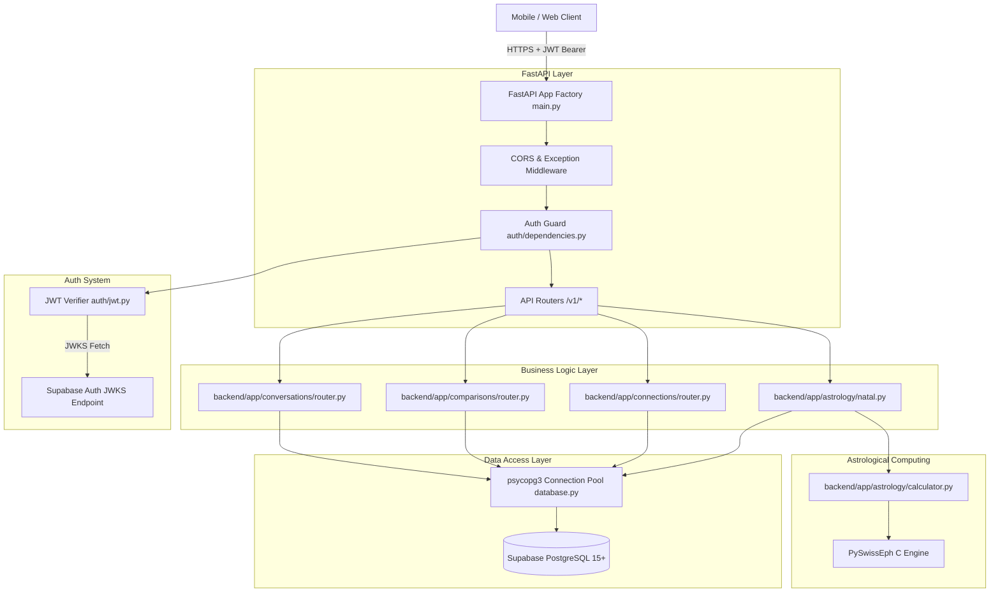

# Jester — Architecture & Request Lifecycle

## 🏛️ System Architecture Overview

Jester uses an asynchronous, layered architecture centered around FastAPI and Supabase PostgreSQL.



---

## 📂 Repository Structure & Component Map

```text
Jester/
├── backend/app/
│   ├── main.py               # Application entrypoint & FastAPI app creation
│   ├── config.py             # Pydantic BaseSettings environment loader
│   ├── api/
│   │   ├── health.py         # System health (/healthz) and API health (/v1/health)
│   │   └── router.py         # Main router aggregator mounting all /v1 endpoints
│   ├── astrology/
│   │   ├── calculator.py     # C-backed Swiss Ephemeris calculations
│   │   ├── constants.py      # Planet IDs, Zodiac signs, element/modality maps
│   │   ├── models.py         # Pydantic schemas for birth input & astro models
│   │   ├── natal.py          # Natal orchestration (DB fetch -> calculate -> persist)
│   │   ├── aspects.py        # Angular aspects (Conjunction, Sextile, Square, Trine, Opposition) & orbs
│   │   ├── router.py         # /v1/astrology/* endpoints
│   │   ├── transits.py       # [STUB] Transit calculations
│   │   └── validation.py     # Date, timezone, precision, and coordinate validators
│   ├── auth/
│   │   ├── dependencies.py   # HTTPBearer token extraction & get_current_user guard
│   │   ├── jwt.py            # Dual-mode JWT verifier (JWKS vs HS256)
│   │   └── models.py         # AuthenticatedUser and TokenPayload models
│   ├── comparisons/
│   │   ├── models.py         # Compare schemas
│   │   └── router.py         # /v1/compare and /v1/people/{id}/why endpoints (invokes Synastry V1)
│   ├── compatibility/
│   │   ├── engine.py         # CompatibilityEngine service layer connecting DB & Synastry
│   │   ├── models.py         # Compatibility model schemas
│   │   ├── rules.py          # Weight matrices, orb tables, and dynamic signal rules
│   │   ├── signals.py        # Signal definitions
│   │   └── synastry.py       # Deterministic Synastry V1 engine (synastry-v1.0.0)
│   ├── connections/
│   │   ├── models.py         # Connection schemas
│   │   └── router.py         # /v1/connections endpoints & canonical pair helper
│   ├── conversations/
│   │   ├── models.py         # Conversation & message schemas
│   │   └── router.py         # /v1/conversations endpoints & chat logic
│   ├── core/
│   │   ├── database.py       # psycopg3 connection pool singleton
│   │   └── errors.py         # API exceptions and global handler
│   ├── interpretation/       # [STUB] Jester AI interpretation pipeline
│   ├── jobs/                 # Background energy calculation jobs (stub)
│   ├── notifications/        # User notification endpoints
│   ├── profiles/             # User profile endpoints (/v1/profiles/*)
│   └── users/                # User identity endpoint (/v1/users/me)
└── supabase/migrations/      # 20 SQL schema and policy migrations
```

---

## 🔄 Core Request Lifecycles & Flow Maps

### 1. Authentication Lifecycle
1. Client sends request with `Authorization: Bearer <token>`.
2. `get_token_from_header` extracts token string.
3. `verify_supabase_jwt` inspects unverified JWT header for `alg`.
   - **Production (`ENV=production`)**: Enforces asymmetric verification (`RS256`, `ES256`, `EdDSA`) via `PyJWKClient` against Supabase JWKS. HS256 is explicitly rejected.
   - **Dev/Test (`ENV=development` / `ENV=test`)**: Permits `HS256` signed with `SUPABASE_JWT_SECRET`.
4. Decoded claims (`sub`) are converted to `uuid.UUID` and returned as `AuthenticatedUser`.

### 2. Natal Chart Recalculation Flow (`/v1/astrology/profile/recalculate`)
1. User identity derived strictly from `JWT.sub`.
2. Router invokes `recalculate_user_astrology(user_id, db)`.
3. Loads raw birth parameters from `public.birth_data` for `user_id`.
4. `validate_birth_data` validates date range (1900-today), timezone validity (`zoneinfo.ZoneInfo`), and coordinate boundaries.
5. `compute_natal_placements` calculates:
   - Julian Day via `swe.julday` (UTC conversion).
   - 10 planetary longitudes + speeds via `swe.calc_ut`.
   - Placidus house cusps & Ascendant via `swe.houses`.
6. Raw longitudes, houses, and retrogrades persisted into `public.astro_private` (server-side ONLY).
7. Maps longitudes to Zodiac signs, calculates primary element and modality weights.
8. Safe summary persisted into `public.astro_safe_profile` and returned to client.

### 3. Social Connection Flow (`/v1/connections`)
1. Client submits `target_user_id`.
2. `get_canonical_pair(u1, u2)` orders UUIDs strictly: `user_a_id = min(u1, u2)`, `user_b_id = max(u1, u2)`.
3. Queries `public.is_user_blocked(user_a, user_b)`. If blocked, raises HTTP 403 Forbidden.
4. Inserts or updates connection record with `status = 'pending'`.
5. Recipient transitions status using `/v1/connections/{id}/transition`:
   - `accept` -> `status = 'accepted'`
   - `decline` -> `status = 'declined'`
   - `block` -> `status = 'blocked', blocked_by = caller_id`
   - `unblock` -> `status = 'removed', blocked_by = NULL`

### 4. Compatibility Flow (`/v1/compare` and `/v1/people/{id}/why`)
1. Accepts `target_user_id`, orders canonical pair `(user_a, user_b)`.
2. Evaluates `public.has_active_connection(user_a, user_b)`. If false, raises HTTP 403 Forbidden.
3. Evaluates `public.is_user_blocked(caller, target)`. If blocked, raises HTTP 404 Privacy-Safe Not Found.
4. Checks `public.compatibility_results` for existing record matching current birth data versions of both users and engine version `synastry-v1.0.0`.
5. If cache hit: returns cached record with data quality indicators.
6. If cache miss or stale: loads `astro_private` placements (auto-recalculating natal placements if missing), invokes `CompatibilityEngine.calculate()`, executes deterministic Synastry V1 multi-dimensional scoring, dynamic signal extraction, recommended topics, and conversation starters.
7. Upserts result into `public.compatibility_results` with full mathematical evidence trace and returns structured payload.

---

## 🎨 The Astrology → JESTER Content Pipeline

```text
ASTROLOGICAL DATA
       ↓ (PySwissEph C Engine)
DETERMINISTIC SIGNALS & ASPECTS (aspects.py)
       ↓ (Rule-Based Aggregator)
CORE INTERPERSONAL DYNAMICS & MEANING
       ↓ (SynastryEngine / transits.py)
RELATIONSHIP / PERSONAL CONTEXT
       ↓ (Prompt Formatter with JESTER Voice Persona)
JESTER VOICE TRANSFORMATION
       ↓ (Structured Models)
USER-FACING INSIGHT (Short, witty, human-readable)
```

**Core Principle**: JESTER does not invent astrological meaning; the engine deterministically computes signals, and JESTER translates those signals into the signature witty, sharp, playful JESTER voice.

---

## 🔒 Important Subsystem Boundaries

- **Database Layer Isolation**: Client applications communicate with FastAPI using JWT tokens. Directly calling Supabase REST API via PostgREST is guarded by RLS policies. `astro_private` has `REVOKE ALL` for `authenticated` and `anon` roles.
- **Privacy Safe Not Found**: When a resource is hidden due to block status or `is_discoverable = false`, endpoints raise `PrivacySafeNotFoundException` (HTTP 404) rather than HTTP 403 to prevent enumeration attacks.
- **Product Model Boundary**: Experience follows `ME → YOU → US → MORE PEOPLE`.

