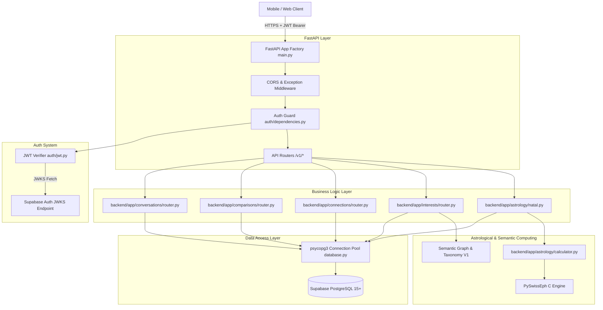

# Jester — Architecture & Request Lifecycle

## 🏛️ System Architecture Overview

Jester uses an asynchronous, layered architecture centered around FastAPI and Supabase PostgreSQL.



---

## 📂 Repository Structure & Component Map

```text
Jester/
├── backend/app/
│   ├── main.py               # Application entrypoint & FastAPI app creation
│   ├── config.py             # Pydantic BaseSettings environment loader
│   ├── api/
│   │   ├── health.py         # System health (/healthz) and API health (/v1/health)
│   │   └── router.py         # Main router aggregator mounting all /v1 endpoints
│   ├── astrology/
│   │   ├── calculator.py     # C-backed Swiss Ephemeris calculations
│   │   ├── constants.py      # Planet IDs, Zodiac signs, element/modality maps
│   │   ├── models.py         # Pydantic schemas for birth input & astro models
│   │   ├── natal.py          # Natal orchestration (atomic DB insert -> calculate -> persist)
│   │   ├── aspects.py        # Angular aspects (Conjunction, Sextile, Square, Trine, Opposition) & orbs
│   │   ├── router.py         # /v1/astrology/* endpoints (POST /v1/astrology/birth-data, recalculate)
│   │   ├── transits.py       # Real planetary transits & daily energy guidance (488 lines, 19 tests)
│   │   └── validation.py     # Date, timezone, precision, and coordinate validators
│   ├── auth/
│   │   ├── dependencies.py   # HTTPBearer token extraction & get_current_user guard
│   │   ├── jwt.py            # Dual-mode JWT verifier (JWKS vs HS256)
│   │   └── models.py         # AuthenticatedUser and TokenPayload models
│   ├── comparisons/
│   │   ├── models.py         # Compare schemas
│   │   └── router.py         # /v1/compare and /v1/people/{id}/why endpoints (invokes Synastry V1)
│   ├── compatibility/
│   │   ├── engine.py         # CompatibilityEngine service layer connecting DB & Synastry
│   │   ├── models.py         # Compatibility model schemas
│   │   ├── rules.py          # Weight matrices, orb tables, and dynamic signal rules
│   │   ├── signals.py        # Signal definitions
│   │   └── synastry.py       # Deterministic Synastry V1 engine (synastry-v1.0.0)
│   ├── connections/
│   │   ├── models.py         # Connection schemas
│   │   └── router.py         # /v1/connections endpoints & canonical pair helper
│   ├── conversations/
│   │   ├── models.py         # Conversation & message schemas
│   │   └── router.py         # /v1/conversations endpoints & chat logic
│   ├── core/
│   │   ├── canonical.py      # Authoritative canonical user pair ordering & seed utilities
│   │   ├── database.py       # psycopg3 connection pool singleton
│   │   └── errors.py         # API exceptions and global handler
│   ├── discovery/            # [SPEC] Discovery Preferences & Feed Engine V1 (/v1/discovery/*)
│   ├── interests/            # [SPEC] Interest System & Interest Graph V1
│   │   ├── models.py         # Taxonomy, user_interests, affinity schemas
│   │   ├── taxonomy.py       # 18-category canonical taxonomy & alias resolver
│   │   ├── graph.py          # Interest relationships, clusters & matching engine
│   │   └── router.py         # /v1/interests/* endpoints
│   ├── communication/        # [SPEC] Communication System & Dynamics V1 (/v1/communication/*)
│   ├── intents/              # [SPEC] Intent System & Relational Purpose V1 (/v1/intents/*)
│   ├── interpretation/       # Jester AI interpretation pipeline & contract library
│   ├── jobs/                 # Background energy calculation jobs (stub)
│   ├── lifestyle/            # [SPEC] Lifestyle System & Cadence V1 (/v1/lifestyle/*)
│   ├── notifications/        # User notification endpoints
│   ├── profiles/             # User profile endpoints (/v1/profiles/*)
│   ├── prompts/              # [SPEC] Prompts & Self-Expression System V1 (/v1/prompts/*)
│   ├── social/               # [SPEC] Social Behavior & Energy Dynamics V1 (/v1/social-behavior/*)
│   ├── telemetry/            # [SPEC] Behavioral Intelligence & Telemetry V1 (/v1/telemetry/*)
│   ├── trust/                # [SPEC] Trust & Verification System V1 (/v1/verification/*, /v1/safety/*)
│   ├── users/                # User identity endpoint (/v1/users/me)
│   └── values/               # [SPEC] Values System & Guiding Compass V1 (/v1/values/*)
└── supabase/migrations/      # SQL schema and policy migrations
```

---

## 🔄 Core Request Lifecycles & Flow Maps

### 1. Authentication Lifecycle
1. Client sends request with `Authorization: Bearer <token>`.
2. `get_token_from_header` extracts token string.
3. `verify_supabase_jwt` inspects unverified JWT header for `alg`.
   - **Production (`ENV=production`)**: Enforces asymmetric verification (`RS256`, `ES256`, `EdDSA`) via `PyJWKClient` against Supabase JWKS. HS256 is explicitly rejected.
   - **Dev/Test (`ENV=development` / `ENV=test`)**: Permits `HS256` signed with `SUPABASE_JWT_SECRET`.
4. Decoded claims (`sub`) are converted to `uuid.UUID` and returned as `AuthenticatedUser`.

### 2. Atomic Birth Data Onboarding Flow (`POST /v1/astrology/birth-data`)
1. User identity derived strictly from `JWT.sub`.
2. Request validated in-memory (`validate_birth_data`).
3. Computes 10 planetary longitudes, Placidus houses, and Ascendant in Python memory via Swiss Ephemeris.
4. Derives signs, dominant element, and modality in Python memory.
5. In a single atomic database transaction (`with db.transaction():`):
   - Upserts `public.birth_data` (returning auto-incremented `data_version`).
   - Upserts `public.astro_private` (server-side ONLY).
   - Upserts `public.astro_safe_profile`.
6. Guarantees: If calculation fails, 0 database writes occur; if any write fails, all writes roll back. Returns `SafeDerivedAstrologyResponse`.

### 3. Natal Chart Recalculation Flow (`/v1/astrology/profile/recalculate`)
1. Maintenance and background reprocessing endpoint.
2. Loads existing `public.birth_data` for `user_id`.
3. Runs identical calculation and safe derivation in memory.
4. Persists to `public.astro_private` and `public.astro_safe_profile` inside an atomic transaction.

### 4. Interest Onboarding & Graph Recommendation Flow (`/v1/interests/*`)
*(Architecture Spec: [`docs/INTEREST_SYSTEM_V1_SPEC.md`](file:///c:/Users/fiord/OneDrive/Desktop/Jester/docs/INTEREST_SYSTEM_V1_SPEC.md))*
1. **Onboarding Selection**: User may skip, or must choose exactly 5 / 5 Primary Interests from a candidate pool of ~20.
2. Persists to `public.user_interests` (`type = 'primary'`).
3. Optional follow-up selects 1 Signature Interest (`is_signature = true`).
4. **Graph Traversal & Matching**:
   - `Shared`: Exact mutual canonical interest matching.
   - `Related`: Weighted edge traversal in `public.interest_relations`.
   - `Complementary`: Multi-signal clustering paired with social energy.
5. **Behavioral Ingestion**: Tracks interaction signals in `public.user_interest_affinity` without overwriting declared preferences.

### 5. Social Connection Flow (`/v1/connections`)
1. Client submits `target_user_id`.
2. `get_canonical_pair(u1, u2)` orders UUIDs strictly: `user_a_id = min(u1, u2)`, `user_b_id = max(u1, u2)`.
3. Queries `public.is_user_blocked(user_a, user_b)`. If blocked, raises HTTP 403 Forbidden.
4. Inserts or updates connection record with `status = 'pending'`.
5. Recipient transitions status using `/v1/connections/{id}/transition`:
   - `accept` -> `status = 'accepted'`
   - `decline` -> `status = 'declined'`
   - `block` -> `status = 'blocked', blocked_by = caller_id`
   - `unblock` -> `status = 'removed', blocked_by = NULL`

### 6. Compatibility Flow (`/v1/compare` and `/v1/people/{id}/why`)
1. Accepts `target_user_id`, orders canonical pair `(user_a, user_b)` via `canonical_pair()`.
2. Evaluates `public.has_active_connection(user_a, user_b)`. If false, raises HTTP 403 Forbidden.
3. Evaluates `public.is_user_blocked(caller, target)`. If blocked, raises HTTP 404 Privacy-Safe Not Found.
4. Checks `public.compatibility_results` for existing record matching current birth data versions of both users and engine version `synastry-v1.0.0`.
5. If cache hit: returns cached record with data quality indicators.
6. If cache miss or stale: loads `astro_private` placements, invokes `CompatibilityEngine.calculate()`, executes deterministic Synastry V1 multi-dimensional scoring, dynamic signal extraction, and synthesizes topics/starters drawing from both aspect dynamics and Interest Graph conversation values.
7. Upserts result into `public.compatibility_results` with full mathematical evidence trace and returns structured payload.

### 7. Location & Origin Lifecycle Flow
*(Architecture Spec: [`docs/LOCATION_SYSTEM_V1_SPEC.md`](file:///c:/Users/fiord/OneDrive/Desktop/Jester/docs/LOCATION_SYSTEM_V1_SPEC.md))*
1. **Onboarding / Profile Selection**: User enters or autocompletes city from canonical `public.geo_cities` (`is_major_hub` chips: Tbilisi, Batumi, Kutaisi, Rustavi). Entry is optional and skippable.
2. User optionally selects Hometown / Origin (`hometown_city_id`) and visibility toggle (`hometown_visible`).
3. Updates `public.profiles` (`current_city_id`, `current_country_id`, `hometown_city_id`, `hometown_country_id`, `location_updated_at`).
4. **Discovery Matching**: Injects soft same-city relevance boost and surfaces shared origin hooks (e.g. *"Both based in Tbilisi, originally from Kvareli"*).
5. **Coordinate Gate**: Zero coordinates or street addresses are serialized to public API DTOs.

### 8. Lifestyle Onboarding & Cadence Flow
*(Architecture Spec: [`docs/LIFESTYLE_SYSTEM_V1_SPEC.md`](file:///c:/Users/fiord/OneDrive/Desktop/Jester/docs/LIFESTYLE_SYSTEM_V1_SPEC.md))*
1. **Onboarding Snapshot**: Quick 3-question single-tap selection (Daily Rhythm, Activity Pace, Work Style). Entry is 100% optional and skippable.
2. Persists to `public.user_lifestyle` (`user_id`, `daily_rhythm`, `activity_pace`, `work_style`, `visibility_flags`).
3. Sensitive habits (drinking, smoking, living situation, children) are excluded from onboarding and managed progressively via profile settings.
4. **Discovery Matching**: Injects soft schedule harmony and cadence observations (e.g. mutual night owls or remote work synergy).
5. **Privacy Gate**: Private attributes are stripped from public responses and omitted from AI prompts when hidden.

### 9. Values Onboarding & Guiding Compass Flow
*(Architecture Spec: [`docs/VALUES_SYSTEM_V1_SPEC.md`](file:///c:/Users/fiord/OneDrive/Desktop/Jester/docs/VALUES_SYSTEM_V1_SPEC.md))*
1. **Onboarding Selection**: User selects 3 to 5 values from 18 canonical options across 5 clusters. Step is 100% optional and skippable.
2. User optionally designates 1 Core Value ("True North", `is_core = true`). Zero 1–10 rating sliders.
3. Persists to `public.user_values` (`user_id`, `value_id`, `is_core`, `sort_order`, `source`).
4. **Discovery & Synergy Matching**: Surfaces shared philosophical resonance and complementary polarities (e.g. *Autonomy + Loyalty*, *Adventure + Stability*).
5. **Anti-Diagnosis Gate**: Strictly prohibits clinical personality grading or percentage calculations ("You are 87% independent").

### 10. Social Behavior Onboarding & Social Rhythm Flow
*(Architecture Spec: [`docs/SOCIAL_BEHAVIOR_SYSTEM_V1_SPEC.md`](file:///c:/Users/fiord/OneDrive/Desktop/Jester/docs/SOCIAL_BEHAVIOR_SYSTEM_V1_SPEC.md))*
1. **Onboarding Snapshot**: User completes optional 3-question single-tap card (Gathering Scale, Social Battery, Warm-Up Dynamic). 100% skippable.
2. Persists to `public.user_social_preferences` (`user_id`, `group_preference`, `social_battery`, `warmup_style`, `planning_style`, `comfort_zone`, `visibility_flags`).
3. **Meeting Intelligence & Discovery**: Evaluates shared gathering comfort (e.g. mutual one-on-one preference) and complementary dynamics (e.g. initiator + observer).
4. **Anti-Typing Invariant**: Never classifies or labels users with psychological personality types (MBTI, Big 5, Introvert/Extrovert boxes).

### 11. Communication Onboarding & First-Conversation Intelligence Flow
*(Architecture Spec: [`docs/COMMUNICATION_SYSTEM_V1_SPEC.md`](file:///c:/Users/fiord/OneDrive/Desktop/Jester/docs/COMMUNICATION_SYSTEM_V1_SPEC.md))*
1. **Onboarding Snapshot**: User completes optional 3-question single-tap card (Depth, Conversational Role, Messaging Medium). 100% skippable.
2. Persists to `public.user_communication_preferences` (`user_id`, `conversation_depth`, `conversation_role`, `messaging_medium`, `response_pace`, `visibility_flags`).
3. **First-Conversation Intelligence**: Pairs user roles (e.g. Questioner + Storyteller) to craft personalized conversation starters.
4. **Anti-Surveillance Invariant**: Strictly prohibits reply-time scorekeeping, read-receipt timers, or scanning private chat message bodies for personality profiling.

### 12. Intent Onboarding, Discovery Partitioning & Connection Context Flow
*(Architecture Spec: [`docs/INTENT_SYSTEM_V1_SPEC.md`](file:///c:/Users/fiord/OneDrive/Desktop/Jester/docs/INTENT_SYSTEM_V1_SPEC.md))*
1. **Onboarding Selection**: User selects 1 Primary Intent (e.g. `friendship`, `dating_open`, `dating_serious`, `activity_partner`, `meaningful_chat`, `collaboration`, `just_exploring`) and optionally up to 2 Secondary Openness options. 100% skippable; defaults to `just_exploring`.
2. Persists to `public.user_intents` (`user_id`, `primary_intent`, `secondary_intents`, `visibility`, `source`). Changes append audit records to `public.user_intent_history` (service-role only).
3. **Discovery Partitioning**: Enforces strict bilateral partition between mutually incompatible intents (e.g. exclusive dating vs. exclusive platonic friendship) to prevent mismatched expectations and harassment.
4. **Contextual Connection Flow**: Automatically surfaces mutual intent context on connection requests and allows senders to attach an optional 1-tap invitation reason (`connection_reason`).
5. **Astrological Primacy Gate**: Declared intent strictly governs astrological framing; synastry dynamics are framed to respect declared intent rather than assuming romance.

### 13. Prompt Authoring, Inline Reply & Moderation Flow
*(Architecture Spec: [`docs/PROMPTS_SELF_EXPRESSION_SYSTEM_V1_SPEC.md`](file:///c:/Users/fiord/OneDrive/Desktop/Jester/docs/PROMPTS_SELF_EXPRESSION_SYSTEM_V1_SPEC.md))*
1. **Curated Selection**: User browses 24 standardized prompt questions across 6 human categories (`voice_quirks`, `curiosities`, `daily_reality`, `connection`, `perspectives`, `action`) and selects 1 to 3 templates.
2. **Authoring & Polish**: User writes concise answers (max 250 characters). Optional AI writing assistant can suggest up to 3 stylistic polishes or shorter formulations upon explicit user request, but NEVER auto-publishes or fabricates text without user approval.
3. **Safety & Moderation Gate**: Answers pass automated pre-publication moderation checks (XSS sanitization, PII filtering for raw phone numbers/handles, and harassment filters). Harmless sarcasm, dry humor, and eccentric opinions are protected.
4. **Interactive Conversation Entry**: Published prompts appear as interactive cards on the public profile. Tapping `[ 💬 Reply to this ]` on any prompt card opens the connection invitation dialog with that specific prompt pre-quoted, transforming passive self-expression into an organic conversation hook.

### 14. Discovery Candidate Generation & Ranking Flow
*(Architecture Spec: [`docs/DISCOVERY_PREFERENCES_SYSTEM_V1_SPEC.md`](file:///c:/Users/fiord/OneDrive/Desktop/Jester/docs/DISCOVERY_PREFERENCES_SYSTEM_V1_SPEC.md))*
1. **Tier 1 (SQL Eligibility Gates)**: Evaluates hard constraints directly in PostgreSQL (`is_discoverable = true`, block isolation, self-exclusion, non-connected status, age bounds, target gender set, and bilateral intent compatibility).
2. **Tier 2 (Multi-Signal Composite Scoring)**: Computes rapid relevance weighting across intent alignment ($25\%$), geographic proximity ($20\%$), Interest Graph overlap ($20\%$), guiding values resonance ($15\%$), prompt presence ($10\%$), and baseline astrological harmony ($10\%$). Selects top 100 candidates.
3. **Tier 3 (JESTER Intelligence & Diversity Reranking)**: Calculates deep synastry dimensions, generates qualitative human explainability reasons, injects complementary diversity (60% direct resonance, 30% complementary dynamic, 10% serendipity wildcard), and applies recent view/dismissal rotation decay.
4. **Paginated Feed Exposure**: Returns clean cursor-paginated `DiscoveryFeedResponse` with zero raw percentage match scores.

### 15. Trust & Verification Lifecycle Flow
*(Architecture Spec: [`docs/TRUST_VERIFICATION_SYSTEM_V1_SPEC.md`](file:///c:/Users/fiord/OneDrive/Desktop/Jester/docs/TRUST_VERIFICATION_SYSTEM_V1_SPEC.md))*
1. **Photo Upload & Gallery Gate**: User uploads 1 to 6 photos to `public.profile_photos` via `avatars` storage bucket. Exactly 1 photo is designated `is_primary = true`. At least 1 photo is strictly required to appear in Discovery.
2. **Face Verification Session (`POST /v1/verification/face/session`)**: Ephemeral liveness session created; returns 5-minute signed token.
3. **Biometric Evaluation (`POST /v1/verification/face/submit`)**: Ephemeral selfie analyzed via `VerificationProvider` abstraction; matches live selfie against primary profile photo.
4. **Private Evidence Storage**: Selfie media stored in private encrypted bucket `verification-evidence` (`public = false`, REVOKE ALL from clients); permanently deleted after 30 days. Never exposed to clients or passed to JESTER AI.
5. **Decoupled Trust Badge**: If similarity $\ge 85\%$, sets `user_verifications.status = 'verified'`, granting `✓ Photo Verified` badge. Primary photo modification resets status.
6. **Safety & Reporting (`POST /v1/safety/report`, `POST /v1/safety/block`)**: Immediate reciprocal blocking with zero existence oracles; structured community reports routed to platform moderation.

### 16. Behavioral Intelligence Telemetry, Decay & Discovery Reranking Flow
*(Architecture Spec: [`docs/BEHAVIORAL_INTELLIGENCE_SYSTEM_V1_SPEC.md`](file:///c:/Users/fiord/OneDrive/Desktop/Jester/docs/BEHAVIORAL_INTELLIGENCE_SYSTEM_V1_SPEC.md))*
1. **Sanitized Telemetry Ingestion (`POST /v1/telemetry/events`)**: Client batches observable product actions (candidate impressions, profile opens, why-aspect expansions, request acceptances). Payload strictly strips PII, message bodies, raw coordinates, and biometric data.
2. **Storage & Auto-Pruning**: Ingests into `public.behavioral_events` (partitioned monthly; hard-deleted after 60 days via TTL background vacuum). Client access revoked.
3. **Decay & Signal Aggregation Engine**: Nightly background worker (`jobs/aggregate_behavioral_signals.py`) derives decayed interest affinity weights ($t_{1/2} = 30\text{ days}$) into `public.user_interest_affinity` and macro behavioral metrics into `public.user_behavioral_signals`.
4. **Discovery Modulation & 6/3/1 Diversity Guarantee**: In Discovery Tier 2/3, behavioral affinity contributes $\le 30\%$ of candidate relevance scoring, operating strictly within allocated diversity buckets (6 Direct Resonance, 3 Complementary Contrast, 1 Serendipitous Wildcard). It is mathematically barred from shrinking contrast or eliminating wildcards.
5. **Sovereign User Control (`POST /v1/users/me/personalization/reset`)**: Users can toggle activity learning off or instantly wipe all derived affinity records, reverting candidate generation immediately to pure declared baselines.

### 17. JESTER AI Context Assembly & Gateway Flow (`JesterAiContextV1`)
*(Architecture Spec: [`docs/JESTER_AI_CONTEXT_SYSTEM_V1_SPEC.md`](file:///c:/Users/fiord/OneDrive/Desktop/Jester/docs/JESTER_AI_CONTEXT_SYSTEM_V1_SPEC.md))*
1. **Surface Scope Resolution**: Request arrives at JESTER AI with a specific target surface (Main Chat, Discovery Feed, Profile Preview, WHY, US, Conversation Starters, Astrology Deep Dive).
2. **On-Demand Context Assembly (`ContextAssemblerService`)**: Fetches declared human signals, safe categorical astrology, and decayed behavioral affinities. Enforces authority hierarchy ($\text{Declared} \gg \text{Observed} \gg \text{Inferred} \gg \text{Astrological}$).
3. **Bilateral Isolation Check**: In two-user contexts, caller receives private fields; candidate profile is strictly scoped to public, discoverable fields only.
4. **Fail-Closed Context Safety Gate (`ContextSafetyGate`)**: Validates assembled payload against forbidden-context blacklist (`messages.body`, `latitude`, `selfie_bytes`, `birth_time`). Any detection trips the gate, drops execution, and yields pre-seeded Georgian fallback copy.
5. **LLM Gateway & Post-Execution Jargon Filter**: Validated `JesterAiContextV1` is formatted with JESTER persona system prompts and passed to LLM runner. Output is programmatically scanned for astrological jargon and mockery before delivery to the client.

### 18. Connection Request, Acceptance & Direct Chat Seeding Flow
*(Architecture Spec: [`docs/CONNECTION_MESSAGING_SYSTEM_V1_SPEC.md`](file:///c:/Users/fiord/OneDrive/Desktop/Jester/docs/CONNECTION_MESSAGING_SYSTEM_V1_SPEC.md))*
1. **Contextual Request Packaging (`POST /v1/connections`)**: Sender A attaches an optional single-tap intent hook (`connection_reason`), optional quoted prompt anchor (`prompt_reference_id`), and optional personal note (max 250 characters). System validates bilateral intent compatibility and enforces daily request caps (15/day).
2. **Canonical State Transition (`pending`)**: Persists to `public.connections` adhering to canonical ordering `user_a_id < user_b_id`. Recipient B receives push notification and unread badge.
3. **Acceptance & Direct Conversation Seeding (`POST /v1/connections/{id}/accept`)**:
   - Connection status transitions atomically to `accepted`.
   - Direct conversation record is created in `public.conversations` with members in `public.conversation_members`.
   - **Inaugural Message Seeding**: If Sender A included an invitation note or quoted prompt, it is automatically persisted as the first message bubble in `public.messages`, initiating the chat without awkward blank states.
4. **Direct Messaging (`POST /v1/conversations/{id}/messages`)**: Connected users exchange UTF-8 text messages (max 2,000 chars) with Unicode emoji. Message delivery is governed by `public.is_active_direct_conversation`, ensuring new messages are barred if disconnected or blocked.
5. **Read Receipt Tracking (`PATCH /v1/conversations/{id}/read`)**: Updates member's private `last_read_message_id` for local unread badge clearing. Anti-surveillance invariant prohibits broadcasting granular "Seen at HH:MM" timestamps to the counterpart.
6. **Civil Disconnection (`POST /v1/connections/{id}/disconnect`)**: Either user may cleanly disconnect (`removed`). Existing chat history locks into an immutable read-only archive; new messaging is permanently barred; mutual discovery surfaces reset with a 48-hour reconnection cooldown; zero notification is broadcast to the counterpart.

---

## 🎨 The Astrology & Semantic Context → JESTER Content Pipeline

```text
ASTROLOGICAL DATA + INTEREST GRAPH + LOCATION/ORIGIN + LIFESTYLE CADENCE + VALUES COMPASS + SOCIAL DYNAMICS + COMMUNICATION RHYTHM + INTENT PURPOSE + PROMPTS / VOICE + DISCOVERY PREFERENCES + TRUST CONTEXT + BEHAVIORAL AFFINITY
       ↓ (PySwissEph Engine, Semantic Graph, Geo, Lifestyle, Values, Social, Communication, Intent, Prompts, Discovery, Trust & Behavioral)
DETERMINISTIC SIGNALS, ASPECTS, SHARED TOPICS, CADENCE, PHILOSOPHICAL RESONANCE, SOCIAL HARMONY, CONVERSATION BRIDGES, INTENT ALIGNMENT, AUTHENTIC VOICE HOOKS, ELIGIBILITY FILTERS, VERIFIED BADGES & OBSERVED AFFINITY
       ↓ (ContextAssemblerService: Surface Scoping & Authority Hierarchy)
STRUCTURED AI CONTEXT CONTRACT (JesterAiContextV1)
       ↓ (ContextSafetyGate: Blacklist Validation & Fail-Closed Assertions)
VALIDATED AI CONTEXT PAYLOAD
       ↓ (Prompt Formatter with JESTER Voice Persona)
JESTER VOICE TRANSFORMATION
       ↓ (Programmatic Jargon & Mockery Filter)
USER-FACING INSIGHT (Short, witty, human-readable)
```

**Core Principle**: JESTER does not invent astrological meaning or user personality; the engine deterministically computes signals, and JESTER translates those signals into the signature witty, sharp, playful JESTER voice.

---

## 🔒 Important Subsystem Boundaries

- **Database Layer Isolation**: Client applications communicate with FastAPI using JWT tokens. Directly calling Supabase REST API via PostgREST is guarded by RLS policies. `astro_private`, `user_interest_affinity`, `user_location_private`, `user_intent_history`, and `user_discovery_preferences` (owner-only) are isolated from general queries.
- **Privacy Safe Not Found**: When a resource is hidden due to block status or `is_discoverable = false`, endpoints raise `PrivacySafeNotFoundException` (HTTP 404) rather than HTTP 403 to prevent enumeration attacks.
- **Behavioral Affinity Isolation**: Internal behavioral affinity scores are recommendation inputs; they must never overwrite explicit user declarations or be leaked as public labels.
- **Geographic Coordinate Isolation**: Exact coordinates (`latitude`, `longitude`) are strictly restricted to internal background tasks. Public API responses serialize only canonical city and country names.
- **Lifestyle & Sensitive Habit Isolation**: Substance use (drinking, smoking), living situations, and family structure are never requested during initial onboarding. They are governed by per-attribute visibility flags and omitted from AI prompts when hidden.
- **Values & Anti-Diagnosis Invariant**: Values represent self-declared human principles and priorities. The system strictly forbids psychological grading, virtue percentages, or moral hierarchies. All canonical values carry equal dignity.
- **Social Behavior & Anti-Typing Invariant**: Social preferences capture interaction comfort, gathering scale, and battery mechanics, strictly avoiding psychological personality diagnoses, MBTI archetypes, or boxing labels. All social battery styles are treated with equal respect.
- **Communication & Anti-Surveillance Invariant**: Communication preferences capture conversation depth, narrative role, and channel format without tracking reply-time latency, scorekeeping response speeds, or parsing private chat messages for psychological analysis.
- **Intent Primacy & Anti-Romantic Assumption Invariant**: Intent captures current temporal purpose on JESTER without mode-switching fragmentation. Astrological chemistry must never be framed as romantic destiny if either participant has declared platonic friendship or collaboration intent. Intent history is strictly private.
- **Prompts & Authentic Human Voice Invariant**: Prompts exist to reveal what a person actually sounds like. They must never be auto-generated or hallucinated by AI without explicit user editing and approval. Prompts provide authentic user-authored context for conversation starters and connection requests, but must never be treated by JESTER AI as clinical psychological truth or psychiatric profiles.
- **Discovery Preferences & Inbound Discoverability Boundary**: Discovery preferences are strictly private, owner-only outbound candidate selection criteria. They must never be exposed or leaked as existence oracles. Inbound discoverability (`profiles.is_discoverable`) determines if a user is eligible to be shown; outbound preferences determine who the user sees. Filtering is anti-marketplace: zodiac signs, physical attributes, income, and sensitive habits are permanently barred from hard exclusionary filtering.
- **Trust & Verification Decoupling Invariant**: Profile photos, biometric verification, and human trustworthiness are completely separate concepts. JESTER strictly forbids numeric trust scores. Verification proves only that an ephemeral selfie matches the primary profile photo. Verification media is stored in a private, client-inaccessible bucket, never exposed in public APIs, and never passed to JESTER AI.
- **Behavioral Intelligence & Anti-Profiling Invariant**: Behavioral intelligence captures observable product interactions strictly to refine candidate relevance and conversation starters. It is fundamentally barred from performing psychological profiling, diagnosing mental health, computing personality or attractiveness scores, or scoring communication response latency. Private message bodies are never parsed. Declared human truth always outranks behavioral observation.
- **JESTER AI Context Isolation & Fail-Closed Boundary**: JESTER AI operates strictly through strongly typed, surface-scoped data contracts (`JesterAiContextV1`). It is never granted direct database connection handles or unrestricted table access. The Context Safety Gate fails closed upon detecting any prohibited data keys (`messages.body`, `latitude`, `selfie_bytes`, `birth_time`), guaranteeing zero private data leakage into third-party LLM APIs.
- **Canonical Connection & Disconnect Isolation Invariant**: Connections are strictly canonical unordered pairs (`CHECK (user_a_id < user_b_id)`). Transitions follow a closed state machine (`pending`, `accepted`, `declined`, `blocked`, `removed`). Disconnecting (`removed`) transitions direct conversations into immutable read-only archives where past mutual messages remain visible for review/safety reporting, but new messages are permanently barred via database helper functions (`is_active_direct_conversation` calls `has_active_connection`). Blocking immediately renders the counterpart reciprocal HTTP 404. Direct messages are UTF-8 text-only up to 2,000 characters without read-receipt timers, typing speed surveillance, or AI training exploitation.
- **Product Model Boundary**: Experience follows `ME → YOU → US → MORE PEOPLE`.


