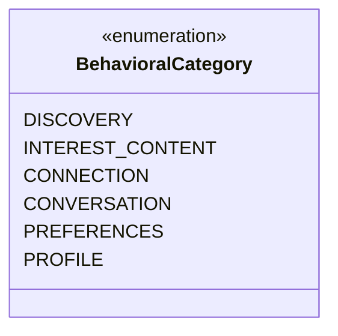
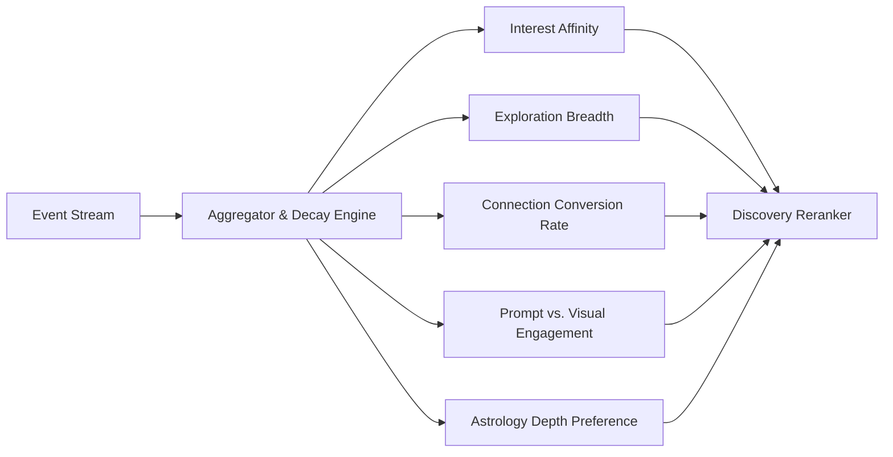
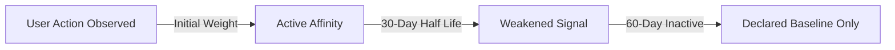
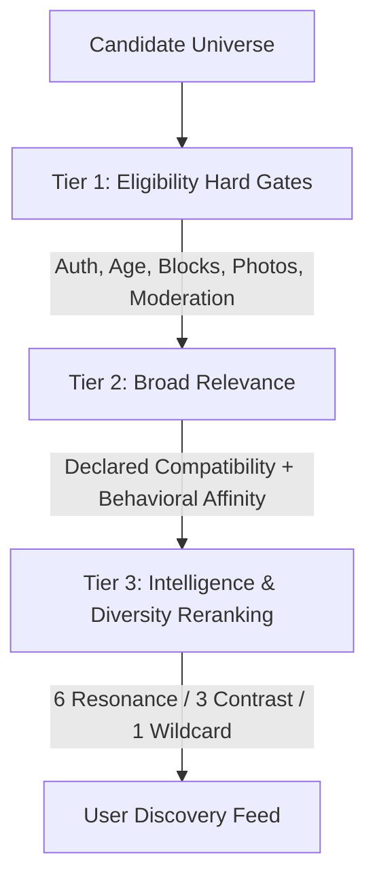
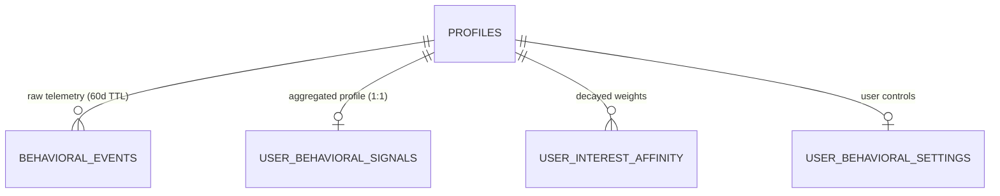

# JESTER — Behavioral Intelligence System V1 Specification

**Document Type:** Platform Architecture, UX, Data & Behavioral Intelligence Specification  
**Version:** V1.0  
**Status:** Canonical Platform Architecture  
**Scope:** Cross-cutting (User Experience, Telemetry, Discovery Pipeline, Recommendation Engine, Privacy, JESTER AI, Database & Security)

---

## 1. Executive Summary & Purpose

The **JESTER Behavioral Intelligence System V1** is an observable product intelligence layer designed to enhance candidate relevance, conversation guidance, and organic discovery without subjecting users to psychological profiling, covert surveillance, or manipulative engagement loops.

### Core Product Axiom:
> **"People first. Signals second. Scores last."**  
> **"Declared human signals outrank observed behavior. Observed behavior outranks statistical inference."**

```text
       DECLARED HUMAN IDENTITY
   (Who I say I am, what I value)
                 +
     OBSERVED PRODUCT BEHAVIOR
(What I explore, open, and follow through on)
                 ↓
    JESTER PRODUCT INTELLIGENCE
  (Contextual, respectful personalization)
```

### Critical Boundaries & Non-Goals:
1. **Behavioral Intelligence is NOT Psychological Profiling:** JESTER does not diagnose personality traits, attachment styles, mental health conditions, emotional vulnerabilities, or subconscious desires.
2. **Observed Behavior $\neq$ Personality Truth:** A user who opens several hiking profiles is simply displaying an observable contextual interest in hiking—not a psychoanalytic trait of "high conscientiousness" or "nature obsession."
3. **No Synthetic Scores:** JESTER explicitly rejects:
   - ❌ `personality_score` / `introvert_score`
   - ❌ `attractiveness_score` / "desirability tiers"
   - ❌ `trust_score` / moral credits
   - ❌ `communication_speed_score` / "good texter" or "dry texter" ratings
   - ❌ `mental_health_score`
4. **Message Privacy Invariant:** Private conversation message bodies are **never mined, parsed, or tokenized** for behavioral profiling or personality diagnosis.

---

## 2. Declared vs. Observed vs. Inferred Model

JESTER establishes a strict three-tier hierarchy governing how user information is treated across the platform:

```mermaid
graph TD
    subgraph Tier 1: Declared Human Truth
        D1[Interests & Passions]
        D2[Core Values & Compass]
        D3[Relationship Intent]
        D4[Communication Preferences]
        D5[Lifestyle & Social Cadence]
        D6[Private Birth Data]
    end

    subgraph Tier 2: Observed Product Telemetry
        O1[Candidate Profile Opens]
        O2[Why-This-Person Card Views]
        O3[Prompt Detail Expansions]
        O4[Connection Requests Sent]
        O5[Connection Acceptances]
        O6[Conversation Continuation]
        O7[Discovery Feed Dismissals]
    end

    subgraph Tier 3: Inferred Product Signals
        I1[Category Affinity Weight]
        I2[Exploration Breadth Index]
        I3[Prompt Resonance Signals]
        I4[Interaction Depth Score]
    end

    Tier 1 -->|Overrides & Anchors| Tier 3
    Tier 2 -->|Updates & Modulates| Tier 3
    Tier 3 -->|Steers Ranking & Diversity| Discovery[Discovery & Suggestion Engine]
```

### 2.1 Tier Definitions

| Layer | Definition | Authority | Mutability | Examples |
| :--- | :--- | :--- | :--- | :--- |
| **A. DECLARED** | Explicit, sovereign choices made by the user during onboarding or profile editing. | **Highest.** Sovereign truth. | Direct user update only. | Primary interests, core values, intent (`dating_intentional`), communication rhythm (`deliberate`), location, photo gallery. |
| **B. OBSERVED** | Verifiable, client/server interaction events occurring within the JESTER product interface. | **High (factual).** Represents real engagement. | Append-only event stream (subject to automated TTL pruning). | Viewing a profile, expanding an astrological "Why" aspect card, sending an invitation note, replying to a message. |
| **C. INFERRED** | Cautiously computed probabilistic modifiers derived from repeated, consistent, decayed observations. | **Lowest.** Tentative recommendation guide. | Dynamic (recomputed by background workers with decay). | `interest_affinity: 0.82`, `exploration_breadth: high`, `prompt_engagement_preference: stories`. |

### 2.2 Precedence Invariant
**Declared always outranks Inferred.** If a user's declared value is `minimal_chatter` and lifestyle is `early_riser`, but their night-owl browsing habits generate telemetry late at night, JESTER **never** overwrites their declared lifestyle or labels them a "late-night party person." Inferred signals merely modulate recommendation weights within declared boundaries.

---

## 3. Behavioral Event Taxonomy V1

JESTER maintains a disciplined, minimal event taxonomy. Only interactions with high predictive value for mutual human resonance are tracked. Vanity metrics and low-signal noise are intentionally omitted.



### 3.1 Canonical Event Catalog

| Domain | Event Name | Trigger Context | Purpose & Intelligence Value |
| :--- | :--- | :--- | :--- |
| **DISCOVERY** | `discovery_feed_opened` | User opens the Discovery tab. | Session baseline; calculates session depth. |
| **DISCOVERY** | `candidate_impression` | Profile card appears in viewport for $\ge 1.0\text{s}$. | Top-of-funnel denominator for conversion metrics. |
| **DISCOVERY** | `candidate_profile_opened` | User taps card to view full profile detail. | Demonstrates genuine curiosity beyond photo/headline. |
| **DISCOVERY** | `candidate_dismissed` | User navigates away or skips without interaction. | Prevents candidate re-presentation; soft negative signal. |
| **DISCOVERY** | `candidate_returned_to` | User revisits a previously viewed candidate. | High-intent curiosity signal. |
| **INTEREST / CONTENT** | `interest_opened` | User taps on a specific interest tag. | Direct interest exploration signal. |
| **INTEREST / CONTENT** | `prompt_opened` | User expands a prompt response card. | Preference for verbal/conversational self-expression. |
| **INTEREST / CONTENT** | `why_opened` | User expands the "Why This Person" synastry card. | Astrological / relational intelligence interest signal. |
| **CONNECTION** | `connection_request_sent` | User sends connection invite (with or without note). | Active outbound attraction/interest. |
| **CONNECTION** | `connection_request_accepted` | Recipient accepts the connection invite. | Mutual bilateral affirmation (strongest positive signal). |
| **CONNECTION** | `connection_request_declined` | Recipient declines the connection invite. | Unilateral divergence signal. |
| **CONNECTION** | `connection_cancelled` | Sender cancels pending request before acceptance. | Retraction signal; neutralizes initial outbound weight. |
| **CONVERSATION** | `conversation_started` | First message sent in accepted connection. | Initial barrier broken; active engagement. |
| **CONVERSATION** | `conversation_continued` | Both participants exchange $\ge 2$ messages each. | Genuine mutual conversational resonance. |
| **PREFERENCES** | `discovery_preference_changed` | User adjusts age, location, or diversity controls. | Immediate candidate pool invalidation & refresh. |
| **PREFERENCES** | `intent_changed` | User updates looking-for intent. | **Hard reset** on intent-specific behavioral weights. |
| **PREFERENCES** | `astrology_preference_changed`| User adjusts astrology visibility mode. | Controls weight of synastry cards in Discovery. |
| **PROFILE** | `profile_updated` | User edits their own prompts, photos, or bio. | Indicates evolving self-expression. |

---

## 4. Event Semantics & Payload Hygiene

To prevent behavioral telemetry from becoming a vector for privacy leakage, every telemetry event is strictly schema-constrained.

### 4.1 Schema Definition
```typescript
interface BehavioralEvent {
  event_id: string;              // UUIDv4
  actor_id: string;              // UUIDv4 (authenticated user)
  event_name: string;            // Canonical taxonomy string
  target_id?: string;            // UUIDv4 of target candidate/entity (null for feed opens)
  target_type?: 'candidate' | 'interest' | 'prompt' | 'preference';
  context?: {
    category_slug?: string;      // e.g. "creative", "outdoor_bouldering"
    dwell_time_ms?: number;      // e.g. 4200 (capped at 60,000 to prevent idle skew)
    has_note?: boolean;          // true if connection request included a personal note
    interaction_depth?: 'glance' | 'standard' | 'deep';
  };
  client_timestamp: string;      // ISO-8601 UTC
  server_timestamp: string;      // ISO-8601 UTC (source of truth)
}
```

### 4.2 Payload Hygiene & Data Sanitization Invariants
- ❌ **NO Raw Message Bodies:** Messages are handled strictly in the conversation subsystem. Telemetry logs only the boolean presence or message count metadata.
- ❌ **NO Exact Coordinates:** GPS lat/long is **never** included in event payloads (geo uses coarse `city_id` references only).
- ❌ **NO Biometric or Verification Evidence:** Selfies, verification tokens, or facial attributes must never be passed to behavioral event queues.
- ❌ **NO Private Birth Data:** Raw birth time, date, or Julian Day are excluded.
- ⏱️ **Dwell Time Normalization:** Viewport dwell time is capped at 60 seconds to eliminate distortion caused by idle, unlocked phones.

---

## 5. Behavioral Signals & Mathematical Models

JESTER derives eight safe, probabilistic product signals from aggregated event streams. These signals are strictly dimensional numbers between 0.0 and 1.0, or discrete categorical tiers.



### 5.1 Signal Catalog

| Signal Name | Format | Definition | Safe Operational Role |
| :--- | :--- | :--- | :--- |
| **`interest_affinity`** | `Map<slug, float>` (0.00 – 1.00) | Probabilistic attraction toward specific topic clusters. | Boosts relevant candidate profiles in Tier 2/3. |
| **`exploration_breadth`** | `enum('focused', 'balanced', 'exploratory')` | Degree to which user explores varied categories vs. repeating a niche. | Balances the 6/3/1 diversity distribution. |
| **`interaction_depth`** | `float` (0.00 – 1.00) | Ratio of deep reads (full bio, prompts, why) to rapid card skips. | Distinguishes thoughtful browsers from fast scanners. |
| **`connection_conversion`**| `float` (0.00 – 1.00) | Ratio of outbound requests that result in accepted connections. | Downstream quality weighting; detects spray-and-pray spam. |
| **`prompt_resonance`** | `Map<prompt_slug, float>` | Engagement with narrative prompts vs. visual photos. | Determines whether prompt answers should be surfaced prominently. |
| **`preference_stability`** | `float` (0.00 – 1.00) | Frequency of filter/preference modifications. | Regulates recommendation cache expiration windows. |
| **`geographic_scope_mode`**| `enum('hyper_local', 'balanced', 'travel_explorer')` | Tendency to engage with nearby vs. distant profiles. | Adjusts geographic candidate ranking smoothly. |
| **`astrology_engagement`** | `enum('minimal', 'moderate', 'deep')` | Engagement with synastry aspects and daily energies. | Adjusts default expansion state of the "Why" tab. |

---

## 6. Interest Affinity: Separate Layer Invariant

Existing JESTER architecture mandates that declared interests must never be overwritten by algorithmic deduction.

```text
[Declared User Interest]    photography (Primary Tag, sort_order=1)
            ≠
[Behavioral Affinity]       photography_affinity = 0.84 (Observed interest)
```

### 6.1 Observation Requirements & False Positive Defenses
To prevent a single accidental click from skewing a user's recommendations:
- **Minimum Observations:** An interest must record at least **5 distinct interactions** across **3 separate sessions** before receiving an affinity weight $> 0.50$.
- **Decay Half-Life:** All affinity signals decay exponentially with a **30-day half-life**:
  $$A(t) = A_0 \cdot 2^{-\frac{\Delta t}{30\text{ days}}}$$
- **Maximum Algorithmic Weight:** Behavioral affinity can at most contribute **30%** of a candidate's relevance score; declared compatibility and declared interests represent the remaining **70%**.

---

## 7. Discovery Behavior & The 6 / 3 / 1 Diversity Invariant

A notorious pathology of modern recommendation engines is the **echo chamber / feedback loop**, where clicking three profiles of a certain style permanently excludes all other human archetypes.

JESTER structurally immunizes against this failure mode via its **Frozen Diversity Model**:

```
┌─────────────────────────────────────────────────────────────┐
│             JESTER DISCOVERY CANDIDATE POOL (10 Cards)      │
├──────────────────────────────┬──────────────────────────────┤
│  6 Direct Resonance (60%)    │ Matches declared interests,  │
│                              │ values, & top behavioral     │
│                              │ affinities.                  │
├──────────────────────────────┼──────────────────────────────┤
│  3 Complementary Contrast    │ Healthy tension: differing   │
│     (30%)                    │ elements, complementary      │
│                              │ social rhythms, contrast.    │
├──────────────────────────────┼──────────────────────────────┤
│  1 Serendipitous Wildcard    │ High-synergy profile outside │
│     (10%)                    │ usual behavioral circles.    │
└──────────────────────────────┴──────────────────────────────┘
```

### Behavioral Constraint on Diversity:
Behavioral intelligence is **strictly confined to ranking candidates WITHIN their designated buckets**. It is mathematically barred from shrinking the Complementary Contrast bucket ($30\%$) or eliminating the Serendipitous Wildcard ($10\%$).

---

## 8. Connection Conversion & Downstream Value Funnel

Not all user actions represent equal human resonance. JESTER weighs interactions according to their position in the commitment funnel:

```
[Candidate Impression]      (Weight: 0.01) - Baseline exposure
         ↓
[Profile Detail Opened]     (Weight: 0.10) - Active curiosity
         ↓
[Why / Aspects Opened]      (Weight: 0.25) - Relational inspection
         ↓
[Connection Request Sent]   (Weight: 0.50) - Outbound expression
         ↓
[Connection Accepted]       (Weight: 2.00) - Mutual bilateral resonance
         ↓
[Conversation Continued]    (Weight: 4.00) - Genuine ongoing dialogue
```

### Anti-Spam / Anti-Spray Protection:
If an account generates high volumes of outbound connection requests ($> 20\text{/day}$) with an acceptance rate $< 5\%$, the system:
1. Lowers the predictive value of that account's outbound clicks (preventing spam from corrupting recommendation vectors).
2. Applies rate-throttling under the `limited` moderation tier.

---

## 9. Conversation Metadata Boundaries

JESTER protects the sanctity of private conversations. The Behavioral Intelligence engine operates under strict structural blindfolds:

### 9.1 Permitted Conversation Telemetry (Metadata Only)
- `conversation_started: boolean` (Was at least 1 message sent?)
- `conversation_continued: boolean` (Did both participants send at least 2 messages?)
- `is_active_within_7d: boolean` (Has the thread seen activity in the last week?)
- `total_messages_exchanged_bucket: '1-2' | '3-10' | '10-50' | '50+'`

### 9.2 Strictly Prohibited Mining
- ❌ **NO Text Parsing:** No keyword scanning, topic extraction, or sentiment analysis.
- ❌ **NO Response-Time Scorekeeping:** JESTER never calculates response latency, never flags "slow texters," and never creates anxiety-inducing "fast responder" badges.
- ❌ **NO Psychological Labeling:** Never infers "avoidant attachment" or "needy communication" from message patterns.

---

## 10. User Transparency & Sovereign Controls

Users retain ultimate ownership over how JESTER learns from their behavior.

```
┌─────────────────────────────────────────────────────────────┐
│ USER SETTINGS > PERSONALIZATION & INTELLIGENCE             │
├─────────────────────────────────────────────────────────────┤
│ [✓] Learn from my activity to improve recommendations        │
│     When enabled, JESTER gently prioritizes topics and      │
│     profiles similar to what you engage with.               │
│                                                             │
│ [ Reset Personalization Data ]                              │
│ Clears your behavioral history. Your declared profile,      │
│ values, and interests will remain completely intact.        │
└─────────────────────────────────────────────────────────────┘
```

1. **One-Click Personalization Reset:** Instantly purges all derived behavioral affinity signals and sets weights back to default declared baselines (`POST /v1/users/me/personalization/reset`).
2. **Behavioral Personalization Toggle:** When disabled, Discovery rankings are computed **solely from declared profile fields and deterministic synastry**, ignoring interaction history entirely.
3. **Transparent Explainability:** Any card influenced by behavioral affinity carries a clear, respectful indicator: *"Suggested because you recently explored creative profiles."*

---

## 11. Signal Decay & Freshness Lifecycle

Behavior is fluid; people change hobbies, moods, and life chapters. JESTER applies continuous exponential decay to all behavioral telemetry:



- **Half-Life Rules:**
  - Interest Affinities: $\tau_{1/2} = 30\text{ days}$.
  - Session Pacing / Exploration Breadth: $\tau_{1/2} = 14\text{ days}$.
  - Dismissal / Skip Fatigue: $\tau_{1/2} = 7\text{ days}$ (dismissed candidates become eligible for soft re-discovery after 14 days if other compatibility factors remain high).
- **Cold Re-activation:** When a lapsed user returns after 6 months of inactivity, their profile operates cleanly from their declared baseline—avoiding an obsolete behavioral ghost.

---

## 12. Cold Start Architecture

A new user has zero interaction history. JESTER handles cold start gracefully without forcing behavioral profiling:

| User Phase | Observations ($N$) | Algorithm Behavior | Primary Drivers |
| :--- | :--- | :--- | :--- |
| **Phase 0: Day 1 New User** | $0$ events | $100\%$ Declared Baseline | Declared interests, core values, location scope, intent, and synastry resonance. |
| **Phase 1: Early Explorer** | $1 - 10$ events | $90\%$ Declared + $10\%$ Observed | Gentle exploration without over-indexing on early clicks. |
| **Phase 2: Active Member** | $11 - 50$ events | $75\%$ Declared + $25\%$ Observed | Balanced personalization while preserving full diversity. |
| **Phase 3: Mature Profile** | $50+$ events | $70\%$ Declared + $30\%$ Observed | Maximum stable behavioral contribution (capped at 30%). |

---

## 13. Integration into the 3-Tier Discovery Pipeline

Behavioral Intelligence integrates into the existing JESTER Discovery Architecture without altering its security or privacy guarantees:



1. **Tier 1 (Eligibility):** Behavioral signals have **ZERO** impact on eligibility. They cannot bypass photo rules, unblock blocked accounts, or hide active members who meet preference filters.
2. **Tier 2 (Relevance Retrieval):** Behavioral affinity provides a modest sorting boost ($\le 30\%$) to candidates sharing high-affinity topic clusters.
3. **Tier 3 (Diversity & Reranking):** Balances candidates across the 6/3/1 diversity distribution, injects explainability chips, and applies skip-fatigue rotation.

---

## 14. Behavioral Intelligence & Astrology Interaction

Astrology in JESTER provides archetypal, symbolic context. Behavioral Intelligence provides empirical, observable interaction data.

### Structural Hierarchy:
$$\text{Declared Human Truth} \gg \text{Observed Behavioral Reality} \gg \text{Astrological Archetype}$$

- **Conflict Resolution Example:**
  - *Astrology Signal:* Mars in Gemini suggests rapid, multi-threaded, chaotic communication.
  - *Declared Preference:* "Deliberate, unhurried, once-a-day thoughtful notes."
  - *Observed Behavior:* Exchanges 1 in-depth message every 24 hours.
  - *JESTER Synthesis:* Prioritizes the declared preference and observed reality. In conversation starter guidance, JESTER AI advises: *"Alex values unhurried, thoughtful communication."* The astrological aspect is mentioned only as a nuance, never as an imperative.

---

## 15. Behavioral Intelligence & Intent Shifts

Relationship Intent is sovereign and dynamic. Users frequently shift between `friendship`, `dating_intentional`, or `creative_collaborators`.

### Intent Change Protocol:
When a user updates their primary intent:
1. **Immediate Invalidation:** All intent-specific behavioral weights are immediately set to zero.
2. **Partition Isolation:** Outbound dating clicks never influence candidate retrieval when the user is operating in friendship mode.
3. **Fresh Slate:** Discovery immediately recalculates candidate pools based purely on the newly declared intent and current baseline values.

---

## 16. Privacy, Security & Data Governance

Behavioral telemetry is classified as **Tier 4: SERVICE-ONLY** data.

### 16.1 Storage & Access Policies
- **Table Isolation:** Raw events live in `public.behavioral_events`. `REVOKE ALL ON public.behavioral_events FROM anon, authenticated;`.
- **Client Ingestion:** Telemetry is written exclusively via a rate-limited RPC endpoint (`record_behavioral_events`) or direct backend API calls.
- **Automated Data Pruning (TTL):**
  - Raw telemetry events are automatically purged after **60 days**.
  - Only decayed, aggregated signals (`user_behavioral_signals`, `user_interest_affinity`) are retained.
- **GDPR / CCPA Right to Erasure:** Deleting an account cascades to all raw events and derived behavioral signals within 60 seconds.

---

## 17. JESTER AI & Behavioral Context Boundaries

JESTER AI serves as a relationship copilot and conversation starter generator. It must never act as a covert psychotherapist.

```json
// PERMITTED CONTEXT PASSED TO JESTER AI:
{
  "active_interests": ["architecture", "analog_synthesizers"],
  "behavioral_focus": "creative_projects",
  "preferred_format": "in_depth_prompts",
  "astrology_openness": "moderate"
}

// STRICTLY PROHIBITED CONTEXT (NEVER PASSED TO AI):
{
  "user_is_lonely": true,
  "inferred_attachment_style": "anxious_preoccupied",
  "clicks_mostly_on_conventionally_attractive_people": true,
  "average_reply_delay_minutes": 142
}
```

---

## 18. Behavioral Explainability

JESTER builds user trust through plain, non-creepy explainability.

### Guiding Principles:
- Use **first-person human terms** rather than algorithmic jargon.
- Emphasize **shared passions and common ground**.
- Never claim to read the user's mind or diagnose their subconscious.

| Scenario | ❌ Bad / Algorithmic Copy | ✅ Approved JESTER Explainability Copy |
| :--- | :--- | :--- |
| **High Interest Affinity** | *"Our neural network calculated an 89% match on your visual consumption habits."* | *"You've both been exploring analog photography lately."* |
| **Prompt Alignment** | *"User matches your textual sentiment profile."* | *"You both answered prompts about slow mornings."* |
| **Serendipitous Wildcard** | *"Randomized control injection."* | *"A different perspective outside your usual circles."* |

---

## 19. Feedback Loops, Scarcity & Algorithmic Bias Mitigation

Uncontrolled behavioral optimization degrades community health by concentrating attention on a tiny minority of "super-popular" profiles.

### V1 Safeguards:
1. **Candidate Exposure Capping:** Once a profile receives $\ge 50$ impressions within a 24-hour window, its appearance frequency is dynamically attenuated to ensure equitable visibility for newer and less active members.
2. **Geographic Scarcity Dampener:** In low-density geographic regions ($< 100$ active profiles), behavioral filtering is relaxed automatically to prevent empty feed states.
3. **Reciprocal Attention Balancing:** Balances outbound demand with candidate responsiveness, preventing users from shouting into a void.

---

## 20. Database Architecture Specification

To implement Behavioral Intelligence V1 cleanly without schema bloat, four specialized entities are introduced:



### 20.1 Schema Blueprint

#### 1. `public.behavioral_events` (Partitioned Raw Event Stream)
- `id` UUID PRIMARY KEY DEFAULT gen_random_uuid(),
- `actor_id` UUID NOT NULL REFERENCES public.profiles(id) ON DELETE CASCADE,
- `event_name` VARCHAR(50) NOT NULL,
- `target_id` UUID REFERENCES public.profiles(id) ON DELETE SET NULL,
- `target_type` VARCHAR(30),
- `context` JSONB DEFAULT '{}'::jsonb,
- `created_at` TIMESTAMPTZ NOT NULL DEFAULT now()
- *Security:* Service-role only. Client access strictly revoked. Automatically partitioned by month; pruned after 60 days.

#### 2. `public.user_behavioral_signals` (Aggregated Behavioral Profile)
- `user_id` UUID PRIMARY KEY REFERENCES public.profiles(id) ON DELETE CASCADE,
- `exploration_breadth` VARCHAR(20) NOT NULL DEFAULT 'balanced' CHECK (exploration_breadth IN ('focused', 'balanced', 'exploratory')),
- `interaction_depth` NUMERIC(4,3) NOT NULL DEFAULT 0.500 CHECK (interaction_depth BETWEEN 0.0 AND 1.0),
- `connection_conversion_rate` NUMERIC(4,3) NOT NULL DEFAULT 0.000 CHECK (connection_conversion_rate BETWEEN 0.0 AND 1.0),
- `total_impressions_count` INTEGER NOT NULL DEFAULT 0,
- `total_opens_count` INTEGER NOT NULL DEFAULT 0,
- `total_requests_sent` INTEGER NOT NULL DEFAULT 0,
- `total_requests_accepted` INTEGER NOT NULL DEFAULT 0,
- `last_aggregated_at` TIMESTAMPTZ NOT NULL DEFAULT now()

#### 3. `public.user_interest_affinity` (Decayed Topic Weights)
- `id` UUID PRIMARY KEY DEFAULT gen_random_uuid(),
- `user_id` UUID NOT NULL REFERENCES public.profiles(id) ON DELETE CASCADE,
- `interest_id` UUID NOT NULL REFERENCES public.interests(id) ON DELETE CASCADE,
- `affinity_score` NUMERIC(4,3) NOT NULL DEFAULT 0.500 CHECK (affinity_score BETWEEN 0.0 AND 1.0),
- `observation_count` INTEGER NOT NULL DEFAULT 1,
- `last_observed_at` TIMESTAMPTZ NOT NULL DEFAULT now(),
- CONSTRAINT uq_user_interest_affinity UNIQUE (user_id, interest_id)

#### 4. `public.user_behavioral_settings` (User Sovereign Controls)
- `user_id` UUID PRIMARY KEY REFERENCES public.profiles(id) ON DELETE CASCADE,
- `personalization_enabled` BOOLEAN NOT NULL DEFAULT true,
- `allow_activity_learning` BOOLEAN NOT NULL DEFAULT true,
- `last_reset_at` TIMESTAMPTZ,
- `updated_at` TIMESTAMPTZ NOT NULL DEFAULT now()

---

## 21. API Architecture Specification

### 21.1 Client-Facing Endpoints

| Method | Path | Auth | Purpose | Payload / Response |
| :--- | :--- | :--- | :--- | :--- |
| `POST` | `/v1/telemetry/events` | Bearer | Ingests a batched array of sanitized client telemetry events. | `Body: { events: BehavioralEventDTO[] }`<br>`202 Accepted` |
| `GET` | `/v1/users/me/behavioral-settings` | Bearer | Retrieves user's personalization toggles and reset status. | `200 OK: { personalization_enabled, allow_activity_learning, last_reset_at }` |
| `PUT` | `/v1/users/me/behavioral-settings` | Bearer | Updates personalization toggles. | `Body: { personalization_enabled?: boolean }`<br>`200 OK` |
| `POST` | `/v1/users/me/personalization/reset` | Bearer | Purges all derived behavioral affinity and resets signals to baseline. | `200 OK: { status: "reset_complete", reset_at: ISO8601 }` |

### 21.2 Service-Role & Background Tasks
- `jobs/aggregate_behavioral_signals.py`: Nightly cron computing decayed affinity vectors and conversation conversion rates.
- `jobs/prune_behavioral_events.py`: Weekly vacuum deleting raw event records older than 60 days.

---

## 22. Security, Anti-Spoofing & Threat Modeling

| Threat | Attack Vector | System Defense |
| :--- | :--- | :--- |
| **Client Event Injection** | Attacker spams `/v1/telemetry/events` with 10,000 false clicks to game candidate ranking. | Server-side rate limiting (max 120 events/min); velocity anomaly filters (rejects click intervals $< 200\text{ms}$). |
| **Recommendation Poisoning** | Competitor creates bot accounts to artificially inflate an interest category. | Affinity updates require multi-session persistence; unverified accounts have reduced affinity weighting. |
| **Behavioral Data Leakage** | Malicious user inspects public API responses to infer another user's browsing patterns. | All affinity and behavioral tables have client access revoked (`REVOKE ALL`). Public endpoints return zero behavioral metadata. |
| **Replay Attacks** | Attacker replays intercepted event telemetry. | Event IDs are UUIDv4 with strict server-side deduplication against a Redis 24-hour bloom filter. |

---

## 23. Analytics vs. Product Intelligence Separation

JESTER enforces a strict firewall between business analytics and personalized product intelligence:

```text
CLIENT TELEMETRY
       │
       ├──► [Aggregated, Anonymized Warehouse] ──► Business KPIs & Funnel Analytics (No PII)
       │
       └──► [Encrypted Product Intelligence]   ──► Real-Time Discovery Reranking (User Scoped)
```

- **Analytics (Business Operations):** Measures cohort retention, DAU, and system health. Data is stripped of user IDs and aggregated into anonymized cohorts.
- **Behavioral Intelligence (Product Experience):** Operates on user-scoped records strictly to optimize individual discovery and conversation guidance. Never exported or sold to third-party ad networks.

---

## 24. V1 Scope vs. Future Evolution

| Dimension | Version 1 (Current Scope) | Future Evolution |
| :--- | :--- | :--- |
| **Affinity Calculation** | Exponential decay heuristics & frequency thresholds. | Contextual multi-armed bandits; collaborative filtering. |
| **Exploration Model** | Frozen 6/3/1 diversity distribution. | Dynamic diversity tuning based on explicit session feedback. |
| **Event Ingestion** | Batched HTTP REST endpoint (`/v1/telemetry/events`). | Real-time WebSocket / edge streaming pipeline. |
| **Explainability** | Rule-based semantic badge strings. | Generative natural language summaries via JESTER AI. |
| **Storage & Retention** | 60-day auto-pruning in PostgreSQL partition. | Long-term anonymized vector embeddings in vector database. |

---

## 25. Open Decisions Requiring Human / Product Owner Approval

1. **Telemetry Ingestion Default:** Should behavioral learning be enabled by default with transparent opt-out (industry standard), or require explicit opt-in during onboarding? *(Recommended: Enabled by default with clear onboarding disclosure and one-click reset).*
2. **Serendipitous Wildcard Ratio:** Should the 6/3/1 diversity ratio (60% direct resonance, 30% complementary contrast, 10% serendipitous wildcard) remain strictly locked, or allow user preference overrides? *(Recommended: Keep frozen to protect organic serendipity).*
3. **Raw Event Retention Window:** Is 60 days optimal, or should it be shortened to 30 days to maximize user privacy? *(Recommended: 30 days is sufficient for the 30-day half-life decay model).*
