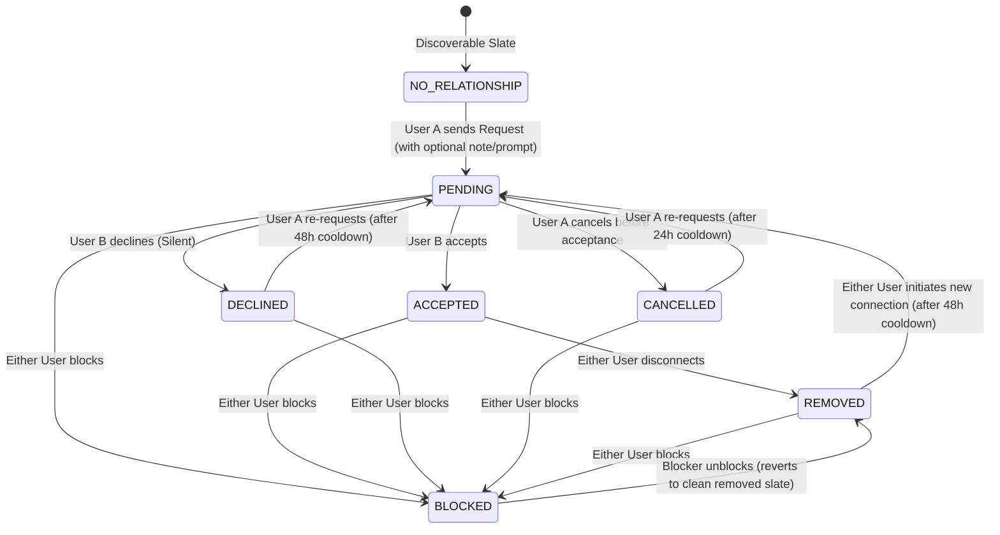
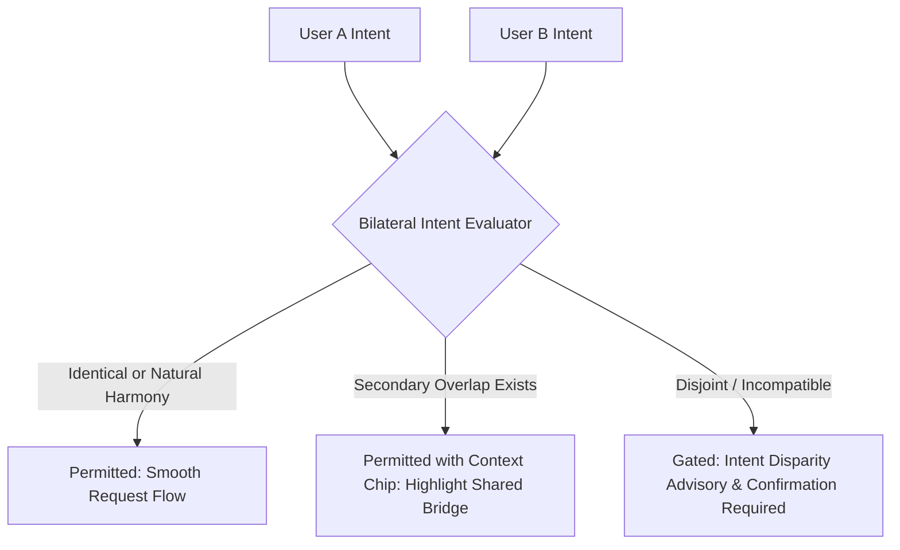
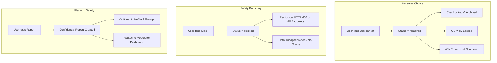
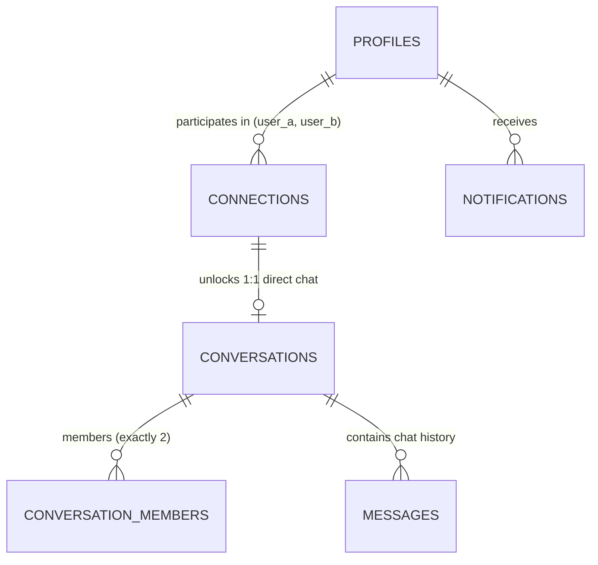

# JESTER — Connection & Messaging System V1 Specification

**Document Type:** Platform Architecture, Product UX, State Machine, Messaging & Relational Interaction Specification  
**Version:** V1.0  
**Status:** Canonical Platform Architecture  
**Scope:** Cross-cutting (Connections State Machine, Request Packaging, Bilateral Intent Compatibility, Direct Messaging, US Transition, Safety & Boundaries, API & Data Contracts)

---

## 1. Executive Summary

The **JESTER Connection & Messaging System V1** defines the intentional permission transition between two users who discover each other and choose to open a richer channel of interaction.

### Core Product Philosophy:
> **"People first. Signals second. Scores last."**  
> **"A connection is not a score. A connection is not compatibility. A connection is not relationship quality.**  
> **It is simply two people choosing to open a richer channel of interaction."**

JESTER is **not a dating-only app**. Connections are established across diverse human motivations:
1. **Friendship** (`friendship`)
2. **Intentional Dating** (`dating_serious`, `dating_open`)
3. **Meaningful Conversation** (`meaningful_chat`)
4. **Activity Partnership** (`activity_partner`)
5. **Creative / Professional Collaboration** (`collaboration`)
6. **Open Exploration** (`just_exploring`)

### The Full Relational Journey:
```text
DISCOVERY (Candidate Card & Qualitative Hook)
    ↓
PROFILE PREVIEW (Authentic Voice Prompts, Safe Big Three, Values)
    ↓
WHY CARD (Relational Dynamics & Shared Chemistry)
    ↓
CONNECT ACTION (Intent Reason, Quoted Prompt, Personal Note)
    ↓
REQUEST LIFECYCLE (Pending Inbound/Outbound, Cooldown, Cancel)
    ↓
ACCEPTANCE / DECLINE (Bilateral Consent Gate)
    ↓
ACTIVE CONNECTION (Unlocks Connections-Only Profile Fields)
    ↓
DIRECT CHAT (First Message Seeding, Contextual Starters)
    ↓
US (Comprehensive Relational Territory & Dynamic Reflection)
```

---

## 2. Current-State Repository Audit

A forensic audit of existing backend code, database schemas, and documentation reveals:

| Subsystem | Existing Implementation | Documented Status | Proposed V1 Target Architecture |
| :--- | :--- | :--- | :--- |
| **Connections Schema** | `public.connections` ([007_connections.sql](file:///c:/Users/fiord/OneDrive/Desktop/Jester/supabase/migrations/007_connections.sql)) has `user_a_id`, `user_b_id`, `status`, `initiated_by`, `blocked_by`. | States: `pending`, `accepted`, `declined`, `blocked`, `removed`. | Preserves canonical pair constraint (`user_a_id < user_b_id`); enhances request metadata (`connection_reason`, `prompt_reference_id`, `invitation_note`). |
| **Connection Requests** | `POST /connections` creates request with `target_user_id` only ([`backend/app/connections/router.py`](file:///c:/Users/fiord/OneDrive/Desktop/Jester/backend/app/connections/router.py)). | Request reasons and quoted prompts documented conceptually. | Fully typed `ConnectionCreateRequest` supporting optional 1-tap `connection_reason`, `prompt_reference_id`, and `invitation_note` (max 200 chars). |
| **Conversations** | Direct conversations created via `POST /conversations` ([`backend/app/conversations/router.py`](file:///c:/Users/fiord/OneDrive/Desktop/Jester/backend/app/conversations/router.py)). | Requires `has_active_connection`. | Lazy creation or automatic thread initialization upon request acceptance, with invitation note pre-seeded as first message. |
| **Messages Schema** | `public.messages` ([012_messages.sql](file:///c:/Users/fiord/OneDrive/Desktop/Jester/supabase/migrations/012_messages.sql)) stores `id`, `conversation_id`, `sender_user_id`, `body`, `created_at`. | Minimal text messaging without media attachments. | Enforces text-only (max 2,000 chars), emoji support, read markers (`last_read_message_id` in member table), and zero message body profiling. |
| **Disconnect vs Block** | Disconnect maps to `action = 'remove'` (sets status to `removed`). Block maps to `action = 'block'` ([`backend/app/connections/router.py`](file:///c:/Users/fiord/OneDrive/Desktop/Jester/backend/app/connections/router.py)). | Distinction documented in `ARCHITECTURE.md`. | Formalizes three distinct actions: `DISCONNECT` (unfriending; chat locked; 48h cooldown), `BLOCK` (reciprocal 404 wipe), and `REPORT` (confidential platform moderation signal). |
| **WHY to US Transition** | `/v1/people/{id}/why` calls `compare_users` ([`backend/app/comparisons/router.py`](file:///c:/Users/fiord/OneDrive/Desktop/Jester/backend/app/comparisons/router.py)), requiring active connection. | Pre-connection WHY documented in Discovery Preferences. | Decouples pre-connection `WHY` (exploring resonance) from post-connection `US` (relational territory & conversation starters). |

---

## 3. Canonical Connection State Machine

JESTER maintains a deterministic, canonical finite state machine for all interpersonal relationships:



### 3.1 State Definitions & Viewpoint Matrix

| State Name | Database Canonical Value | Initiator (User A) Viewpoint | Recipient (User B) Viewpoint | Compatibility / US Allowed? | Messaging Allowed? |
| :--- | :--- | :--- | :--- | :---: | :---: |
| **NO_RELATIONSHIP** | *(No record or removed)* | Can send request; view public profile & WHY. | Can send request; view public profile & WHY. | ❌ No | ❌ No |
| **PENDING** | `status = 'pending'`, `initiated_by = A` | **Request Sent:** Pending badge; can cancel. | **Request Received:** Accept / Decline buttons; view note. | ❌ No | ❌ No |
| **ACCEPTED** | `status = 'accepted'` | **Connected:** Full US unlocked; chat unlocked. | **Connected:** Full US unlocked; chat unlocked. | ✅ Yes (`US`) | ✅ Yes |
| **DECLINED** | `status = 'declined'` | **Discoverable Slate:** (Silent; no decline banner). | **Discoverable Slate:** Request dismissed from inbox. | ❌ No | ❌ No |
| **CANCELLED** | `status = 'removed'` *(or soft cancelled)* | **Request Cancelled:** Can re-request after 24h. | **Slate Cleared:** Removed from received inbox. | ❌ No | ❌ No |
| **REMOVED** | `status = 'removed'` | **Disconnected:** Chat locked (archived); US locked. | **Disconnected:** Chat locked (archived); US locked. | ❌ No | ❌ No |
| **BLOCKED** | `status = 'blocked'`, `blocked_by = X` | **Blocker:** Sees blocked status in settings; can unblock. | **Blocked:** Profile/Chat returns HTTP 404 (total disappearance). | ❌ No (404) | ❌ No (404) |

### 3.2 Detailed Transition Rules

| Transition | Actor | Pre-Conditions | Resulting State | System Actions & Notifications | Reversibility |
| :--- | :--- | :--- | :--- | :--- | :--- |
| **Send Request** | Initiator | No active connection; not blocked; within rate limit ($\le 20\text{/day}$). | `PENDING` | Creates connection row; dispatches `connection_request` notification to recipient. | Reversible via Cancel. |
| **Accept** | Recipient | `PENDING` state; actor is recipient (`auth.uid() != initiated_by`). | `ACCEPTED` | Updates status; dispatches `connection_accepted` notification to initiator; initializes direct chat thread. | Reversible via Disconnect. |
| **Decline** | Recipient | `PENDING` state; actor is recipient (`auth.uid() != initiated_by`). | `DECLINED` | Updates status; **zero notification sent to initiator** (silent decline protects dignity). 48h re-request cooldown. | Reversible if initiator re-requests later. |
| **Cancel** | Initiator | `PENDING` state; actor is initiator (`auth.uid() == initiated_by`). | `REMOVED` | Deletes pending request notification from recipient inbox. 24h cooldown on re-sending. | Can re-request after cooldown. |
| **Disconnect** | Either party | `ACCEPTED` state. | `REMOVED` | Revokes `has_active_connection`; locks chat thread; locks US access; sets 48h re-request cooldown. Zero notification sent. | Can reconnect after 48h cooldown. |
| **Block** | Either party | Any state. | `BLOCKED` | Sets `status = 'blocked'`, `blocked_by = auth.uid()`; terminates chat; enforces reciprocal HTTP 404 on all endpoints. | Reversible by Blocker unblocking. |
| **Unblock** | Blocker only | `BLOCKED` state; actor is `blocked_by`. | `REMOVED` | Transitions to clean disconnected slate (`removed`). Does NOT auto-restore accepted connection. | Reversible by re-blocking. |

---

## 4. Connection Request Architecture

JESTER connection requests are **warm, intentional invitations**, transforming cold discovery into meaningful human context:

```text
┌─────────────────────────────────────────────────────────────┐
│                 SEND CONNECTION REQUEST                     │
├─────────────────────────────────────────────────────────────┤
│ To: Mariam K. (Tbilisi • Active Explorer)                   │
│ Shared Purpose: Activity Partner (Hiking & Bouldering)     │
├─────────────────────────────────────────────────────────────┤
│ Why Connect? (Optional 1-Tap Reason)                        │
│ [ 🧗 Shared Activity ]  [ ☕ Grab Coffee ]  [ 💬 Great Chat ]│
├─────────────────────────────────────────────────────────────┤
│ Quoted Prompt (Optional Anchor)                             │
│ "A weekend ritual I refuse to give up: Morning espresso and │
│  scouting new bouldering routes in Kazbegi."                │
├─────────────────────────────────────────────────────────────┤
│ Personal Note (Optional, max 200 characters)                │
│ "I'm heading up to Truso Valley next weekend if you're      │
│  looking for trail buddies!"                                │
├─────────────────────────────────────────────────────────────┤
│ [ Cancel ]                             [ Send Invitation ]  │
└─────────────────────────────────────────────────────────────┘
```

### 4.1 Request Payload Components
1. **`target_user_id` (Required):** UUID of candidate.
2. **`connection_reason` (Optional):** Structured 1-tap tag (`coffee_chat`, `activity_outing`, `creative_project`, `meaningful_dialogue`, `exploring_connection`).
3. **`prompt_reference_id` (Optional):** UUID of target's published prompt. Pre-populates the prompt text as an anchor.
4. **`invitation_note` (Optional):** Freeform text string capped at **200 characters**.
   - Input is sanitized against HTML/XSS and raw external contact handles/phone numbers.
   - User may request AI writing polish via `POST /v1/connections/ai-note-assist`, but text **must be explicitly approved and submitted by the human user**.

### 4.2 Anti-Creepiness & Privacy Invariants:
- ❌ **NO Behavioral Exposure:** Requests must **never** reference internal telemetry (e.g. never generate *"Saw you looking at my profile 4 times"*).
- ❌ **NO Presumptuous Romance:** Requests between users with declared platonic intents must never include romantic pre-selections or romantic AI starters.

---

## 5. Bilateral Intent Compatibility in Connections

Connection requests respect declared intent boundaries to prevent harassment, mismatched expectations, and predatory interactions:



### Intent Compatibility Matrix:

| User A (Sender) Intent | User B (Recipient) Intent | Bilateral Compatibility Status | Connection Request Behavior |
| :--- | :--- | :--- | :--- |
| `friendship` | `friendship` | 🟢 **Direct Harmony** | Smooth 1-tap request; framed around shared activities and companionship. |
| `activity_partner` | `activity_partner` | 🟢 **Direct Harmony** | Smooth request; pre-selects activity outings. |
| `dating_serious` | `dating_serious` | 🟢 **Direct Harmony** | Smooth request; framed around intentional romance and core values. |
| `dating_open` | `friendship` (Secondary: `just_exploring`) | 🟡 **Bridge Overlap** | Permitted. Connection context defaults strictly to platonic friendship bridge. |
| `dating_serious` | `friendship` (No romantic openness) | 🔴 **Disjoint Intent** | **Intent Disparity Advisory surfaced to Sender:** *"Mariam is exclusively looking for Friendship. Would you like to connect strictly as friends?"* Sender must confirm platonic intent before request can be dispatched. |
| `collaboration` | `dating_serious` | 🔴 **Disjoint Intent** | Discovery partitions candidates. If requested via direct link, surfaces Intent Advisory. |

---

## 6. Privacy & Visibility Boundaries

Access permissions evolve strictly across the relationship lifecycle:

```text
┌──────────────────────────────────────────────────────────────────────────────────┐
│                             DATA VISIBILITY MATRIX                               │
├──────────────────────────┬──────────────┬──────────────┬──────────────┬──────────┤
│ Data Element             │ Pre-Connect  │ Pending Req  │ Connected    │ Blocked  │
├──────────────────────────┼──────────────┼──────────────┼──────────────┼──────────┤
│ Display Name & Avatar    │ ✅ Visible    │ ✅ Visible    │ ✅ Visible    │ ❌ 404   │
│ City & Country           │ ✅ Visible    │ ✅ Visible    │ ✅ Visible    │ ❌ 404   │
│ Primary Interests (5)    │ ✅ Visible    │ ✅ Visible    │ ✅ Visible    │ ❌ 404   │
│ Published Prompts (1-3)  │ ✅ Visible    │ ✅ Visible    │ ✅ Visible    │ ❌ 404   │
│ Big Three (Sun/Moon/Asc) │ ✅ Visible    │ ✅ Visible    │ ✅ Visible    │ ❌ 404   │
│ WHY Card Dynamic Hooks   │ ✅ Visible    │ ✅ Visible    │ ✅ Visible    │ ❌ 404   │
├──────────────────────────┼──────────────┼──────────────┼──────────────┼──────────┤
│ Invitation Note & Reason │ ❌ Hidden     │ ✅ Recipient  │ ✅ Seeded Chat│ ❌ 404   │
│ Connections-Only Prompts │ ❌ Hidden     │ ❌ Hidden     │ ✅ Visible    │ ❌ 404   │
│ Secondary Interests      │ ❌ Hidden     │ ❌ Hidden     │ ✅ Visible    │ ❌ 404   │
│ Full US Relational View  │ ❌ Hidden     │ ❌ Hidden     │ ✅ Visible    │ ❌ 404   │
│ Direct 1-on-1 Chat       │ ❌ Hidden     │ ❌ Hidden     │ ✅ Visible    │ ❌ 404   │
├──────────────────────────┼──────────────┼──────────────┼──────────────┼──────────┤
│ Exact Birth Time & Date  │ 🚫 NEVER     │ 🚫 NEVER     │ 🚫 NEVER     │ 🚫 NEVER │
│ Verification Selfies     │ 🚫 NEVER     │ 🚫 NEVER     │ 🚫 NEVER     │ 🚫 NEVER │
│ Discovery Preferences    │ 🚫 NEVER     │ 🚫 NEVER     │ 🚫 NEVER     │ 🚫 NEVER │
│ Behavioral Telemetry     │ 🚫 NEVER     │ 🚫 NEVER     │ 🚫 NEVER     │ 🚫 NEVER │
│ Numeric Match Score %    │ 🚫 NEVER     │ 🚫 NEVER     │ 🚫 NEVER     │ 🚫 NEVER │
└──────────────────────────┴──────────────┴──────────────┴──────────────┴──────────┘
```

---

## 7. Messaging System V1 Specification

Direct communication in JESTER is designed for **calm, deliberate human connection**, free from surveillance mechanics and feature bloat.

### 7.1 Permitted V1 Capabilities
- **Text Messaging:** UTF-8 text messages up to **2,000 characters**.
- **Emoji Support:** Full standard Unicode emoji rendering.
- **Inaugural Message Seeding:** When User B accepts User A's request, User A's `invitation_note` and `quoted_prompt` automatically become the **first message bubble** in the thread!
- **Conversation State Summary:** Direct conversations show last message preview, timestamp, and unread indicator.
- **Realtime Delivery:** Realtime message dispatch via Supabase Realtime channel `conversation:{id}`.

### 7.2 Explicitly Excluded from Messaging V1
- ❌ **NO Read Receipt Surveillance:** Zero "Seen at 2:14 PM" timestamps; zero typing speed metrics.
- ❌ **NO Media / Image / Audio Attachments:** Eliminates CSAM/NSFW attack surface and complex media storage in V1.
- ❌ **NO Ephemeral / Disappearing Messages:** Keeps messaging auditable for safety and moderation reports.
- ❌ **NO Message Editing / Deletion by Sender:** Once sent, messages remain part of the immutable thread record (unless purged via moderation or account deletion).

---

## 8. Communication Preferences Integration

JESTER integrates declared preferences from [`docs/COMMUNICATION_SYSTEM_V1_SPEC.md`](file:///c:/Users/fiord/OneDrive/Desktop/Jester/docs/COMMUNICATION_SYSTEM_V1_SPEC.md) into the messaging interface:

```text
┌─────────────────────────────────────────────────────────────┐
│ DIRECT CHAT HEADER: ALEX M. & NINO K.                       │
├─────────────────────────────────────────────────────────────┤
│ 💡 Communication Harmony:                                   │
│    • Depth: Deep & Meaningful conversations                 │
│    • Dynamic: Nino brings the stories, Alex brings curiosity│
│    • Pacing: Unhurried, thoughtful notes                    │
└─────────────────────────────────────────────────────────────┘
```

- **Reassuring Pacing Badges:** If both users declared `response_pace = 'unhurried'`, the thread header displays a calming badge: `[ ☕ Unhurried Pace • No Pressure for Instant Replies ]`.
- **Zero Latency Grading:** The system strictly forbids tracking reply latency, displaying response timers, or labeling either participant a "slow responder" or "dry texter."

---

## 9. Conversation Starting Experience ("The Insight Becomes the Invitation")

Starting a conversation should never feel like staring into a blank void:

### 9.1 Contextual Starter Drawer
When opening a newly accepted conversation thread, JESTER renders an optional **Starter Tray** containing three distinct human hooks:

1. **The Quoted Prompt Bridge:** If the connection was initiated via a prompt reply, the conversation begins organically with that dialogue.
2. **The Shared Passion Hook:** Generated from mutual Interest Graph overlap (*"You both explore analog synthesizers. Ask them about their current favorite setup."*).
3. **The Relational Dynamic Hook:** Generated from synastry and values harmony (*"Different creative mediums, identical nocturnal focus. Ask what project keeps them up past midnight."*).

### 9.2 Human Agency Invariant
- Starters are **suggestions only**.
- The user can tap a starter to populate the text input box, edit the text freely, and tap `[ Send ]`.
- **AI NEVER auto-sends messages.** The user remains the sole author and dispatcher of every message.

---

## 10. JESTER AI Integration & Boundaries

JESTER AI acts as an empathetic relational copilot in conversation surfaces, governed strictly by [`docs/JESTER_AI_CONTEXT_SYSTEM_V1_SPEC.md`](file:///c:/Users/fiord/OneDrive/Desktop/Jester/docs/JESTER_AI_CONTEXT_SYSTEM_V1_SPEC.md):

```text
┌─────────────────────────────────────────────────────────────┐
│ ❌ STRICTLY PROHIBITED IN CONVERSATION AI                   │
├─────────────────────────────────────────────────────────────┤
│ • Reading message bodies for psychological profiling.       │
│ • Diagnosing emotional states or analyzing sentiment.       │
│ • Scoring communication velocity or calculating latency.    │
├─────────────────────────────────────────────────────────────┤
│ ✅ PERMITTED IN CONVERSATION AI                             │
├─────────────────────────────────────────────────────────────┤
│ • Suggesting creative icebreakers based on declared tags.   │
│ • Explaining relational dynamics in the US tab.             │
│ • Assisting with note drafting upon explicit user request.  │
└─────────────────────────────────────────────────────────────┘
```

---

## 11. Connection → US Transition

Acceptance transforms two independent profiles into a shared **US** relational experience:

```text
BEFORE ACCEPTANCE (WHY Tab):
• "Why You Might Connect"
• Top 3 Shared Passions
• 2 Qualitative Astrological Chemistry Hooks
• Intent Alignment Pill

AFTER ACCEPTANCE (US Tab):
• "Your Shared Territory"
• Comprehensive Relational Dynamics (Mercury-Mercury communication, Moon-Venus emotional rhythm)
• Complete Values & Social Energy Balancing (One-on-one comfort vs. group adventures)
• Dynamic Conversation Starter & Date Idea Library
• Safe Astrological Deep Analysis (Qualitative, zero jargon)
```

**Product Distinction:** Acceptance does not assume instant intimacy. It simply grants permission to explore the full shared territory together.

---

## 12. Disconnect, Block & Report Protocol

JESTER enforces clear structural separation between personal boundaries, uncoupling, and platform moderation:



### Detailed Differences:
- **Disconnect (`remove`):** A civil decision to end a connection. Chat history remains readable in read-only archive mode; new messages are blocked. Either user can initiate a new connection after a 48-hour cooldown.
- **Block (`block`):** A personal protection boundary. Immediately purges visibility in both directions. All profile and chat endpoints return HTTP 404 (`PrivacySafeNotFoundException`).
- **Report (`report`):** A community safety signal. Confidential submission across 6 standardized categories (`fake_profile`, `harassment`, `inappropriate_content`, `spam_scam`, `underage`, `other`). The reported user is **never notified**.

---

## 13. Notifications System V1

JESTER restricts notifications strictly to actionable, high-dignity events:

| Event | In-App Notification? | Recipient | Notification Copy (KA / EN) |
| :--- | :---: | :---: | :--- |
| **Request Received** | ✅ Yes | Target User | *"ალექსმა გამოგიგზავნათ კავშირის მოთხოვნა"* / *"Alex sent you a connection request."* |
| **Request Accepted** | ✅ Yes | Initiator | *"მარიამი დათანხმდა თქვენს მოთხოვნას — შეგიძლიათ დაიწყოთ საუბარი"* / *"Mariam accepted your request — say hello!"* |
| **Request Declined** | 🚫 **NEVER** | Initiator | *(Silent decline protects dignity and prevents retaliation).* |
| **New Message** | ✅ Yes | Other Member | *"ახალი შეტყობინება მარიამისგან"* / *"New message from Mariam."* |
| **User Disconnected**| 🚫 **NEVER** | Other Member | *(Silent disconnect; thread transitions to read-only archive).* |

---

## 14. Abuse Prevention & Anti-Spam Architecture

To prevent spam, harassment, and predatory behavior:

1. **Outbound Request Velocity Capping:** Authenticated users are limited to **20 connection requests per rolling 24-hour window**.
2. **Inbound Request Backlog Cap:** Recipient inboxes cap active pending requests at **50 items**. Senders receive a polite notice: *"This person's inbox is currently full."*
3. **Re-Request Cooldown:**
   - Cancelled request: **24-hour cooldown** before re-requesting.
   - Declined request: **48-hour cooldown** before re-requesting.
   - Disconnected connection: **48-hour cooldown** before re-requesting.
4. **Message Throttling:** Capped at **30 messages per rolling minute** per conversation.
5. **Spray-and-Pray Detection:** Accounts sending $> 15$ requests per day with an acceptance rate $< 5\%$ are flagged by background jobs for rate-throttling (`limited` standing).

---

## 15. Database Architecture Specification

To implement Connection & Messaging V1 without duplicate tables or security holes, existing entities are enhanced and formalized:



### 15.1 Schema Blueprint

#### 1. Enhanced `public.connections` Table
- `id` UUID PRIMARY KEY DEFAULT gen_random_uuid(),
- `user_a_id` UUID NOT NULL REFERENCES public.profiles(id) ON DELETE CASCADE,
- `user_b_id` UUID NOT NULL REFERENCES public.profiles(id) ON DELETE CASCADE,
- `status` VARCHAR(20) NOT NULL DEFAULT 'pending' CHECK (status IN ('pending', 'accepted', 'declined', 'blocked', 'removed')),
- `initiated_by` UUID NOT NULL REFERENCES public.profiles(id) ON DELETE CASCADE,
- `blocked_by` UUID REFERENCES public.profiles(id) ON DELETE CASCADE,
- `connection_reason` VARCHAR(30),             -- 'coffee_chat', 'activity_outing', 'creative_project', etc.
- `prompt_reference_id` UUID REFERENCES public.prompt_templates(id),
- `invitation_note` VARCHAR(200),               -- Sanitized personal note (max 200 chars)
- `created_at` TIMESTAMPTZ NOT NULL DEFAULT now(),
- `updated_at` TIMESTAMPTZ NOT NULL DEFAULT now(),
- CONSTRAINT connections_canonical_pair CHECK (user_a_id < user_b_id),
- CONSTRAINT connections_unique_pair UNIQUE (user_a_id, user_b_id)

#### 2. Enhanced `public.conversation_members` Table
- `conversation_id` UUID NOT NULL REFERENCES public.conversations(id) ON DELETE CASCADE,
- `user_id` UUID NOT NULL REFERENCES public.profiles(id) ON DELETE CASCADE,
- `last_read_message_id` UUID REFERENCES public.messages(id) ON DELETE SET NULL,
- `last_read_at` TIMESTAMPTZ,
- PRIMARY KEY (conversation_id, user_id)

#### 3. `public.messages` Table (Preserved & Hardened)
- `id` UUID PRIMARY KEY DEFAULT gen_random_uuid(),
- `conversation_id` UUID NOT NULL REFERENCES public.conversations(id) ON DELETE CASCADE,
- `sender_user_id` UUID NOT NULL REFERENCES public.profiles(id) ON DELETE CASCADE,
- `body` TEXT NOT NULL CHECK (char_length(body) BETWEEN 1 AND 2000),
- `created_at` TIMESTAMPTZ NOT NULL DEFAULT now()

---

## 16. API Architecture Specification

### 16.1 Connection Endpoints

| Method | Path | Auth | Description | Request / Response |
| :--- | :--- | :--- | :--- | :--- |
| `GET` | `/v1/connections` | Bearer | Lists active connections and incoming/outgoing pending requests. | `200 OK: list[ConnectionDetailDTO]` |
| `POST` | `/v1/connections` | Bearer | Creates a connection request with optional reason, note, and prompt anchor. | `Body: ConnectionCreateRequest`<br>`201 Created: ConnectionResponse` |
| `POST` | `/v1/connections/{id}/transition` | Bearer | Transitions state (`accept`, `decline`, `cancel`, `disconnect`, `block`). | `Body: ConnectionTransitionRequest`<br>`200 OK: ConnectionResponse` |
| `POST` | `/v1/connections/ai-note-assist` | Bearer | Suggests a polished, witty 1-sentence note based on quoted prompt. | `Body: { prompt_text, user_draft? }`<br>`200 OK: { suggestion }` |

### 16.2 Messaging Endpoints

| Method | Path | Auth | Description | Request / Response |
| :--- | :--- | :--- | :--- | :--- |
| `GET` | `/v1/conversations` | Bearer | Lists user's active direct conversations for Inbox view. | `200 OK: list[ConversationInboxDTO]` |
| `GET` | `/v1/conversations/{id}` | Bearer | Fetches conversation details and other member profile summary. | `200 OK: ConversationDetailDTO` |
| `GET` | `/v1/conversations/{id}/messages` | Bearer | Cursor-paginated message history (ordered chronologically). | `200 OK: list[MessageResponse]` |
| `POST` | `/v1/conversations/{id}/messages` | Bearer | Sends a text message (max 2,000 chars). Realtime broadcast. | `Body: MessageCreate`<br>`201 Created: MessageResponse` |
| `PATCH`| `/v1/conversations/{id}/read` | Bearer | Updates caller's `last_read_message_id` and resets unread count. | `Body: { message_id }`<br>`200 OK` |
| `GET` | `/v1/conversations/{id}/starters` | Bearer | Fetches 3 contextual starter prompts (shared interests/dynamics). | `200 OK: list[StarterPromptDTO]` |

---

## 17. UX State Inventory

Every possible client state is mapped deterministically before visual screen design begins:

1. **State: Discoverable Candidate (No Relationship):** Primary action: `[ ✨ Connect ]`. Secondary: `[ 💡 Why This Person ]`.
2. **State: Request Modal Open:** Form containing Why Connect pill selector, quoted prompt card, and 200-character personal note input.
3. **State: Intent Disparity Advisory:** Modal warning when sender and recipient have disjoint intents, requiring explicit platonic confirmation.
4. **State: Outbound Request Pending:** Candidate profile button renders `[ ⏳ Request Sent ]`. Tapping reveals `[ Cancel Request ]` option.
5. **State: Inbound Request Received (Inbox):** Renders sender avatar, display name, connection reason, quoted prompt, and personal note with `[ ✓ Accept ]` and `[ ✕ Decline ]` actions.
6. **State: Request Accepted Banner:** Transient toast: *"You and Mariam are now connected!"* with `[ 💬 Send Message ]` action.
7. **State: Request Declined (Silent):** Sender's UI transitions back to Discoverable Slate without notice. Recipient's inbox card dismisses.
8. **State: Connected & Active:** Profile button displays `[ 💬 Message ]`. US tab is unlocked.
9. **State: Conversation Empty (Seeded Note):** Direct chat thread opens with User A's invitation note and quoted prompt already anchored as the top message bubble.
10. **State: Conversation Active:** Chronological message list with message input box, emoji picker, and expandable Starter Tray.
11. **State: Optimistic Message Pending:** Sent message renders with subtle clock icon pending server confirmation.
12. **State: Message Delivery Failed:** Red retry exclamation mark with `[ Tap to Retry ]`.
13. **State: Disconnected / Removed (Archive Mode):** Thread renders read-only banner: *"This connection has ended. Messaging is disabled."* Input box hidden.
14. **State: Blocked (Reciprocal 404):** Profile, messages, and connection resolve as HTTP 404 `PrivacySafeNotFoundException`.
15. **State: Rate Limited Cooldown:** Button disabled with countdown: *"You can send another request in 18 hours."*
16. **State: Recipient Inbox Full:** Notice: *"This user has too many pending requests right now. Try again later."*

---

## 18. Analytics & Behavioral Telemetry Integration

Adheres strictly to [`docs/BEHAVIORAL_INTELLIGENCE_SYSTEM_V1_SPEC.md`](file:///c:/Users/fiord/OneDrive/Desktop/Jester/docs/BEHAVIORAL_INTELLIGENCE_SYSTEM_V1_SPEC.md):

- **Permitted Behavioral Events:**
  - `connection_request_sent` (context: `has_reason`, `has_prompt`, `has_note`)
  - `connection_request_accepted` (downstream weight: $2.00$)
  - `connection_request_declined` (divergence signal)
  - `connection_request_cancelled` (retraction signal)
  - `conversation_started` (initial message sent)
  - `conversation_continued` ($\ge 2$ messages each, weight: $4.00$)
  - `connection_disconnected` (cooldown tracking)
- **Strictly Barred Surveillance:**
  - ❌ **NO Message Text Parsing:** Message bodies are never inspected for behavioral telemetry.
  - ❌ **NO Latency Scorekeeping:** Reply latency is never tracked or scored.

---

## 19. Security, Authorization & Privacy Invariants

- **Canonical Pair Enforcement:** `user_a_id < user_b_id` prevents duplicate opposing connection rows in PostgreSQL.
- **Participant Authorization:** Helper function `public.is_active_direct_conversation(conv_id, user_id)` verifies that caller is an active member **AND** that `has_active_connection(user_1, user_2)` is true.
- **Disconnect Isolation:** When a connection transitions to `removed`, `has_active_connection` immediately returns `false`. Direct messaging is locked; new message insertions fail database checks.
- **Zero Existence Leakage:** Blocked or deleted users return `HTTP 404 PrivacySafeNotFoundException` across all connection, conversation, and messaging endpoints.
- **Server-Side Note Sanitization:** Invitation notes pass automated regex sanitization pre-insertion to strip HTML tags, executable scripts, and raw phone numbers.

---

## 20. V1 vs. Future Roadmap

| Capability | Version 1 (Current Scope) | Future Evolution |
| :--- | :--- | :--- |
| **Messaging Format** | Text-only (max 2,000 chars) + Unicode emoji. | Voice notes, image sharing, link rich-previews. |
| **Conversation Scope** | 1-on-1 direct conversations only. | Group conversations, double dates, collaborative circles. |
| **Read State** | Last read message pointer (`last_read_message_id`). | Ephemeral typing indicators (without latency scorekeeping). |
| **Connection Requests** | Structured 1-tap reason + quoted prompt + 200-char note. | Interactive audio icebreakers or collaborative mini-games. |
| **Relational Depth** | US View with shared territory & synastry dynamics. | Shared bucket lists, calendar sync, joint event RSVPs. |

---

## 21. Open Product Decisions Requiring Product Owner Approval

1. **Invitation Note Requirement:** Should personal notes on connection requests remain strictly optional (recommended), or be mandatory to encourage high-effort invitations? *(Recommended: Keep optional to minimize friction, while prominently offering the 1-tap reason as a lightweight middle ground).*
2. **Re-Request Cooldown Duration:** Is a 48-hour cooldown after a decline optimal, or should it be extended to 7 days to prevent persistent pestering? *(Recommended: 7 days after a decline; 24 hours after a sender-initiated cancellation).*
3. **Archived Chat Retention After Disconnect:** Should disconnected users be able to read historical chat logs in read-only archive mode, or should the chat thread be deleted immediately upon disconnect? *(Recommended: Retain read-only historical archive for 30 days to allow safety reporting of harassment, then prune).*
