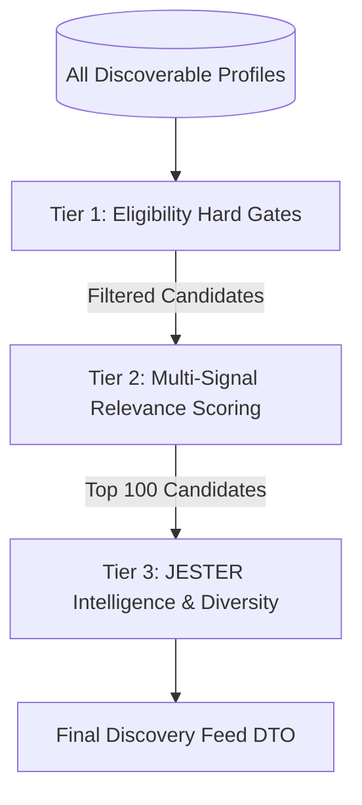

# JESTER — DISCOVERY PREFERENCES SYSTEM V1
## Product, UX, Data Architecture & Relationship Intelligence Specification

---

## 1. Executive Summary & Core Product Axiom

JESTER is a **People Discovery and Relationship Intelligence** platform. Its mission is to help people understand themselves, understand others, and build genuine human relationships:

$$\text{ME} \longrightarrow \text{YOU} \longrightarrow \text{US} \longrightarrow \text{MORE PEOPLE}$$

Previous system specifications have codified:
1. **Identity & Astrological Foundation** (`public.profiles`, `public.birth_data`, `public.astro_safe_profile`)
2. **Location & Origin System V1** (`public.geo_cities`, `current_city_id`, `hometown_city_id`)
3. **Interest System & Graph V1** (`public.interests`, `public.interest_relations`, `public.user_interests`)
4. **Lifestyle System V1** (`public.user_lifestyle` — daily rhythm, activity pace, work style)
5. **Values System V1** (`public.values_options`, `public.user_values` — guiding compass, core value)
6. **Social Behavior System V1** (`public.user_social_preferences` — gathering scale, battery, warmup)
7. **Communication System V1** (`public.user_communication_preferences` — depth, conversational role, medium, pacing)
8. **Intent System V1** (`public.user_intents` — primary relational purpose & secondary openness)
9. **Prompts / Self-Expression System V1** (`public.user_prompts` — authentic voice, headline, conversational hooks)

The tenth foundational system is **Discovery Preferences**.

### The Core Product Question
Discovery Preferences answers:
> **"Who and what do you want JESTER to show you?"**

This is fundamentally distinct from:
- **Identity:** *"Who am I?"*
- **Intent:** *"What am I looking for right now?"*
- **Interests:** *"What topics excite me?"*
- **Discoverability:** *"Can others find me?"*

### Governing Product Axiom
> **"People first. Signals second. Scores last."**

Modern dating and social platforms have degraded human discovery into hyper-granular filter marketplaces, encouraging users to filter humans like commodities on an e-commerce catalog (filtering by height, astrological sign, exact income, religion, political party, workout frequency). This commodification produces:
1. **The Paradox of Choice & False Scarcity:** Hyper-filtered criteria artificially empty candidate pools.
2. **Superficial Exclusion:** Meaningful human chemistry often flourishes between people who look "incompatible" on paper checklists.
3. **Transactional Coldness:** Profiles are evaluated as checklists rather than whole human beings.

JESTER rejects the filter marketplace. Discovery Preferences in JESTER V1 are designed to **steer relevance and protect personal boundaries without fragmenting humanity into exclusionary silos**.

---

## 2. Conceptual Distinctions: Four Relational Layers

To prevent architectural confusion, JESTER formally decouples four distinct concepts:

```text
┌─────────────────────────────────────────────────────────────────────────────┐
│ 1. INTENT ("What am I looking for?")                                         │
│    • Temporal purpose on JESTER (Friendship, Dating, Activity, Collaborate). │
│    • Governs relationship mode & frames all astrological interpretations.    │
├─────────────────────────────────────────────────────────────────────────────┤
│ 2. DISCOVERY PREFERENCES ("Who do I want to discover?")                     │
│    • User controls over candidate eligibility & recommendation steering.    │
│    • Controls who appears in the user's discovery feeds and suggestions.    │
├─────────────────────────────────────────────────────────────────────────────┤
│ 3. HARD DEALBREAKERS ("Who should I definitely NOT be shown?")               │
│    • Absolute exclusionary barriers (Age bounds, blocked users, safety).    │
│    • Candidates violating these are mathematically omitted (0% exposure).   │
├─────────────────────────────────────────────────────────────────────────────┤
│ 4. SOFT PREFERENCES ("Who would I generally prefer to see?")                │
│    • Multi-signal relevance boosts (Same city, shared interests, values).   │
│    • Candidates can still appear, but receive intelligent ranking weight.   │
└─────────────────────────────────────────────────────────────────────────────┘
```

| Dimension | Intent | Discovery Preferences | Hard Dealbreakers | Soft Preferences |
| :--- | :--- | :--- | :--- | :--- |
| **Question Answered** | *"Why am I here?"* | *"Who should JESTER show me?"* | *"Who is completely off-limits?"* | *"What aligns with my lifestyle/taste?"* |
| **Mutuality** | Bilateral (must align) | Unilateral (controls caller's feed) | Bilateral enforcement | Unilateral ranking weights |
| **Candidate Impact** | Partitions pools | Shapes candidate ranking | Strict zero inclusion | Relevance score adjustment |
| **Visibility** | Declared on profile | **Strictly Private** | **Strictly Private** | **Strictly Private** |
| **System Layer** | Relational Purpose | Candidate Retrieval | Eligibility Filtering | Ranking & Ordering |

---

## 3. Hard vs. Soft Filter Architecture

The most critical architectural decision in Discovery is establishing the boundary between **Hard Exclusion** and **Soft Relevance**. Allowing users to turn every human characteristic into a hard filter destroys discovery diversity and creates ghost towns.

### 3.1 Hard Filters (Strict Eligibility Gate — Layer 1)
If a candidate fails any hard filter, they are **excluded entirely** from the candidate query results. Zero records returned.

| Attribute | Hard Filter Rule | Rationale & Architectural Rule |
| :--- | :--- | :--- |
| **Account Safety & Standing** | `status = 'active'`, not suspended, not banned | Platform integrity and user safety. |
| **Discoverability Status** | `is_discoverable = true` | Inbound consent: non-discoverable users are never exposed. |
| **Self-Exclusion** | `candidate_id != caller_id` | Caller never sees themselves in discovery. |
| **Mutual Block State** | `NOT is_user_blocked(caller, candidate)` | Absolute privacy & harassment prevention (resolves as 404). |
| **Existing Connection State**| Not already connected (`status != 'accepted'`) | Active connections live in Chat/Contacts, not in discovery feeds. |
| **Bilateral Intent Compatibility** | Must have overlapping intent or `just_exploring` | Protects users from misaligned expectations (e.g. serious dating vs. pure friendship). |
| **Age Boundary** | Candidate age $\in [\text{min\_age}, \text{max\_age}]$ | Personal comfort, legal safety, and age-gap boundaries. |
| **People / Gender Preference** | Candidate gender matches caller's target set | Essential for romantic intents; optional/broad for friendship. |

### 3.2 Soft Preferences (Intelligent Relevance Weighting — Layer 2)
Candidates meeting all hard filters enter the relevance scoring engine. Attributes in this layer **never exclude a person**; they simply adjust candidate sorting and highlight contextual synergy.

| Attribute | Soft Weighting Behavior | Why NOT a Hard Filter in V1 |
| :--- | :--- | :--- |
| **Location / City** | Same city receives $+25\%$ boost; same country $+10\%$. | Remote friendship, travel, and high-synergy connections should not be blocked. |
| **Shared Interests** | Shared canonical interests receive $+20\%$ boost; related graph $+10\%$. | Complementary connections often share curiosity rather than identical hobbies. |
| **Values Compass** | Shared core value receives $+15\%$ boost; harmonious polarities $+10\%$. | Values are subjective human priorities, not moral grading criteria. |
| **Lifestyle Cadence** | Mutual night owls or schedule harmony receive $+10\%$ boost. | People adapt schedules; filtering by sleep habits is unnecessarily rigid. |
| **Social Rhythm** | Mutual one-on-one preference surfaces low-key meeting suggestions. | Social battery is a dynamic recharge style, not a personality barrier. |
| **Communication Depth** | Role pairing (Questioner + Storyteller) boosts conversational ease. | Pacing is personal reassurance, never an exclusionary gate. |
| **Astrological Synergy** | High synastry dimensions provide $+5\%$ to $+15\%$ relevance boost. | Astrology illuminates dynamic chemistry; it must never be a gatekeeper. |
| **Occupation / Education**| Informational only on profile; zero ranking penalty. | Prevents elitist socioeconomic gatekeeping. |

---

## 4. Age Preferences & Date-of-Birth Privacy

Age is a legitimate personal comfort and safety boundary. However, age architecture must strictly protect raw birth data.

### 4.1 Calculation & Data Boundary
- **Raw Birth Date Protection:** `public.birth_data.birth_date` is strictly private and owner-only. It is **never** serialized in public DTOs or discovery responses.
- **Computed Age:** The backend dynamically computes integer age in SQL memory during query execution:
  ```sql
  FLOOR(DATE_PART('year', CURRENT_DATE) - DATE_PART('year', birth_date))::INT
  ```
- **Public Exposure:** Public profile responses serialize only the calculated integer `age` (e.g., `29`), never `birth_date`.

### 4.2 Age Boundary Constraints
- **Absolute Minimum Platform Age:** **18 years old**. Users under 18 cannot register or appear in JESTER.
- **Configurable Range:**
  - `age_min`: Integer, minimum 18, default: $\max(18, \text{user\_age} - 5)$.
  - `age_max`: Integer, maximum 99, default: $\text{user\_age} + 7$.
  - `age_dealbreaker`: Boolean (default: `true`). When `true`, age acts as a hard boundary. When `false`, age outside the range receives a soft distance penalty rather than strict exclusion.
- **Intent-Dependent Default Ranges:**
  - `dating_serious` / `dating_open`: Narrow default range ($\pm 5$ years).
  - `friendship` / `activity_partner` / `collaboration`: Broader default range ($\pm 10$ years).

---

## 5. Gender & People Preference Architecture

Representing "Who do you want to discover?" requires separating **Identity** from **Discovery Target**.

### 5.1 Identity vs. Discovery Preference
- **Gender Identity (`public.profiles.gender`):**
  *"Who am I?"*
  Values: `'man'`, `'woman'`, `'non_binary'`, `'prefer_not_to_say'`.
- **People Discovery Preference (`public.user_discovery_preferences.target_genders`):**
  *"Who do I want to see in Discovery?"*
  Values: Array of slugs: `['man']`, `['woman']`, `['non_binary']`, or `['all']`.

### 5.2 Intent-Aware People Preferences
Gender preference has radically different relational meanings depending on declared intent:

```text
┌─────────────────────────────────────────────────────────────────────────────┐
│ A. ROMANTIC INTENT (Dating Serious, Dating Open)                            │
│    • Gender preference represents romantic/sexual attraction.              │
│    • Acts as a strict hard boundary (e.g. a heterosexual woman sees men).   │
├─────────────────────────────────────────────────────────────────────────────┤
│ B. PLATONIC INTENT (Friendship, Activity Partner, Collaboration)            │
│    • Defaults to "Everyone" (all genders).                                  │
│    • User can optionally specify comfortable social boundaries              │
│      (e.g., a woman seeking only female workout partners).                 │
├─────────────────────────────────────────────────────────────────────────────┤
│ C. EXPLORATORY INTENT (Just Exploring, Meaningful Chat)                     │
│    • Defaults to "Everyone" to encourage open, serendipitous discovery.     │
└─────────────────────────────────────────────────────────────────────────────┘
```

### 5.3 Privacy & Non-Disclosure
- A user's `target_genders` preference is **strictly private**. Other users are never told whether they match or fail another user's gender preferences.

---

## 6. Location Preferences (Zero GPS, City & Country Semantics)

In accordance with JESTER's core security invariants ([`docs/SECURITY.md`](SECURITY.md)), JESTER V1 collects **zero GPS coordinates, zero street addresses, and zero real-time location pings**.

### 6.1 Location Discovery Scope Options
Instead of arbitrary distance sliders (*"within 15 km"*), Discovery Preferences defines four clean geographic scopes:

| Scope Slug | Label (EN / KA) | Definition & Query Logic | Default For |
| :--- | :--- | :--- | :--- |
| **`same_city`** | **My City First**<br>*ჯერ ჩემი ქალაქი* | Prioritizes candidates where `current_city_id` matches caller's current city. Candidates outside city are de-prioritized. | `activity_partner`, `dating_serious` |
| **`same_country`** | **Entire Country**<br>*მთელი ქვეყანა* | Includes candidates across all cities within the caller's country (`current_country_id`), boosting same-city candidates. | `dating_open`, `friendship` |
| **`regional_nearby`**| **Nearby & Regional**<br>*რეგიონი და მეზობელი* | Encompasses domestic cities plus neighboring cross-border hubs (e.g., Tbilisi + Batumi + Yerevan + Baku). | `collaboration`, `just_exploring` |
| **`anywhere`** | **Worldwide / Any Location**<br>*ნებისმიერი ადგილი* | Removes geographic filters entirely. Ranks purely by shared interests, values, and relational chemistry. | `meaningful_chat`, `collaboration` |

### 6.2 Hard vs. Soft Location Gate
- `location_dealbreaker`: Boolean (default: `false`).
  - When `false` (Recommended): Location is a **soft relevance boost** ($+25\%$ for same city). If local pool is small, high-synergy candidates from nearby cities gracefully populate the feed.
  - When `true`: Strict hard boundary. Candidates whose city/country does not match are excluded.
- **Hometown Synergy Hook:** When two users share a hometown root (`hometown_city_id`), discovery cards surface contextual warmth (*"Both based in Tbilisi · Both originally from Kvareli"*).

---

## 7. Interest Preferences & Interest Graph Integration

### 7.1 The Dilemma of Interest Filters
If users can filter by exact interests (*"Show me only people who like Photography"*), discovery collapses into a search engine. Furthermore, JESTER already possesses an advanced semantic Interest Graph ([`docs/INTEREST_SYSTEM_V1_SPEC.md`](INTEREST_SYSTEM_V1_SPEC.md)).

### 7.2 V1 Architecture: Contextual Interest Lenses
- **Primary Unified Feed:** Uses the Interest Graph automatically to calculate interest resonance (Shared, Related, and Complementary clusters). Users do **not** configure hard interest filters for their main feed.
- **Contextual Discovery Lenses (Optional Feed Tabs):**
  Users can optionally switch their view to explore specific interest domains without modifying their underlying preference profile:
  - `[ All People ]` (Default unified feed)
  - `[ Shared Interests ]` (Weighted toward exact mutual interests)
  - `[ Creative & Arts ]` (Filtered by Interest Cluster)
  - `[ Outdoor & Active ]` (Filtered by Interest Cluster)
- **Hard Interest Exclusions:** Strictly prohibited in V1. Users cannot say *"Exclude anyone who likes Gaming."*

---

## 8. Lifestyle Cadence in Discovery (Intelligence over Filtering)

Lifestyle attributes (`daily_rhythm`, `activity_pace`, `work_style`, sensitive habits) belong to **Relationship Intelligence**, not exclusionary filtering.

### 8.1 Why Lifestyle is Soft in V1
1. **False Incompatibilities:** An early bird and a night owl frequently build rewarding relationships if their social battery and values align.
2. **Anti-Discrimination Invariant:** Allowing hard filtering on living situations, pet ownership, or work styles turns JESTER into a rental housing board or corporate resume screener.
3. **Sensitive Habit Privacy:** Smoking and drinking preferences can be toggled private on individual profiles. If users could hard-filter by smoking status, it would create an **existence oracle** leaking private habits of other users.

### 8.2 Discovery Integration
- Lifestyle provides **schedule harmony context** and playful camaderie observations (e.g. *"Both night owls — expect 2 AM chats"* or *"One wakes with the sun, one owns the night — natural balance"*).
- Acts as a soft $+10\%$ relevance weight when cadences align.

---

## 9. Values & Worldview in Discovery (Resonance over Moral Sorting)

Values represent self-declared human priorities ([`docs/VALUES_SYSTEM_V1_SPEC.md`](VALUES_SYSTEM_V1_SPEC.md)).

### 9.1 Non-Exclusionary Philosophy
- Hard filtering on values (*"I only want ambitious people"*) creates moral hierarchies, virtue signaling, and algorithmic echo chambers.
- **Core Value Resonance:** If User A and User B share a Core Value (`is_core = true`), both receive a significant relevance boost ($+20\%$) and a prominent discovery card banner:
  > *"Both guided by Curiosity as your True North."*
- **Complementary Polarities:** Highlighting dynamic balances (*Autonomy + Loyalty*: *"Space to breathe with a secure tether"*).
- **V1 Policy:** Values are strictly **soft discovery signals**, never hard exclusionary filters.

---

## 10. Social Behavior & Communication in Discovery

### 10.1 Social Rhythm Pairing
- Social behavior preferences ([`docs/SOCIAL_BEHAVIOR_SYSTEM_V1_SPEC.md`](SOCIAL_BEHAVIOR_SYSTEM_V1_SPEC.md)) guide **meeting setting intelligence**, not candidate gatekeeping:
  - Mutual `one_on_one` preference triggers recommendations for quiet café hangouts.
  - Mutual `recharge_solo` highlights low-pressure social expectations.
- Zero hard filters on introversion, extroversion, or battery capacity.

### 10.2 Communication Dynamics & The Anti-Surveillance Invariant
- Communication preferences ([`docs/COMMUNICATION_SYSTEM_V1_SPEC.md`](COMMUNICATION_SYSTEM_V1_SPEC.md)) guide **first-conversation icebreakers**:
  - Pairing a `question_curious` user with a `story_expressive` user.
- **Strictly Prohibited:**
  - Filtering by reply time or response speed.
  - Latency shaming badges (*"Fast responder"*, *"Slow texter"*).
  - Filtering out users who prefer text over voice notes.

---

## 11. Intent Integration & Bilateral Partitioning

Intent is the single most important structural partition in JESTER Discovery ([`docs/INTENT_SYSTEM_V1_SPEC.md`](INTENT_SYSTEM_V1_SPEC.md)).

### 11.1 Bilateral Intent Partitioning Matrix
Discovery candidate generation enforces strict bilateral compatibility:

```text
┌─────────────────────────┬──────────────────────────────────────────────────┐
│ Caller Primary Intent   │ Eligible Candidate Primary / Secondary Intents   │
├─────────────────────────┼──────────────────────────────────────────────────┤
│ dating_serious          │ dating_serious, dating_open, just_exploring      │
│ dating_open             │ dating_open, dating_serious, just_exploring      │
│ friendship              │ friendship, activity_partner, meaningful_chat,   │
│                         │ collaboration, just_exploring                    │
│ activity_partner        │ activity_partner, friendship, just_exploring     │
│ collaboration           │ collaboration, friendship, just_exploring        │
│ meaningful_chat         │ meaningful_chat, friendship, just_exploring      │
│ just_exploring          │ ALL INTENTS (Universal Bridge)                   │
└─────────────────────────┴──────────────────────────────────────────────────┘
```

### 11.2 The Intent Partitioning Rule
A user seeking **exclusively platonic friendship** will **never** be shown a user seeking **exclusively serious dating** unless one party has declared a secondary openness bridge or `just_exploring`. This prevents unwanted romantic solicitation, mismatched emotional expectations, and user harassment.

---

## 12. Astrology in Discovery: The Intelligence Layer Boundary

Astrology is JESTER's deterministic intelligence layer, not a religious dogma or exclusionary wall.

### 12.1 The Problem with Astrological Filtering
In conventional astrology apps, users routinely filter out entire zodiac signs (*"No Scorpios"*, *"No Geminis"*). This violates JESTER's foundational axioms:
1. **People first. Signals second. Scores last.**
2. A sun sign represents $< 5\%$ of an astrological profile; real synastry involves multi-dimensional aspect dynamics across all 10 planetary bodies.
3. Sun-sign prejudice is superstitious and dehumanizing.

### 12.2 Astrological Controls in Discovery
- **No Zodiac Sign Filtering:** Users **cannot** filter candidates by Zodiac sign (Sun, Moon, or Rising).
- **Astrology Experience Mode (`public.user_discovery_preferences.astrology_mode`):**
  Users can control how prominently astrological intelligence is surfaced in their discovery feed:
  - `'full_insights'` (Default): Discovery cards display synastry synergy highlights, dimensional dynamics, and astrological conversational hooks.
  - `'minimal_insights'`: Discovery cards display only the safe planetary signs (Sun/Moon/Rising) without synastry commentary.
  - `'hidden'`: Astrological cards and badges are suppressed from discovery cards; discovery focuses purely on human prompts, interests, location, and values.
- **Astrology Never Overrides Consent:** High synastry compatibility never bypasses intent partitions, age boundaries, or user blocks.

---

## 13. Dealbreakers Policy (Anti-Filter Marketplace Invariant)

To maintain platform health and prevent the emergence of an exclusionary filter marketplace, JESTER V1 establishes a formal Dealbreaker Policy:

### 13.1 Permitted Dealbreakers in V1
Only three attributes can function as hard dealbreakers:
1. **Age Range:** Strictly bounded by user-defined `[age_min, age_max]`.
2. **Gender / People Preference:** Strictly bounded when declared for romantic intents.
3. **Intent Compatibility:** Bilateral non-overlapping intent partition.

### 13.2 Prohibited Dealbreakers in V1
The following attributes are **strictly prohibited** from becoming hard dealbreakers:
- ❌ Height, body type, or physical attributes.
- ❌ Zodiac sign or astrological placements.
- ❌ Religion, political affiliation, or ethnicity.
- ❌ Income, occupation, or education level.
- ❌ Smoking or drinking habits (managed via profile privacy, not exclusionary search).
- ❌ Living situation or parental status.

---

## 14. Default Discovery Configuration (Zero-Friction Sensible Defaults)

A new user onboarding onto JESTER must be able to explore immediately without being forced to configure 15 filter dials.

### 14.1 Automatic Default Derivation
Upon account creation and onboarding completion, JESTER automatically constructs the user's `discovery_preferences` row using sensible, open defaults derived from their profile:

```json
{
  "age_min": 21,
  "age_max": 35,
  "age_dealbreaker": true,
  "target_genders": ["all"],
  "location_scope": "same_city",
  "location_dealbreaker": false,
  "astrology_mode": "full_insights",
  "feed_diversity_level": "balanced",
  "source": "default_derived"
}
```

- If caller is 26, `age_min` defaults to $\max(18, 26 - 5) = 21$, and `age_max` defaults to $26 + 7 = 33$.
- `target_genders` defaults to `["all"]` for platonic/exploratory intents.
- `location_scope` defaults to `'same_city'`, but `location_dealbreaker` is `false`, ensuring candidates from nearby regional hubs smoothly backfill if local density is low.

---

## 15. Discovery Experience & Feed Architecture

### 15.1 Unified Feed with Contextual Lenses
Rather than fragmenting users across disjointed sub-apps or separate directories, JESTER V1 provides a **Single Unified Candidate Pool** governed by the user's Discovery Preferences.

Within the Discovery tab, users can tap lightweight **Contextual Lenses** to filter the active view dynamically:
1. **✨ For You (Recommended):** The balanced master feed combining intent alignment, interest resonance, location proximity, prompt voice, and astrological synergy.
2. **📍 Nearby:** Emphasizes same-city and local neighborhood candidates.
3. **🎯 Shared Purpose:** Groups candidates sharing identical primary intent (e.g. all seeking Activity Partners).
4. **💡 Shared Curiosities:** Ranks candidates with high Interest Graph overlap.

---

## 16. Three-Tier Discovery Ranking Architecture

To deliver relevant, surprising, and human recommendations without calculating expensive synastry matrices for every user on every request, JESTER utilizes a **Three-Tier Ranking Pipeline**:



### Tier 1: Eligibility Hard Gates (Database SQL Query)
Executes directly in PostgreSQL using indexes:
- `p.is_discoverable = true`
- `p.id != viewer_id`
- `NOT public.is_user_blocked(viewer_id, p.id)`
- `NOT public.has_active_connection(viewer_id, p.id)`
- `p.age BETWEEN pref.age_min AND pref.age_max` (if dealbreaker)
- `p.gender = ANY(pref.target_genders)` (if gender specified)
- `p.primary_intent IN (SELECT eligible_intents FROM ...)` (bilateral partition)

### Tier 2: Multi-Signal Relevance Scoring (Fast Composite Weights)
Computes a composite relevance score $R \in [0.0, 100.0]$:

$$R = w_{\text{intent}} \cdot S_{\text{intent}} + w_{\text{loc}} \cdot S_{\text{loc}} + w_{\text{interest}} \cdot S_{\text{interest}} + w_{\text{values}} \cdot S_{\text{values}} + w_{\text{prompt}} \cdot S_{\text{prompt}} + w_{\text{astro}} \cdot S_{\text{astro}}$$

- $w_{\text{intent}} = 0.25$ (Shared intent alignment)
- $w_{\text{loc}} = 0.20$ (Same city = 1.0, same country = 0.5, other = 0.1)
- $w_{\text{interest}} = 0.20$ (Shared canonical + semantic graph distance)
- $w_{\text{values}} = 0.15$ (Core value match = 1.0, shared values = 0.6)
- $w_{\text{prompt}} = 0.10$ (Published prompt present & active)
- $w_{\text{astro}} = 0.10$ (Baseline element/modality harmony)

### Tier 3: JESTER Intelligence & Diversity Reranking (Python Service Layer)
The top 100 candidates from Tier 2 are ingested into the JESTER Intelligence service:
1. **Full Synastry & Hook Resolution:** Resolves deep synastry dimensions and fetches human JESTER copy.
2. **Diversity Injection (Anti-Echo-Chamber):** Interleaves candidates across age brackets, interest clusters, and complementary rhythms (e.g. 1 out of every 5 candidates is a high-chemistry complementary match rather than an identical mirror).
3. **Freshness & Rotation Penalty:** Applies exponential decay to profiles viewed or dismissed in the last 7 days.

---

## 17. Discovery Diversity Model (Anti-Echo-Chamber)

A recommendation algorithm that only maximizes similarity quickly produces a monotonous feed: identical ages, identical tech jobs, identical hiking hobbies, and identical viewpoints.

JESTER introduces the **Relational Complementarity Principle**:
- **Shared Dimension:** Establishes common ground (e.g., both value `Curiosity` and both live in Tbilisi).
- **Complementary Dimension:** Introduces generative contrast:
  - *Interests:* One loves Architecture; one loves Analog Synthesizers.
  - *Communication:* One is an expressive Storyteller; one is an inquisitive Questioner.
  - *Social Dynamic:* One initiates social plans; one brings grounded observant calm.
- **Feed Interleaving:** In every batch of 10 discovery cards:
  - **6 Cards:** Strong Direct Resonance (shared interests, same intent, shared values).
  - **3 Cards:** Complementary Contrast (different interests, matching curiosity/values).
  - **1 Card:** Serendipitous Wildcard (unexpected high-synergy connection outside usual circles).

---

## 18. Explainability Model (Human Relational Reasons)

In strict adherence to *"Scores last"*, JESTER **never** surfaces raw percentage match scores in Discovery (e.g. *"87% Match"* or *"9.4 Compatibility"*). Percentage scores create false certainty and game-like evaluation.

Instead, every discovery card features a **Qualitative Human Reason** explaining why this person is being shown:

```text
┌─────────────────────────────────────────────────────────────┐
│ DISCOVERY EXPLANATION EXAMPLES                              │
├─────────────────────────────────────────────────────────────┤
│ 1. Mutual Core Intent:                                      │
│    "You're both looking for an activity partner in Tbilisi." │
│                                                             │
│ 2. Shared Guiding Compass:                                  │
│    "Both guided by Curiosity as your True North."           │
│                                                             │
│ 3. Complementary Communication Rhythm:                      │
│    "One loves telling vivid stories, one loves asking the   │
│     right questions."                                       │
│                                                             │
│ 4. Interest Graph Bridge:                                   │
│    "You both share an obsession with vintage photography."  │
│                                                             │
│ 5. Shared Roots Hook:                                       │
│    "Both based in Tbilisi · Both originally from Kakheti."  │
└─────────────────────────────────────────────────────────────┘
```

---

## 19. User Control & Settings UX

### 19.1 The Discovery Settings Sheet
Users manage their Discovery Preferences through a dedicated, elegant modal sheet accessible via the Discovery feed header icon (`[ ⚙️ Preferences ]`).

Controls include:
1. **Age Range Slider:** Dual-handle slider (`18` to `65+`), with `Dealbreaker` toggle switch.
2. **Who You Want to See:** Segmented buttons: `[ Women ]` `[ Men ]` `[ Non-Binary ]` `[ Everyone ]`.
3. **Location Scope:** Segmented chips: `[ My City ]` `[ Entire Country ]` `[ Worldwide ]`.
4. **Astrology in Feed:** Segmented options: `[ Full Insights ]` `[ Minimal ]` `[ Hidden ]`.
5. **Feed Diversity:** Slider from `Focused` (high similarity) to `Adventurous` (more complementary serendipity).

### 19.2 The "Changes Who I See" Clarity Principle
The UI prominently clarifies the mental model:
> ℹ️ *"These settings control who JESTER shows to you. To control whether other people can find you, visit Profile → Discoverability."*

---

## 20. Discoverability vs. Discovery Preferences

These two systems are architecturally independent:

| Dimension | Discoverability (`is_discoverable`) | Discovery Preferences (`discovery_preferences`) |
| :--- | :--- | :--- |
| **Question** | *"Can other people find me?"* | *"Who and what do I want to see?"* |
| **Vector** | **Inbound** (Passive exposure) | **Outbound** (Active candidate filtering) |
| **Storage** | Column on `public.profiles` | Dedicated row in `public.user_discovery_preferences` |
| **When OFF** | User is hidden from all discovery feeds, suggestions, and searches. | User resets filters to default broad scope. |
| **Independent State**| A user can have Discoverability **OFF** while still actively browsing Discovery feeds. | A user can have Discoverability **ON** while setting strict discovery preferences. |

---

## 21. Normalized Database Schema Blueprint

```sql
-- ============================================================================
-- DISCOVERY PREFERENCES SYSTEM V1 SCHEMA BLUEPRINT
-- ============================================================================

-- 1. User Discovery Preferences Table
CREATE TABLE public.user_discovery_preferences (
    user_id UUID PRIMARY KEY REFERENCES public.profiles(id) ON DELETE CASCADE,
    
    -- Age Boundaries
    age_min SMALLINT NOT NULL DEFAULT 18 CHECK (age_min >= 18 AND age_min <= age_max),
    age_max SMALLINT NOT NULL DEFAULT 99 CHECK (age_max >= age_min AND age_max <= 99),
    age_dealbreaker BOOLEAN NOT NULL DEFAULT true,
    
    -- Gender / People Preferences (Array of target genders)
    target_genders JSONB NOT NULL DEFAULT '["all"]'::jsonb,
    
    -- Geographic Scope
    location_scope VARCHAR(30) NOT NULL DEFAULT 'same_city' 
        CHECK (location_scope IN ('same_city', 'same_country', 'regional_nearby', 'anywhere')),
    location_dealbreaker BOOLEAN NOT NULL DEFAULT false,
    
    -- Preferred Intent Overrides (Optional multi-select; empty = use natural intent compatibility)
    target_intents JSONB NOT NULL DEFAULT '[]'::jsonb,
    
    -- Astrological Depth Control
    astrology_mode VARCHAR(30) NOT NULL DEFAULT 'full_insights'
        CHECK (astrology_mode IN ('full_insights', 'minimal_insights', 'hidden')),
        
    -- Recommendation Diversity Steering
    diversity_level VARCHAR(30) NOT NULL DEFAULT 'balanced'
        CHECK (diversity_level IN ('focused', 'balanced', 'adventurous')),
        
    -- Metadata & Source
    source VARCHAR(30) NOT NULL DEFAULT 'default_derived' 
        CHECK (source IN ('default_derived', 'user_configured', 'reset_to_default')),
    created_at TIMESTAMPTZ NOT NULL DEFAULT now(),
    updated_at TIMESTAMPTZ NOT NULL DEFAULT now()
);

-- 2. Indexes for Rapid Retrieval
CREATE INDEX idx_user_discovery_pref_user ON public.user_discovery_preferences(user_id);

-- 3. Row-Level Security (RLS) Enforcement
ALTER TABLE public.user_discovery_preferences ENABLE ROW LEVEL SECURITY;

-- Preferences are strictly owner-only! Never readable by other users.
CREATE POLICY user_discovery_preferences_owner_all ON public.user_discovery_preferences
    FOR ALL TO authenticated
    USING (user_id = auth.uid())
    WITH CHECK (user_id = auth.uid());

-- Revoke all permissions from public and anon
REVOKE ALL ON public.user_discovery_preferences FROM anon, public;
GRANT SELECT, INSERT, UPDATE ON public.user_discovery_preferences TO authenticated;
GRANT ALL ON public.user_discovery_preferences TO service_role;
```

---

## 22. API Architecture & Endpoint Contracts

### 22.1 Endpoints Inventory

| Method | Endpoint | Auth | Purpose |
| :--- | :--- | :--- | :--- |
| `GET` | `/v1/discovery/preferences` | Bearer JWT | Retrieve current user's discovery preferences. |
| `PATCH` | `/v1/discovery/preferences` | Bearer JWT | Update discovery preferences (age, gender, location, astrology). |
| `POST` | `/v1/discovery/preferences/reset` | Bearer JWT | Reset preferences to sensible default derived state. |
| `GET` | `/v1/discovery/feed` | Bearer JWT | Fetch paginated discovery feed using active preferences. |
| `GET` | `/v1/discovery/options` | Public / JWT| Return canonical taxonomy for preference options and scopes. |

### 22.2 DTO Payloads

#### `GET /v1/discovery/preferences` Response:
```json
{
  "user_id": "9b1deb4d-3b7d-4bad-9bdd-2b0d7b3dcb6d",
  "age_min": 22,
  "age_max": 34,
  "age_dealbreaker": true,
  "target_genders": ["all"],
  "location_scope": "same_city",
  "location_dealbreaker": false,
  "target_intents": ["friendship", "activity_partner"],
  "astrology_mode": "full_insights",
  "diversity_level": "balanced",
  "source": "user_configured",
  "updated_at": "2026-09-13T20:00:00Z"
}
```

#### `GET /v1/discovery/feed` Response:
```json
{
  "candidates": [
    {
      "id": "c4b12345-6789-abcd-ef01-23456789abcd",
      "display_name": "Natia",
      "age": 27,
      "avatar_url": "https://...",
      "headline": "Analog photographer and coffee enthusiast.",
      "location": {
        "city": "Tbilisi",
        "country": "Georgia"
      },
      "origin": {
        "city": "Kvareli",
        "country": "Georgia"
      },
      "primary_intent": {
        "slug": "friendship",
        "name": "New Friends",
        "badge_icon": "users"
      },
      "featured_prompt": {
        "prompt_text": "A completely unnecessary hill I'll die on...",
        "answer": "Pineapple on pizza is culinary innovation."
      },
      "primary_interests": [
        { "slug": "photography", "name": "Photography", "is_signature": true },
        { "slug": "coffee", "name": "Coffee" },
        { "slug": "hiking", "name": "Hiking" }
      ],
      "safe_astrology": {
        "sun_sign": "Taurus",
        "moon_sign": "Scorpio",
        "ascendant_sign": "Leo"
      },
      "explanation": {
        "primary_reason": "You both love photography and are looking for friendship in Tbilisi.",
        "resonance_type": "shared_interests_and_intent"
      }
    }
  ],
  "next_cursor": "eyJvZmZzZXQiOjEwfQ==",
  "has_more": true
}
```

---

## 23. Security & Privacy Invariants

1. **Strict Preference Privacy Invariant:**
   A user's discovery preferences (`target_genders`, `age_min`, `age_max`, `location_scope`, `target_intents`) are **strictly confidential**. They are never exposed to other users or serialized in public profiles.
2. **Zero Filtered-Out Notification Invariant:**
   Candidates who are filtered out by another user's discovery preferences are **never informed** that they were filtered out. The system never reveals whether an exclusion occurred due to age, gender, intent, or distance.
3. **Mutual Block Invisibility (404 Invariant):**
   If User A has blocked User B (or vice versa), neither user can ever appear in the other's discovery feed, regardless of preference settings.
4. **Discoverability Gate Invariant:**
   If a user sets `is_discoverable = false`, they are immediately purged from all discovery candidate generation pipelines across all users.
5. **DOB Masking Invariant:**
   Raw birth date and birth time are never returned in discovery DTOs. Only computed integer age is serialized.

---

## 24. Analytics & Event Taxonomy

To optimize candidate relevance without compromising user privacy, the following privacy-safe events are logged:

| Event Name | Parameters | Purpose |
| :--- | :--- | :--- |
| `discovery_preferences_opened` | `{ screen: "discovery_feed" }` | Tracks user intent to adjust settings. |
| `discovery_preference_changed` | `{ field: "location_scope", new_value: "same_country" }` | Tracks which preference dimensions users tune. |
| `discovery_dealbreaker_toggled`| `{ dealbreaker: "age", enabled: true }` | Measures dealbreaker usage rate. |
| `discovery_preferences_reset` | `{ reason: "pool_exhaustion" }` | Tracks recovery from overly restrictive filters. |
| `discovery_feed_viewed` | `{ count: 10, lens: "for_you" }` | Monitors discovery engagement. |
| `discovery_candidate_opened` | `{ position: 3, resonance_type: "shared_interests" }` | Measures effectiveness of explainability reasons. |
| `discovery_candidate_connected`| `{ target_intent: "friendship", prompt_replied: true }`| Measures conversion from discovery to connection. |

*Sensitive parameters (e.g. specific age numbers or specific target gender selections) are strictly omitted from client analytics logs.*

---

## 25. UX States & Edge Case Handling

Discovery must behave gracefully under all edge conditions:

| UX State | Trigger Condition | System & UI Behavior |
| :--- | :--- | :--- |
| **1. First-Time User** | User opens Discovery for the first time. | Feed renders immediately using sensible auto-derived defaults. Brief onboarding tooltip points out `[ ⚙️ Preferences ]`. |
| **2. Active Feed** | Normal healthy candidate pool available. | Smooth vertical card feed with qualitative explainability tags and prompt conversation hooks. |
| **3. Restrictive Settings** | User sets very tight age ($\pm 1$ yr) + city dealbreaker. | Candidates are filtered strictly; if candidate count $< 5$, appends gentle inline notice: *"Your current filters are very specific."* |
| **4. Pool Depleted** | Caller has reviewed all eligible local candidates. | Graceful Empty State: *"You've explored everyone matching your current settings in Tbilisi."* Features 1-tap button: `[ 🌍 Broaden to Entire Country ]`. |
| **5. Discoverability OFF**| Caller has `is_discoverable = false`. | Persistent non-intrusive banner in feed: *"Your profile is currently private. Other people cannot discover you. [ Make Discoverable ]"*. |
| **6. No Active Intent** | User skipped intent during onboarding. | Feed operates in `just_exploring` mode, showing a balanced variety of friendship, activity, and exploration profiles. |
| **7. Complete Exhaustion**| Zero eligible users nationwide. | Friendly illustration + notification sign-up: *"You're among the earliest pioneers in your area. We'll let you know when new people join."* |

---

## 26. V1 Scope vs. Future Evolution

| Dimension | System V1 (Target Scope) | Future Evolution (Post-V1) |
| :--- | :--- | :--- |
| **Geographic Scopes** | Same City, Same Country, Regional, Anywhere | Custom traveling / nomad modes, event-specific discovery. |
| **Age Controls** | Min/Max integer bounds with dealbreaker toggle | Dynamic peer-group clustering. |
| **Gender Controls** | Categorical selections (Men, Women, Non-Binary, All) | Fluid social circle filtering. |
| **Interest Filters** | Curated contextual lenses (Feed Tabs) | User-created community feeds and niche interest micro-clubs. |
| **Dealbreakers** | Strict limitation to Age, Gender, Intent | Verified identity dealbreakers (e.g. verified photos only). |
| **Feed Intelligence** | 3-Tier Pipeline (SQL -> Composite Score -> Diversity) | Machine-learned collaborative filtering based on chat conversion. |

---

## 27. Cross-Domain Conflict Audit & Resolutions

| Component | Potential Conflict | Authoritative V1 Resolution |
| :--- | :--- | :--- |
| **Discoverability vs Preferences** | Conflating inbound privacy with outbound candidate filtering. | Firm architectural boundary: `is_discoverable` lives on `public.profiles` (inbound); `user_discovery_preferences` is a separate table (outbound). |
| **Location & Distance** | Demands for "within 10 miles" radius filtering. | Rebuffed: JESTER collects zero GPS coordinates. Location filtering operates on canonical `geo_cities` and `geo_countries`. |
| **Astrology vs Gatekeeping** | Users demanding to filter out specific zodiac signs. | Hard architectural invariant: Zodiac sign filtering is strictly banned. Users may only control the display depth of astrological insights (`full`, `minimal`, `hidden`). |
| **Intent vs Preferences** | Redundant configuration of looking-for criteria. | Preferences automatically inherit the user's declared Intent compatibility matrix, allowing optional sub-intent filtering without redundant setup. |
| **Lifestyle & Habits** | Demands to filter by smoking, drinking, or remote work. | Rebuffed: Lifestyle attributes remain soft relationship intelligence and conversation context to prevent discriminatory filter marketplaces. |

---

## 28. Open Decisions Requiring Product Owner Approval

1. **Default Gender Preference for Friendship:** Should the default for Friendship and Activity Partner strictly be `["all"]` (all genders), or should female users default to same-gender with an option to expand? *(Recommendation: Default to `["all"]` with clear single-tap adjustment in settings).*
2. **Feed Exhaustion Threshold:** Should JESTER automatically expand from `same_city` to `same_country` when candidate pool drops below 3, or require explicit user confirmation via a button tap? *(Recommendation: Require explicit single-tap confirmation to respect user agency).*
3. **Discoverability While Hidden:** Should users whose `is_discoverable = false` be allowed to browse discovery feeds and send connection requests, or should browsing require active reciprocity? *(Recommendation: Allow browsing while hidden in V1, with clear banner nudges encouraging reciprocity).*
