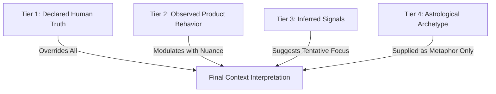
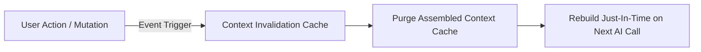
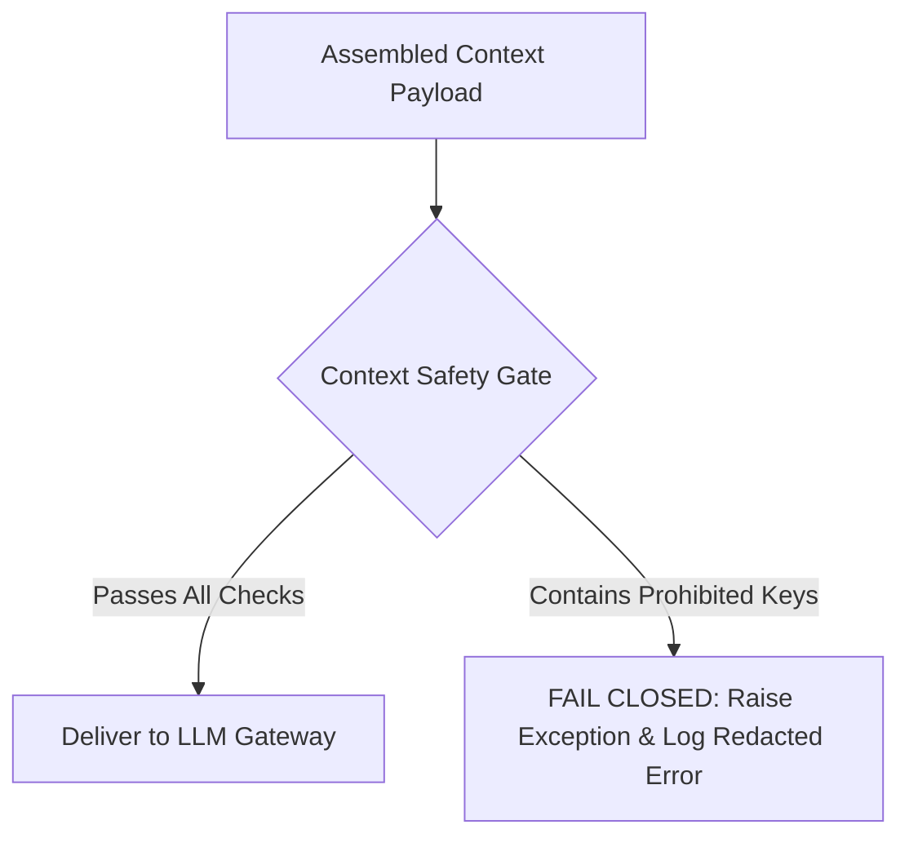
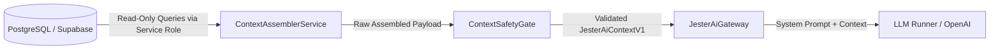

# JESTER — JESTER AI Context System V1 Specification

**Document Type:** Platform Architecture, AI Context Assembly, Privacy & Relational Intelligence Specification  
**Version:** V1.0  
**Status:** Canonical Platform Architecture  
**Scope:** Cross-cutting (JESTER AI Gateway, Context Assembly Service, Subsystem Boundaries, Data Contracts, Privacy Gates, Security Invariants)

---

## 1. Executive Summary

The **JESTER AI Context System V1** defines the controlled, deterministic context assembly layer between JESTER's multi-domain data systems and the JESTER AI relational copilot.

### Core Architectural Axiom:
> **"User Data → Context Assembly → Context Safety Gate → JESTER AI"**  
> **"JESTER AI must NEVER receive unrestricted access to the user's database."**

```text
┌────────────────────────────────────────────────────────────────────────┐
│                        RAW APPLICATION DATA                            │
│  (Profiles, Interests, Values, Lifestyle, Social, Comm, Intent,       │
│   Prompts, Preferences, Synastry V1, Behavioral Affinity, Trust)       │
└──────────────────────────────────┬─────────────────────────────────────┘
                                   │
                                   ▼
┌────────────────────────────────────────────────────────────────────────┐
│                   CONTEXT ASSEMBLER SERVICE                            │
│  • Surface-Specific Scope Resolver                                     │
│  • Authority Hierarchy Sorter (Declared > Observed > Inferred > Astro) │
│  • Categorical Normalizer & Data Minimizer                             │
└──────────────────────────────────┬─────────────────────────────────────┘
                                   │
                                   ▼
┌────────────────────────────────────────────────────────────────────────┐
│                 CONTEXT SAFETY GATE (FAILS CLOSED)                     │
│  • Blacklist Validator (Zero coordinates, zero PII, zero selfies)      │
│  • Privacy Isolation (Zero private messages, zero private prefs)       │
│  • Anti-Psychological Profiling Policy Check                           │
└──────────────────────────────────┬─────────────────────────────────────┘
                                   │ Validated JesterAiContextV1
                                   ▼
┌────────────────────────────────────────────────────────────────────────┐
│                          JESTER AI GATEWAY                             │
│  • Injects JESTER Persona & Tone Guardrails                            │
│  • Synthesizes Prompts for OpenAI / Anthropic / Local LLM Runner       │
│  • Programmatic Jargon & Mockery Filtering Post-Execution              │
└────────────────────────────────────────────────────────────────────────┘
```

### Core Governing Invariants:
1. **People First. Signals Second. Scores Last:** JESTER AI translates human connections into relatable dialogue; it never outputs synthetic percentage match scores or moral evaluations.
2. **Context Authority Hierarchy:**
   $$\text{DECLARED HUMAN TRUTH} \gg \text{OBSERVED PRODUCT BEHAVIOR} \gg \text{INFERRED RECOMMENDATION SIGNALS} \gg \text{ASTROLOGICAL INTERPRETATION}$$
   Astrology never overrides declared human reality. Behavioral observations never overwrite declared choices. Inferred signals remain tentative and probabilistic.
3. **AI Is Not the Source of Truth:** JESTER AI consumes structured, verified context. It does not independently determine or redefine a user's interests, values, intent, or compatibility.
4. **Absolute Prohibition on Psychological Profiling:** JESTER AI context is strictly barred from diagnosing personality disorders, attachment styles (e.g., "anxious-preoccupied"), mental health conditions, loneliness, or emotional instability, and never computes attractiveness or moral credit scores.
5. **Sanctity of Private Communication:** Private direct message text is **never mined, tokenized, or ingested** into JESTER AI for behavioral intelligence or user profiling.
6. **Minimum Necessary Context:** Every AI request receives solely the minimum structured payload required for that specific product surface.

---

## 2. Current-State Audit & Forensic Gap Analysis

A comprehensive audit of the repository and documentation was conducted to reconcile existing reality with V1 requirements:

| Dimension | Existing Implementation | Documented Architecture | Proposed V1 Context Architecture |
| :--- | :--- | :--- | :--- |
| **Prompt Assembly** | `prompts.py` builds hardcoded prompts strictly for single `InterpretationContract` signals and Deep Analysis blocks ([`backend/app/interpretation/prompts.py`](../backend/app/interpretation/prompts.py)). | High-level domain invariants documented in [`docs/AI.md`](AI.md). | Unified `ContextAssemblerService` generating strongly typed, validated `JesterAiContextV1` across 7 distinct product surfaces. |
| **Data Scope & Sourcing** | `/v1/compare` and `/people/{id}/why` fetch only birth data and synastry signals ([`backend/app/comparisons/router.py`](../backend/app/comparisons/router.py)). | Multi-domain context (Interests, Values, Lifestyle, Social, Comm, Intent, Prompts) documented across V1 specs. | Centralized multi-domain context assembly joining declared human truth, safe astrology, and aggregated behavioral signals. |
| **Declared vs. Inferred** | No distinction exists in runtime prompt structures; signals are passed as raw flat strings. | Conceptually distinguished in [`INTEREST_SYSTEM_V1_SPEC.md`](INTEREST_SYSTEM_V1_SPEC.md) and [`BEHAVIORAL_INTELLIGENCE_SYSTEM_V1_SPEC.md`](BEHAVIORAL_INTELLIGENCE_SYSTEM_V1_SPEC.md). | Explicit structural separation directly inside the context contract (`declared` vs. `observed_affinities` vs. `inferred_signals`). |
| **Safety Filtering** | Basic jargon regex check in `jester.py` ([`backend/app/interpretation/jester.py`](../backend/app/interpretation/jester.py)). | High-level privacy invariants in [`docs/SECURITY.md`](SECURITY.md). | Deterministic `ContextSafetyGate` that validates context payloads and fails closed before LLM invocation. |
| **Conflict Resolution** | Ad-hoc or undefined when signals conflict. | Stated conceptually ("declared outranks inferred"). | Formally codified conflict resolution rules engine with deterministic priority arbitration. |

---

## 3. Canonical AI Context Contract: `JesterAiContextV1`

All context provided to JESTER AI is serialized into a validated, strongly typed Pydantic data contract:

```typescript
interface JesterAiContextV1 {
  schema_version: "1.0.0";
  request_id: string;                 // UUIDv4 correlation ID
  surface: AiProductSurface;         // Surface scope enum
  assembled_at: string;              // ISO-8601 UTC timestamp
  
  // 1. Identity & Standing (Sanitized)
  actor: {
    user_id: string;                 // Anonymized internal UUID
    display_name: string;
    is_verified: boolean;            // True if holding ✓ Photo Verified badge
    account_standing: "good" | "limited";
  };

  // 2. Safe Location & Origin
  location: {
    current_city: string;            // Canonical city name (e.g. "Tbilisi")
    current_country: string;         // Canonical country name (e.g. "Georgia")
    origin_city?: string;            // Provided ONLY if user enabled hometown_visible
    origin_country?: string;
    relative_geo_tier?: "same_neighborhood" | "same_city" | "same_country" | "international";
  };

  // 3. Declared Human Truth (Highest Authority)
  declared: {
    interests: {
      primary: string[];             // Up to 5 primary onboarding tags
      secondary: string[];           // Selected secondary interests
      signature_interest?: string;   // "Talk about forever" interest
    };
    values: {
      core_value?: string;           // Single guiding compass anchor
      guiding_values: string[];      // Up to 4 supporting values
    };
    lifestyle: {
      daily_rhythm?: string;         // "early_riser" | "night_owl" | "flexible"
      activity_pace?: string;        // "slow_deliberate" | "dynamic_spontaneous"
      work_reality?: string;         // "remote_flexible" | "office_anchor"
      // Sensitive habits (drinking/smoking) omitted if toggled hidden
    };
    social_dynamics: {
      gathering_scale?: string;      // "one_on_one" | "small_crew" | "bustling"
      social_battery?: string;       // "recharge_solo" | "draws_energy"
      warm_up_pacing?: string;       // "instant_open" | "slow_burn"
    };
    communication: {
      preferred_depth?: string;      // "deep_meaningful" | "light_banter"
      conversational_role?: string;  // "storyteller" | "questioner" | "listener"
      messaging_format?: string;     // "quick_snack" | "thoughtful_letter"
      response_pace?: string;        // "unhurried" | "active_ping_pong"
    };
    intent: {
      primary_intent: string;        // e.g. "friendship" | "dating_serious"
      secondary_intents: string[];   // Up to 2 openness options
      is_platonic_strictly: boolean; // True if friendship/activity/collaboration
    };
    prompts: Array<{
      category_slug: string;
      prompt_question: string;
      user_answer: string;
    }>;                              // Published prompt answers (max 3)
  };

  // 4. Observed Product Telemetry & Inferred Signals (Separated Layer)
  behavioral?: {
    observed_affinities: Array<{
      category_slug: string;
      affinity_score: number;        // 0.00 to 1.00 (decayed)
      confidence_level: "tentative" | "established";
    }>;
    exploration_breadth?: "focused" | "balanced" | "exploratory";
    preferred_prompt_style?: string;
  };

  // 5. Safe Astrological Context (Categorical Only)
  astrology?: {
    sun_sign: string;                // e.g. "Aries"
    moon_sign: string;               // e.g. "Scorpio"
    ascendant_sign?: string;         // e.g. "Sagittarius" (null if time unknown)
    dominant_element: string;        // "Fire" | "Earth" | "Air" | "Water"
    dominant_modality: string;       // "Cardinal" | "Fixed" | "Mutable"
    synastry_dynamics?: Array<{
      theme: string;                 // e.g. "Conversational Spark"
      intensity: "high" | "moderate" | "subtle";
      archetype_narrative: string;   // Structured qualitative meaning
    }>;
  };

  // 6. Person-to-Person Bilateral Dynamics (Only on relational surfaces)
  relational?: {
    target_person: {
      display_name: string;
      is_verified: boolean;
      current_city: string;
      shared_interests: string[];
      complementary_interests: string[];
      shared_values: string[];
      shared_lifestyle_rhythms: string[];
      communication_pairing: {
        initiator_role: string;
        target_role: string;
        synergy_type: "reciprocal_harmony" | "complementary_balance";
      };
      intent_harmony: {
        mutual_primary: boolean;
        interaction_framework: "platonic_exploratory" | "romantic_intentional" | "collaborative";
      };
      synastry_hooks: string[];      // Non-jargon qualitative dynamic chips
    };
  };
}
```

---

## 4. Declared vs. Observed vs. Inferred Model

The Context Assembly System enforces structural differentiation so the AI model never confuses user sovereignty with algorithmic inference:

```text
┌───────────────────────────────┬───────────────────────────────┬───────────────────────────────┐
│ DECLARED CONTEXT              │ OBSERVED TELEMETRY            │ INFERRED SIGNALS              │
├───────────────────────────────┼───────────────────────────────┼───────────────────────────────┤
│ • What user explicitly stated │ • What product recorded       │ • What engine derived         │
│ • "I love photography"        │ • Opened 6 architecture cards │ • Architecture affinity = 0.82│
│ • Absolute authority          │ • Factual event counts        │ • Probabilistic guideline     │
│ • Directly editable by user   │ • Subject to 60-day auto-TTL  │ • Continuously decayed (30d)  │
│ • Framed as: Identity Truth   │ • Framed as: Recent Activity  │ • Framed as: Possible Passion │
└───────────────────────────────┴───────────────────────────────┴───────────────────────────────┘
```

### Prompt Guardrail Instruction:
> *"Treat `declared` fields as established human truth. Treat `behavioral.observed_affinities` as recent curiosities. Never inform the user that their behavioral affinity defines who they are. If declared interests conflict with observed affinities, declared interests always take precedence."*

---

## 5. Context Authority Hierarchy & Conflict Resolution

When signals within the assembled context exhibit tension or contradiction, the context assembler applies a deterministic resolution matrix:



### Deterministic Conflict Rules:

| Domain | Conflict Scenario | System Resolution | Approved AI Tone & Output |
| :--- | :--- | :--- | :--- |
| **Lifestyle vs. Astrology** | User declares `daily_rhythm = 'early_riser'`. Natal chart has Mars in Sagittarius (archetypally chaotic/nocturnal). | **Declared wins.** AI treats the user as an early riser. Planetary placement is referenced only as morning enthusiasm, never overriding sleep schedule. | *"You bring fiery morning drive and structured momentum."* |
| **Intent vs. Synastry** | Mutual intent is `friendship`. Synastry contains Venus-Mars conjunction (high physical attraction). | **Intent Primacy wins.** AI strictly suppresses all romantic/sexual framing; translates aspect into creative synergy or shared drive. | *"You share high creative momentum and an easy conversational spark."* |
| **Communication vs. Behavior** | User declares `response_pace = 'unhurried'`. Telemetry shows active rapid exchanges. | **Declared wins.** AI validates the declared unhurried preference; rapid exchanges are treated as situational exceptions without commentary. | *"You appreciate unhurried depth, leaving room for thoughtful notes."* |
| **Interests vs. Affinity** | Declared interest is `Jazz`. Observed telemetry shows high engagement with `Techno` profiles. | **Dual Context.** AI anchors primary identity on Jazz, framing Techno as an active recent exploration. | *"Rooted in a deep appreciation for jazz, while recently exploring electronic soundscapes."* |

---

## 6. Context Freshness, Caching & Lifecycle Invalidation

Context is assembled **just-in-time** from pre-computed, cached subsystem states. Stale context is architecturally barred from reaching the LLM gateway.



### Invalidation Triggers:
1. **Profile Mutation:** Updates to bio, display name, prompts, or city invalidate context immediately.
2. **Intent Shift:** Updating primary or secondary intent triggers a **hard cache wipe** and resets intent-specific behavioral affinity weights.
3. **Preference Modification:** Changing Discovery Preferences (`age`, `location_scope`, `astrology_mode`) purges discovery-scoped AI context.
4. **Primary Photo Replacement:** Resets verification state, immediately setting `actor.is_verified = false` until re-verified.
5. **Nightly Decay Job:** Recalculates behavioral affinity vectors with a 30-day exponential half-life; updates `last_aggregated_at`.
6. **User Reset Action:** Executing `POST /v1/users/me/personalization/reset` instantly deletes all behavioral affinity context records.

---

## 7. Surface-Specific Context Scopes

To enforce the principle of **Minimum Necessary Context**, the context assembler tailors the payload specifically to the target product surface:

```text
┌──────────────────────────────────────────────────────────────────────────────────┐
│                             SURFACE SCOPING MATRIX                               │
├───────────────────────┬──────────────────────────────────┬───────────────────────┤
│ Surface               │ Allowed Context Layers           │ Strictly Excluded     │
├───────────────────────┼──────────────────────────────────┼───────────────────────┤
│ 1. Main Chat (ME)     │ Identity, Declared Self, Safe    │ Relational partners,  │
│                       │ Astrology, Behavioral Affinities │ other users' data     │
├───────────────────────┼──────────────────────────────────┼───────────────────────┤
│ 2. Discovery Feed     │ Identity, Location, Declared     │ Private messages, raw │
│    Exploration        │ Intent, Top Shared Passions      │ charts, detailed why  │
├───────────────────────┼──────────────────────────────────┼───────────────────────┤
│ 3. Person Profile     │ Candidate Public Profile, Shared │ Unconnected private   │
│    Preview            │ Interests, Prompt Hook           │ fields, full synastry │
├───────────────────────┼──────────────────────────────────┼───────────────────────┤
│ 4. WHY Card           │ Bilateral Declared Harmony,      │ Direct chat history,  │
│                       │ Safe Synastry Hooks, Intent      │ raw coordinates       │
├───────────────────────┼──────────────────────────────────┼───────────────────────┤
│ 5. US (Connected)     │ Full Bilateral Interpersonal     │ Unrelated external    │
│                       │ Territory, Deep Analysis Aspects │ candidate profiles    │
├───────────────────────┼──────────────────────────────────┼───────────────────────┤
│ 6. Conversation       │ Quoted Prompt, Shared Topics,    │ Entire bio dump, raw  │
│    Starters           │ Communication Role Pairing       │ astrological degrees  │
├───────────────────────┼──────────────────────────────────┼───────────────────────┤
│ 7. Astrology Deep     │ Structured Categorical Aspects,  │ Private messages,     │
│    Explanation        │ Dominant Element / Modality      │ non-astrological data │
└───────────────────────┴──────────────────────────────────┴───────────────────────┘
```

---

## 8. Person-to-Person Bilateral Context Boundary

When JESTER AI reasons about two users (Surfaces 3, 4, 5, 6), privacy walls are strictly enforced between User A and User B:

```text
┌──────────────────────────────────────┐     ┌──────────────────────────────────────┐
│          USER A (CALLER)             │     │         USER B (CANDIDATE)           │
├──────────────────────────────────────┤     ├──────────────────────────────────────┤
│ • Full private declared context      │     │ • Safe public profile ONLY           │
│ • Private discovery preferences      │     │ • Declared public interests & values │
│ • Behavioral exploration history     │     │ • Public prompt answers              │
│ • Full personal natal placements     │     │ • Safe derived placements ONLY       │
└──────────────────┬───────────────────┘     └──────────────────┬───────────────────┘
                   │                                            │
                   └─────────────────────┬──────────────────────┘
                                         │
                                         ▼
                   ┌───────────────────────────────────────────┐
                   │        SAFE BILATERAL OVERLAP ONLY        │
                   │ • Shared Interests & Values               │
                   │ • Communication Role Pairing              │
                   │ • Intent Alignment                        │
                   │ • Pre-calculated Synastry Dynamic Hooks   │
                   └───────────────────────────────────────────┘
```

### Non-Leakage Invariants:
- User A's private discovery filters (e.g. strict age dealbreakers) are **never revealed** to User B or used in bilateral copy.
- User B's hidden habits (e.g. smoking, drinking marked private) are **never exposed** to User A through AI conversational inferences.

---

## 9. The Context Safety Gate (Fail-Closed Architecture)

Before any assembled context payload is delivered to the LLM Gateway, it must pass through the **Context Safety Gate**. If any validation rule fails, the gate **fails closed**—aborting the request and raising `ContextSafetyViolationException`.



### Safety Gate Validation Pipeline:
1. **Blacklist Scan:** Recursively inspects the JSON payload for prohibited keys:
   `["password", "token", "jwt", "body", "latitude", "longitude", "birth_time", "selfie", "evidence", "report", "block", "score_numeric", "introvert_score", "attractiveness_score"]`.
2. **PII Sanitization:** Asserts zero unmasked email addresses, raw phone numbers, or social media handles exist in prompt answers or bio strings.
3. **Astrology Jargon Pre-Filter:** Asserts zero technical aspect degrees or numerical orb tolerances are included in prompt inputs.
4. **Intent Protection Check:** Asserts that if `is_platonic_strictly == true`, all romantic dynamic hooks have been pruned from the payload.

---

## 10. Explicit Context Exclusions Matrix

The following table authoritatively defines the platform's forbidden-context boundaries:

| Data Element | JESTER AI Ingestion Status | Operational Justification & Security Invariant |
| :--- | :---: | :--- |
| **Raw Message Bodies (`messages.body`)** | 🚫 **NEVER** | Sanctity of private communication. AI never mines private chat for user profiling. |
| **Exact GPS Coordinates (`lat`, `long`)** | 🚫 **NEVER** | Anti-stalking & location privacy. Only canonical city/country names permitted. |
| **Verification Selfies / Biometrics** | 🚫 **NEVER** | Biometric data containment. Verification evidence is client-inaccessible and 30-day auto-pruned. |
| **Private Birth Data (`birth_time`, `lat/long`)** | 🚫 **NEVER** | Owner-only table (`birth_data`). AI receives only derived categorical placements. |
| **Community Reports & Moderation Logs** | 🚫 **NEVER** | Prevents AI prejudice, bias, or leakage of confidential trust & safety investigations. |
| **Raw Telemetry Logs & Dwell Times** | 🚫 **NEVER** | Anti-surveillance. AI receives only high-level decayed affinity scores ($t_{1/2} = 30\text{d}$). |
| **Private Discovery Preferences** | 🚫 **NEVER** | Candidate confidentiality. Excluded candidates must never deduce they were filtered out. |
| **Numeric Compatibility Match %** | 🚫 **NEVER** | *"Scores last."* AI explains dynamic connections through qualitative human narratives only. |
| **Psychological / Attachment Labels** | 🚫 **NEVER** | Non-diagnostic boundary. JESTER never assigns MBTI, clinical, or personality types. |
| **Attractiveness / Desirability Tiers** | 🚫 **NEVER** | Rejects algorithmic human ranking. All members are treated with equal dignity. |

---

## 11. Behavioral Intelligence Integration Rules

Context consumption from [`docs/BEHAVIORAL_INTELLIGENCE_SYSTEM_V1_SPEC.md`](BEHAVIORAL_INTELLIGENCE_SYSTEM_V1_SPEC.md) is strictly regulated:

```json
// APPROVED BEHAVIORAL CONTEXT STRUCTURE:
{
  "observed_affinities": [
    {
      "category_slug": "analog_photography",
      "affinity_score": 0.84,
      "confidence_level": "established"
    }
  ],
  "exploration_breadth": "balanced",
  "preferred_prompt_style": "narrative_quirks"
}
```

### Ingestion Invariants:
- If a user has toggled `personalization_enabled = false` in their behavioral settings, the `behavioral` context object is serialized as `null`.
- If a user has executed a personalization reset, all affinity records remain empty until new observations meet the multi-session threshold.
- Behavioral affinity is treated as an **activity clue**, never as an identity imperative.

---

## 12. Explainability & Transparent AI Reasoning

When JESTER AI provides advice or explains why two people might connect, its reasoning must be strictly grounded in the allowed context:

```text
┌─────────────────────────────────────────────────────────────┐
│ ❌ REJECTED (CREEPY / PSEUDO-SCIENTIFIC EXPLANATIONS)       │
├─────────────────────────────────────────────────────────────┤
│ • "Our AI analyzed your subconscious attraction patterns."  │
│ • "You are 89% compatible based on your psychological mesh."│
│ • "Your chart dictates that you will fall in love with them"│
├─────────────────────────────────────────────────────────────┤
│ ✅ APPROVED (GROUNDED / HUMBLE JESTER EXPLANATIONS)         │
├─────────────────────────────────────────────────────────────┤
│ • "You've both been exploring analog photography lately."   │
│ • "You both answered prompts about slow morning routines."  │
│ • "Different creative mediums, identical nocturnal pace."   │
└─────────────────────────────────────────────────────────────┘
```

---

## 13. Data Ownership, Access Policies & Service Topology

Context assembly operates within a strictly segmented service topology:



### Access Boundaries:
- `ContextAssemblerService` runs on the backend server using the internal database connection pool. It **never exposes database connection objects to the LLM runner**.
- Client applications cannot directly invoke `ContextAssemblerService`; context is assembled purely on-demand within authorized API endpoints (`/v1/interpretations/*`, `/v1/chat/*`).

---

## 14. API & Internal Service Contracts

Context assembly is exposed internally within the FastAPI application layer:

### 14.1 Python Service Interface
```python
class IContextAssemblerService(ABC):
    @abstractmethod
    async def assemble_context(
        self,
        actor_id: UUID,
        surface: AiProductSurface,
        target_user_id: UUID | None = None,
        db_conn: psycopg.Connection = None,
    ) -> JesterAiContextV1:
        """
        Assembles, normalizes, and validates surface-specific AI context.
        Raises PrivacySafeNotFoundException if target is blocked or hidden.
        Raises ContextSafetyViolationException if payload trips safety gate.
        """
        pass
```

### 14.2 Internal Debug / Verification Endpoint (Non-Production Only)
- **Path:** `GET /v1/ai/context/inspect?surface={surface}&target_user_id={uuid}`
- **Auth:** Bearer JWT with `admin` or `developer` role.
- **Environment Gate:** Aborts with `HTTP 403 Forbidden` if `ENV == 'production'`.
- **Response:** Returns sanitized `JesterAiContextV1` JSON payload for automated regression testing and compliance auditing.

---

## 15. Context Logging, Redaction & Observability

To balance observability with strict user privacy:

- **Redacted Payloads in Logs:** Full AI context payloads are **never logged to disk, stdout, or cloud log aggregators**.
- **Allowed Telemetry:**
  ```json
  {
    "event": "ai_context_assembled",
    "request_id": "c7a84e2a-...",
    "surface": "why_card",
    "actor_id_hash": "sha256(user_id)",
    "context_size_bytes": 1420,
    "assembly_latency_ms": 14.2,
    "gate_status": "passed"
  }
  ```
- **Error Captures:** If an exception occurs, error logs record the error code, request ID, and stack trace—stripping all user prompts, names, and context values.

---

## 16. Failure Modes & Graceful Degradation

The Context System degrades gracefully without breaking the user experience:

| Failure Mode | Trigger Condition | System Degradation & Fallback Behavior |
| :--- | :--- | :--- |
| **Safety Gate Trip** | Prohibited key or unmasked PII detected in context. | **Fails Closed:** Drops request; logs alert; returns deterministic Georgian fallback insight from Content Library. Zero raw error leaked to client. |
| **Astrology Incomplete** | User birth time unknown ($Ascendant = null$). | Placidus polar error / missing houses are gracefully omitted; context provides Sun, Moon, and dominant element only. |
| **Personalization Opt-Out** | User toggles off activity learning. | Behavioral context block is set to `null`; AI relies 100% on declared interests and core values. |
| **Cold-Start Account** | Brand new account ($N = 0$ events). | Context populates declared onboarding profile; behavioral block is omitted cleanly. |
| **Mutual Block Encounter** | Caller or target has active block. | Raises `PrivacySafeNotFoundException` (HTTP 404). Zero context generated. Zero existence oracle leaked. |

---

## 17. Testing & Verification Plan

Automated test suites must rigorously assert context integrity and isolation:

1. **Authority Hierarchy Tests (`tests/test_ai_context_authority.py`):**
   - Asserts declared lifestyle overrides conflicting astrological archetypes.
   - Asserts platonic intent strictly suppresses romantic framing in synastry prompts.
2. **Context Safety Gate Tests (`tests/test_ai_context_safety_gate.py`):**
   - Injects mock prohibited keys (`latitude`, `messages.body`, `selfie_bytes`) and asserts `ContextSafetyViolationException` is raised.
   - Verifies fail-closed execution and zero LLM network dispatch.
3. **Surface Scope Tests (`tests/test_ai_context_scopes.py`):**
   - Asserts Main Chat context contains zero external candidate data.
   - Asserts Person Profile context strips candidate's private discovery preferences.
4. **Behavioral Opt-Out Tests (`tests/test_ai_context_behavioral.py`):**
   - Asserts calling personalization reset wipes `behavioral` block from context.

---

## 18. V1 vs. Future Roadmap

| Dimension | Version 1 (Current Scope) | Future Evolution |
| :--- | :--- | :--- |
| **Context Assembly** | Synchronous, just-in-time relational join. | Edge-cached context workers with incremental Redis streaming. |
| **Memory Architecture** | Stateless per-request assembly; zero autonomous agent memory. | Ephemeral multi-turn conversational session buffer (max 5 turns). |
| **Explainability** | Rule-based template chips and grounded prompts. | Structured chain-of-thought verification with citation links. |
| **LLM Gateway** | External API client with post-execution jargon regex filter. | Streaming client with real-time token-level safety intervention. |

---

## 19. Open Product Decisions Requiring Product Owner Approval

1. **Hometown / Origin Context Granularity:** Should JESTER AI reference hometown differences internationally (e.g. *"You're both in Tbilisi, but carry roots from Rome and Kutaisi"*), or restrict origin commentary to domestic Georgian regions? *(Recommended: Allow broad domestic and international origin bridges with zero stereotyping).*
2. **Conversation Starter Quoting:** When generating conversation starters from prompt cards, should the AI quote the prompt verbatim, or rephrase it playfully? *(Recommended: Quote verbatim in quotes, followed by a witty JESTER conversational hook).*
3. **Astrology Depth in Main Chat:** Should the general copilot chat surface astrological insights proactively, or only when explicitly asked by the user? *(Recommended: Blend subtle archetypal warmth proactively, but reserve deep astrological breakdowns for explicit user inquiries).*
