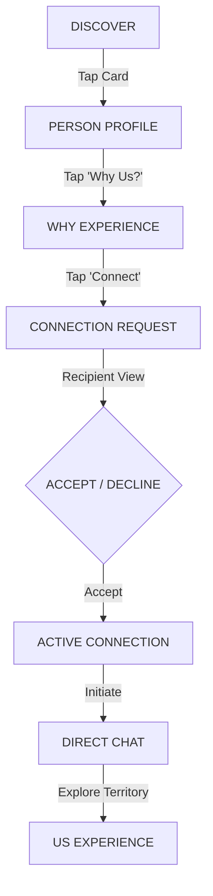

# JESTER — Product Identity & UI/UX Design Brief

**Document Type:** Master Product Identity, UI/UX Strategy & Design System Brief  
**Author:** Senior Product Design & UX Strategy  
**Audience:** Product Designers, UI/UX Designers, Brand Strategists, Design Engineers  
**Target Environment:** iOS, Android (React Native), Web (React / Vite) — Mobile-First  
**Primary Locale:** Georgian (`ka`) First; English (`en`) Secondary  
**Status:** Authoritative Foundation Document  

---

# Executive Preface: How to Read This Brief

This document is the single source of truth for designing the **JESTER** product experience. 

It is written for a product designer who is approaching the project for the first time. It is not an abstract mood board, nor is it a generic startup pitch deck. It is an operational design specification that translates locked architectural invariants, proprietary relationship algorithms, mathematical models, and human psychology into concrete screen hierarchies, interaction patterns, typographic rules, and visual systems.

Throughout this brief, three categories of information are explicitly separated:
1. **[EXISTING PRODUCT DECISION]:** Firmly codified backend behaviors, database schemas, security invariants, or product boundaries that the UI must respect and cannot alter.
2. **[DESIGN INTERPRETATION]:** The psychological, cognitive, and emotional translation of those product decisions into interface logic.
3. **[DESIGN RECOMMENDATION]:** Actionable UI/UX proposals for components, layouts, motion, and visual treatments ready for high-fidelity execution in Figma and code.

---

# 1. Product Definition

### 1.1 What JESTER Is
**JESTER** is a next-generation **People Discovery and Relationship Intelligence** platform. 

It is a digital environment engineered to help human beings understand themselves, understand other people, and navigate the subtle, invisible dynamics of interpersonal chemistry—spanning friendships, creative collaborations, activity partnerships, and intentional dating.

Beneath the surface, JESTER runs a high-precision, deterministic astronomical calculation engine powered by Swiss Ephemeris (`pyswisseph`) and an advanced Synastry algorithm (`synastry-v1.0.0`). Above the surface, however, JESTER is completely humanized: it translates astronomical geometry into sharp, relatable, psychologically astute observations about how two people communicate, where they find friction, why they spark, and what makes them click.

```text
       ASTROLOGICAL ENGINE (Swiss Ephemeris / C-Bindings)
                               ↓
          DETERMINISTIC SIGNALS (Aspect Geometry & Orbs)
                               ↓
         RELATIONSHIP INTELLIGENCE (Semantic Contracts)
                               ↓
         JESTER VOICE LAYER (Witty, Observant, Sharp)
                               ↓
    USER EXPERIENCE (Curiosity → Understanding → Connection)
```

### 1.2 The Problem JESTER Solves
Modern social and discovery platforms suffer from two distinct product failures:

1. **The Superficiality of the Dating / Social Swipe:**  
   Platforms like Tinder, Bumble, or Hinge reduce complex human beings to photo galleries and resume-like prompts. Users are forced to evaluate candidates through rapid, gamified swiping. A "match" is declared based solely on reciprocal visual approval, but neither user has any clue *why* they might connect, how they will talk, or where their communication will stall. The result is chronic swipe fatigue, superficial evaluation, ghosting, and conversational paralysis.

2. **The Esoteric Isolation of Traditional Astrology Apps:**  
   Apps like Co-Star, The Pattern, or Sanctuary either trap users in solitary self-obsession (*"Look at my chart, look at my day"*) or alienate them with dense, cryptic jargon (*"Saturn square your 7th house cusp"*). They are fatalistic, dramatic, and offer zero practical bridges for real-world social interaction.

**JESTER eliminates this gap.** It replaces superficial visual vetting and mystical astrology jargon with **substantive relationship intelligence**.

### 1.3 Who JESTER Is For
The core user persona is defined simply as:
> **"People who are interested in people."**

* **Primary Demographic:** Young adults aged **18–28** (university students, creative professionals, digital natives, urban social explorers).
* **Psychographic Profile:** Self-reflective, socially curious, culturally literate, meme-fluent, and skeptical of corporate superficiality. They already share personality tests, send daily screenshots to group chats, and analyze interactions with friends and romantic partners.
* **Core Need:** A language to talk about human dynamics that feels intellectually sharp, slightly cheeky, completely grounded in reality, and visually modern.

### 1.4 What Makes JESTER Different
Traditional platforms ask: *"Do you like how they look?"*  
Traditional astrology apps ask: *"Who are you based on the stars?"*  
**JESTER asks: *"Why do you two connect?"***

```text
┌─────────────────────────────────────────────────────────────────────────┐
│                           THE JESTER AXIOM                              │
│                                                                         │
│           "They show the match. JESTER explains the connection."        │
│                                                                         │
│       Score creates curiosity.       Interpretation creates value.      │
│                      The insight becomes the invitation.                │
└─────────────────────────────────────────────────────────────────────────┘
```

### 1.5 The Core User Experience: The Relational Loop
The entire product architecture maps to a four-stage psychological progression:

$$\mathbf{ME} \longrightarrow \mathbf{YOU} \longrightarrow \mathbf{US} \longrightarrow \mathbf{MORE\ PEOPLE}$$

1. **ME (Self-Understanding):** *"What does JESTER notice about me?"* — The user receives sharp, unvarnished observations about their social presence, emotional processing, and blind spots.
2. **YOU (Other-Understanding):** *"What does JESTER notice about this person?"* — The user inspects a candidate's profile, discovering their authentic voice, values, and rhythm without violating privacy.
3. **US (Interpersonal Dynamics):** *"What happens when we meet?"* — JESTER reveals the chemistry, communication styles, intellectual friction, and conversational starters between two specific people.
4. **MORE PEOPLE (Discovery):** *"Who else is out there that I resonate with?"* — Armed with relational context, the user explores an intentional discovery feed designed to inspire curiosity rather than mindless consumption.

---

# 2. The JESTER Character & Persona

### 2.1 The Archetypal Origin: The Court Jester
Historically, the Court Jester was never a mindless clown. He was the most intellectually dangerous figure in the medieval court:
* He was the **only person permitted to speak unvarnished truth to the king** without losing his head.
* He used **humor, satire, paradox, and irony** to disarm defensive egos and expose foolishness, vanity, and hidden realities.
* While everyone else flattered the monarch, the Jester held up a polished mirror.

```text
FLATTERY (False Comfort)  ←────────  JESTER  ────────→  CRUELTY (Abuse)
                                        │
                            Truth Wrapped in Wit
```

### 2.2 What Must NOT Be Interpreted Literally
A product designer must avoid literal, kitschy historical tropes:
* ❌ **NO medieval fantasy aesthetics:** No parchment textures, Gothic calligraphy, royal crowns, or Renaissance faire motifs.
* ❌ **NO clown imagery:** No three-pronged floppy hats, bells, oversized shoes, harlequin diamonds, or circus paraphernalia.
* ❌ **NO cartoon mascot:** JESTER is not a cartoon mascot bouncing across the screen like Clippy or Duolingo's owl.

### 2.3 The Modern Product Manifestation
In modern UI/UX design, JESTER appears as an **invisible, razor-sharp editorial presence**. 

Think of JESTER as **that extraordinarily perceptive, stylish, slightly cynical best friend who can read a room in three seconds, immediately identifies the unspoken tension between two people, and leans over to whisper a witty, devastatingly accurate observation that makes you laugh out loud.**

### 2.4 Personality Dimensions & Design Translation

| Personality Dimension | Meaning for Copy & Voice | Translation into UI / Interaction Design |
| :--- | :--- | :--- |
| **Intelligent** | Articulate, psychologically acute, references real human social realities. | Clean, structured typography; high information density; sophisticated card layouts. |
| **Observant** | Notices subtle contradictions (*"You claim you want peace, but you thrive on drama"*). | Micro-callouts, "JESTER Notices" chips, highlighted conversational friction points. |
| **Witty & Playful** | Clever double-entendres, sharp punchlines, conversational irony. | Delightful micro-animations, unexpected tactile button responses, crisp copy reveals. |
| **Cheeky & Sarcastic** | Teases user vanity; punctures pretense without cynicism. | Bold typographic pull-quotes; contrast-driven badges; zero corporate euphemisms. |
| **Warm & Safe** | Never punches down; respects personal boundaries and vulnerability. | Protective privacy badges, soft ambient card glows, generous touch padding, reassuring empty states. |
| **Confident & Direct** | Speaks with calm authority; never apologetic or desperate for likes. | High-contrast action buttons, solid geometric surfaces, unambiguous navigation states. |
| **Human & Modern** | Completely free of cosmic jargon; speaks contemporary urban vernacular. | Editorial photography framing, clean sans-serif typography, iOS/Android native conventions. |

---

# 3. Brand Positioning: What JESTER Is NOT

To protect the designer from falling into generic design tropes, JESTER is explicitly bounded by four negative constraints:

```text
┌────────────────────────────────────────────────────────────────────────┐
│                        WHAT JESTER IS NOT                              │
│                                                                        │
│   ❌ NOT a Traditional Astrology App (No horoscopes, no crystal balls)  │
│   ❌ NOT a Dating-Only App (Platonic, creative, activity & romantic)    │
│   ❌ NOT a Generic AI Chatbot (No open-ended conversational hallucinations) │
│   ❌ NOT a Match Percentage Calculator (No flat "87% Compatible" stats) │
└────────────────────────────────────────────────────────────────────────┘
```

### 3.1 Why It Is NOT an Astrology or Horoscope App
* **[EXISTING PRODUCT DECISION]:** Swiss Ephemeris is strictly JESTER's deterministic mathematical backend.
* **[DESIGN INTERPRETATION]:** Astrology is computational infrastructure, exactly like an encryption algorithm or a database index. Users do not need to see cryptographic hashes to trust an app; similarly, JESTER users do not need to decipher planetary natal wheels to understand interpersonal chemistry.
* **UI Rule:** Never show astrological natal wheels, planetary degree symbols ($\degree$), house cusps, or transit matrices in primary user flows. The interface must look like a contemporary editorial social product, not an occult temple.

### 3.2 Why It Is NOT a Dating-Only App
* **[EXISTING PRODUCT DECISION]:** JESTER supports six distinct relationship intents:
  1. `friendship` (Platonic deep connection)
  2. `dating_serious` (Intentional long-term partnership)
  3. `dating_open` (Romantic exploration)
  4. `activity_partner` (Workout, travel, hobby companion)
  5. `collaboration` (Creative, startup, artistic co-creator)
  6. `just_exploring` (Serendipitous social curiosity)
* **[DESIGN INTERPRETATION]:** Designing JESTER as a romantic meat-market ruins its utility for friendships and creative collaborations.
* **UI Rule:** Avoid romantic-only iconography (no floating red hearts, no Cupid arrows). Use universal symbols of connection (interlocking geometry, sparks, dialogue bubbles, resonance rings).

### 3.3 Why It Is NOT an AI Chatbot
* **[EXISTING PRODUCT DECISION]:** JESTER's intelligence is rule-governed, contract-based, and deterministic. LLMs are used strictly as a stylistic translation layer to voice structured semantic signals into the JESTER tone.
* **[DESIGN INTERPRETATION]:** An open chat interface (*"Ask JESTER anything..."*) invites hallucinations, wastes user attention, and feels like every lazy AI wrapper on the market.
* **UI Rule:** The primary product is structural, visual, and navigable. AI surfaces appear contextually (e.g., generating conversation starters, synthesizing a WHY breakdown, delivering Today's Energy), not as an omniscient chat window dominating the home screen.

---

# 4. Core Product Philosophy & UX Translation

### 4.1 "People are more interesting when you know how to see them."
* **The Philosophy:** Most digital profiles present a flat, sterile resume: photo, age, job title, generic hobby tags (*"Travel, Coffee, Dogs"*). JESTER believes every person is a fascinating bundle of contradictions, communication styles, emotional habits, and hidden motivations.
* **Concrete UX Translation:**
  - Profiles highlight **human contradictions and behavioral styles** rather than static stats.
  - Instead of *"Loves Cinema"*, JESTER highlights: *"Analyzes movie plots for two hours afterward; needs someone who won't get annoyed by plot-hole debates."*
  - The UI elevates **Prompts & Self-Expression Answers** above basic bio text.

### 4.2 "See people differently."
* **The Philosophy:** Shift the user from judgment (*"Is this person hot or not?"*) to curiosity (*"How does this person experience the world, and what would happen if we started talking?"*).
* **Concrete UX Translation:**
  - Discovery cards feature **Qualitative Resonance Hooks** (e.g., *"Both driven by restless curiosity — you will either inspire each other or stay up until 4 AM arguing about urban architecture"*).
  - The interface provides immediate **Conversational Handholds** (pre-seeded icebreakers and debate topics) so the user never faces the terror of an empty text box.

---

# 5. Core User Journey

The JESTER user journey is an intentional, permission-gated relationship progression:



### Stage-by-Stage UX Blueprint

| Stage | Route | Emotional Purpose | Functional Purpose & Key UI Elements |
| :--- | :--- | :--- | :--- |
| **1. DISCOVER** | `/discover` | **Curiosity & Serendipity** | Browsing candidate cards; filtering via Contextual Lenses; viewing qualitative resonance hooks; zero binary swiping. |
| **2. PERSON** | `/people/:id` | **Authentic Impression** | Full public profile view; inspecting authentic voice prompts, values compass, lifestyle cadence, and safe Big Three astrology tags. |
| **3. WHY** | `/people/:id/why` | **Revelation & Fascination** | Deep comparative breakdown; understanding shared synergies, dynamic friction, communication balance, and conversation topics. |
| **4. CONNECT** | `/people/:id` (Modal) | **Intentionality** | Packaging a connection request; selecting an intent reason; optionally quoting a specific prompt answer; writing a short note (max 200 chars). |
| **5. REQUEST** | `/connections` (Tab) | **Anticipation & Boundary** | Outbound: Pending badge with cancel option. Inbound: Accept / Decline buttons with quoted note preview; zero social pressure. |
| **6. ACCEPT** | State Transition | **Mutual Consent** | Bilateral agreement unlocks richer connection-only profile fields and direct messaging channels. |
| **7. CHAT** | `/chat/:id` | **Conversational Ease** | Text messaging pre-seeded with the sender's invitation note; contextual icebreakers pinned above keyboard; zero awkwardness. |
| **8. US** | `/compare/:id` | **Shared Relational Territory** | Deep ongoing relationship map; dynamic harmony tracking; shared discussion topics; living relational intelligence. |

---

# 6. Discovery Experience

### 6.1 Conceptual Signal Weighting & UI Visual Hierarchy
**[EXISTING PRODUCT DECISION]:** In JESTER Discovery Preferences V1, candidate ranking is governed by a multi-signal composite score:

```text
┌──────────────────────────────────────────────────────────────────┐
│                   DISCOVERY SIGNAL WEIGHTING                     │
│                                                                  │
│   Intent Alignment         25%  ████████████████████             │
│   Location Proximity       20%  ████████████████                 │
│   Shared Interests         20%  ████████████████                 │
│   Values Compass           15%  ████████████                     │
│   Prompts / Authentic Voice 10%  ████████                         │
│   Astrological Harmony     10%  ████████                         │
└──────────────────────────────────────────────────────────────────┘
```

#### How This Dictates Visual Hierarchy on the Discovery Card:
1. **Top Anchor (Primary Lens — Intent & Location):**
   - The user immediately sees *why* this person is here and *where* they are (e.g., `[ Activity Partner • Tbilisi ]` or `[ Creative Collab • Batumi ]`).
   - A candidate whose intent clashes with yours will **never** appear due to bilateral intent partitioning.
2. **Body Focal Point (Human Voice & Common Ground — Interests & Prompts):**
   - The card features the candidate's primary prompt answer and highlighted shared interest tags.
   - Example: *"My signature rabbit hole: Analog modular synths"* + `Shared: Photography, Architecture`.
3. **The JESTER Resonance Hook (Values & Qualitative Insight):**
   - A dedicated editorial card banner synthesizing the connection:  
     *"Both guided by Autonomy as your True North. You will respect each other's boundaries instantly."*
4. **Quiet Astrological Presence (Subtle Footer Anchor — 10% Weight):**
   - Discrete, elegant tags showing Sun, Moon, and Ascendant signs (e.g., `♈ Aries Sun • ♒ Aquarius Moon • ♌ Leo Rising`).
   - **Never** dominant; always positioned as an understated secondary layer.

### 6.2 The 6 / 3 / 1 Feed Diversity Model
**[EXISTING PRODUCT DECISION]:** To prevent feed monotony, algorithmic echo chambers, and clone-matching, every batch of 10 discovery cards follows a strict diversity ratio:

```text
┌─────────────────────────────────────────────────────────────────────────┐
│                       10-CARD DIVERSITY MODEL                           │
│                                                                         │
│   [ 1 ] [ 2 ] [ 3 ] [ 4 ] [ 5 ] [ 6 ]   6 Direct Resonance              │
│   ───────────────────────────────────   (Shared interests, same intent) │
│   [ 7 ] [ 8 ] [ 9 ]                     3 Complementary Contrast        │
│   ─────────────────                     (Opposite styles, high spark)   │
│   [ 10 ]                                1 Serendipitous Wildcard        │
│   ──────                                (Surprise high-synergy outlier) │
└─────────────────────────────────────────────────────────────────────────┘
```

#### Visual Card Treatments for Diversity Types:
* **Direct Resonance (6/10):**  
  - Clean, harmonious styling. Soft indigo/slate border.
  - Tag: `✨ Natural Resonance` (Shared interests, aligned rhythms).
* **Complementary Contrast (3/10):**  
  - Dynamic visual accent. Subtle warm amber/coral edge highlight.
  - Tag: `⚡ Dynamic Spark` (e.g., *"Storyteller + Questioner"*, *"Night Owl + Early Bird"*).
* **Serendipitous Wildcard (1/10):**  
  - Premium editorial treatment. Subtle iridescent or violet gradient border.
  - Tag: `🎲 Wildcard Curiosity` (An unexpected match from outside your usual interest circles with remarkable synastric chemistry).

---

# 7. Person Profile

### 7.1 What a JESTER Profile Communicates
A JESTER profile is not a visual meat-market catalog (Dating), nor is it a vanity follower board (Social), nor is it a corporate resume (LinkedIn). 

It communicates **relational presence**: how this person thinks, what they care about, how they communicate, and what kind of space they occupy in a room.

```text
┌────────────────────────────────────────────────────────────────────────┐
│                        PROFILE TAXONOMY                                │
│                                                                        │
│   Dating Apps:     "Look at me."        (Physical desirability)        │
│   Social Networks: "Look at my life."   (Curated status & clout)       │
│   LinkedIn:        "Look at my career." (Professional competence)      │
│   JESTER:          "Here is how I am."  (Relational reality & voice)   │
└────────────────────────────────────────────────────────────────────────┘
```

### 7.2 Information Architecture Hierarchy
The profile is organized into five clearly demarcated structural zones:

```text
┌─────────────────────────────────────────────────────────────┐
│ 1. IDENTITY & VIBE HEADER                                   │
│    Avatar, Display Name ("First L."), Age, City, Occupation │
│    Photo Verification Badge (✓), Relationship Intent Badge  │
├─────────────────────────────────────────────────────────────┤
│ 2. JESTER "FIRST IMPRESSION" HOOK                           │
│    Witty, observant 1-sentence editorial card about how     │
│    this person shows up in social spaces                    │
├─────────────────────────────────────────────────────────────┤
│ 3. AUTHENTIC VOICE (PROMPTS)                                │
│    2–3 high-character prompt cards with user answers        │
│    (Each prompt card features a 1-tap "Connect via this" CTA│
├─────────────────────────────────────────────────────────────┤
│ 4. RELATIONAL COMPASS                                       │
│    • Core Value Anchor (e.g. "Truth Over Harmony")          │
│    • Social Rhythm (e.g. "Recharge Solo • Small Crews")     │
│    • Communication Style (e.g. "Direct Banter • Unhurried") │
├─────────────────────────────────────────────────────────────┤
│ 5. CURATED INTEREST GRAPH                                   │
│    Cluster chips: Primary Passions + "Rabbit Hole" interest │
├─────────────────────────────────────────────────────────────┤
│ 6. QUIET ASTROLOGICAL FOOTPRINT                             │
│    Safe Big Three Pills: Sun, Moon, Rising (No degrees)     │
└─────────────────────────────────────────────────────────────┘
```

---

# 8. WHY — The Signature Experience

### 8.1 "Why might this person be interesting to me?"
**WHY** is JESTER's crown jewel. It is the signature feature that converts passive curiosity into an irresistible conversational invitation.

It answers the question every human subconsciously asks when looking at another person:  
> *"What would actually happen if we met?"*

### 8.2 Deconstructing the WHY Architecture
**[EXISTING PRODUCT DECISION]:** In accordance with JESTER's security invariants, pre-connection users do not receive full raw synastry matrices. Instead, the backend generates a **Safe Comparative Preview** (`comparePreview`) that synthesizes multiple data layers into human language:

```text
┌─────────────────────────────────────────────────────────────────────────┐
│                          THE WHY SYNTHESIS                              │
│                                                                         │
│   Declared Human Truth (Interests, Values, Intent, Lifestyle, Prompts)  │
│                                   +                                     │
│   Deterministic Astrological Synastry (Harmony, Chemistry, Friction)    │
│                                   ↓                                     │
│                     JESTER WHY ENGINE (Backend)                         │
│                                   ↓                                     │
│                    HUMAN RELATIONSHIP INTELLIGENCE                      │
│                                                                         │
│   1. Connection Invitation Card ("The Insight")                         │
│   2. Communication Dynamic Balance (Storyteller vs. Questioner)         │
│   3. Dynamic Friction & Growth Point ("Where You Will Clash")           │
│   4. Three Concrete Conversation Starters ("What to Talk About")        │
└─────────────────────────────────────────────────────────────────────────┘
```

### 8.3 Screen Anatomy: The WHY Interface
1. **The Hero Dynamic Banner:**  
   Displays a high-contrast relationship thesis (e.g., *"High intellectual velocity with zero patience for pleasantries. You will either launch a project together in 48 hours or exhaust each other by midnight."*).
2. **Dimension Balance Meters (Qualitative, NOT Percentages):**
   - **Communication Flow:** `Effortless Ping-Pong` (Mercury-Air harmony)
   - **Attraction & Chemistry:** `High Voltage / Dynamic Friction` (Venus-Mars tension)
   - **Emotional Safety:** `Steady / Slow-Burn` (Moon-Earth grounding)
   - **Growth & Challenge:** `Provocative Catalyst` (Sun-Pluto aspect)
3. **Friction & Balance Module:**  
   Crucially, JESTER does not pretend every connection is perfect. It explicitly highlights the *healthy friction point*:  
   *"Where you will clash: Alexandre wants to act immediately; Davit wants to debate every theoretical risk first. If you don't assign a decision-maker, nothing gets built."*
4. **Conversation Starters (Interactive Icebreakers):**  
   Three clickable conversation starter cards. Tapping any starter opens the Connection Drawer with that starter pre-filled as the invitation note!

---

# 9. Astrology: The Quiet Intelligence Layer

### 9.1 The Governing Visual Rule
> **Astrology is the engine beneath the hood, not the paint on the car.**

A designer who fills JESTER with purple nebulas, glowing zodiac wheels, and esoteric glyphs has fundamentally failed the assignment.

```text
┌───────────────────────────────────────────────────────────────────────┐
│                      ASTROLOGY VISIBILITY RULES                       │
│                                                                       │
│   WHAT THE USER SEES:                                                 │
│   ✔ Clean text labels (e.g., "Aries Sun", "Scorpio Moon")             │
│   ✔ Subtle elemental color pips (Fire: Amber, Earth: Sage,            │
│      Air: Sky, Water: Indigo)                                         │
│   ✔ Qualitative dynamic chips (e.g., "Cardinal Drive", "Fixed Focus")  │
│                                                                       │
│   WHAT THE USER NEVER SEES:                                           │
│   ✖ Planetary longitudes, degrees, or minutes (e.g., 23°41' Aries)     │
│   ✖ House numbers or Placidus cusps (e.g., "7th House Cusp")          │
│   ✖ Aspect degree grids or orb tolerances (e.g., "Square 0.4° orb")   │
│   ✖ Raw birth dates, exact birth times, or geographic coordinates     │
│   ✖ Mystical or occult visual paraphernalia                           │
└───────────────────────────────────────────────────────────────────────┘
```

### 9.2 Visual Clichés to Avoid
* ❌ No dark indigo galaxy backgrounds with twinkling star overlays.
* ❌ No mystical crystal ball, tarot card, or incense iconography.
* ❌ No ancient Greek / Hellenistic faux-stone borders.
* ❌ No glowing neon constellation lines connecting dots.

### 9.3 How Astrology Quietly Supports Insights
Astrological signals should be surfaced as **subtle behavioral tags**:
- Instead of showing an aspect line between Mars and Saturn, render a tag: `Constructive Friction`.
- Instead of showing a Gemini-Mercury trine Aquarius-Mercury, render a tag: `High Mental Bandwidth`.
- In the user profile, the "Safe Big Three" appear as a clean horizontal trio of micro-badges:
  `[ ♈ Aries Sun ]` `[ ♒ Aquarius Moon ]` `[ ♌ Leo Rising ]`

---

# 10. JESTER AI: The Relational Copilot

### 10.1 The Anti-Chatbot Rule
JESTER AI is **NOT a conversational bot sitting in a blank chat room waiting for user prompts**. It is an **embedded contextual intelligence service**.

```text
TRADITIONAL AI APP: [ Blank Prompt Box ] → User must think of something to say.
JESTER AI:          Contextual Copilot   → Appears at critical friction points
                                           with proactive, structured insight.
```

### 10.2 Contextual Entry Points

```text
┌────────────────────────────────────────────────────────────────────────┐
│                        JESTER AI ENTRY POINTS                          │
│                                                                        │
│   1. ONBOARDING:     Generates the "Welcome Insight" upon chart math.  │
│   2. HOME:           Delivers "Today's Energy" (1–2 sharp sentences).  │
│   3. WHY SCREEN:     Synthesizes bilateral chemistry & friction.       │
│   4. CHAT COMPOSER:  Suggests 1-tap contextual icebreakers.            │
│   5. ME PROFILE:     Provides private self-reflection lens.            │
└────────────────────────────────────────────────────────────────────────┘
```

### 10.3 JESTER AI Personality & Guardrails
* **Tone:** Observant, witty, slightly sarcastic, human, warm.
* **Never Sycophantic:** Does not say *"Great question!"*, *"I'd be happy to help with that!"*, or *"As an AI..."*.
* **Never Lectures:** Does not write multi-paragraph essays. Max insight length is 2–3 sentences.
* **Prohibited Behaviors (Strict Safety Invariants):**
  - ❌ Never performs psychological profiling or mental health diagnoses (no labeling users as "narcissistic", "bipolar", or "anxious-avoidant").
  - ❌ Never predicts future events (no fortune-telling).
  - ❌ Never evaluates physical attractiveness or calculates "moral scores".
  - ❌ Never reads, profiles, or trains on private direct messages between users.

---

# 11. Brand Voice & Microcopy Guide

JESTER's voice is its primary brand moat. It is defined by the **Core Triad Formula**:

$$\text{OBSERVATION} \longrightarrow \text{CONTRADICTION} \longrightarrow \text{PUNCHLINE}$$

### 11.1 Tone Distribution
* **Witty & Observant (35%):** Sharp human truth delivered with humor.
* **Playful & Teasing (29%):** Affectionately poking social vanity.
* **Warm & Grounded (18%):** Reassuring validation during vulnerable moments.
* **Bold & Direct (9%):** Cutting through social excuses.
* **Savage (8%):** High-impact truth-telling for extreme contradictions.
* **Romantic / Tender (1%):** Reserved strictly for deep, verified relationship resonance.

### 11.2 Microcopy Comparison Table

| Product Surface | ❌ Generic / Wrong Tone | ❌ Toxic / Cruel Mockery | ✔ Authentic JESTER Voice |
| :--- | :--- | :--- | :--- |
| **Aries Placement** | *"You are a brave and bold pioneer who loves challenges."* | *"You're an aggressive infant who throws tantrums when ignored."* | *"საკუთარ თავს „თავისუფალ მოაზროვნედ“ ასაღებ, მაგრამ მოდი ნუ გავართულებთ: უბრალოდ ვერავინ გეტყვის, რა უნდა იფიქრო."* |
| **Empty Discovery Feed** | *"No users found in your area! Check back soon."* | *"Nobody wants to hang out with you. Try being less boring."* | *"ყველა პოტენციური კანდიდატი დაათვალიერე. ან შენი ფილტრებია ზედმეტად მკაცრი, ან თბილისს ცოტა დრო სჭირდება ახალი ხალხის გასაჩენად."* |
| **Connection Request Sent** | *"Your invitation has been submitted successfully."* | *"Now sit by your phone and pray they don't ignore you."* | *"მოთხოვნა გაგზავნილია. ბურთი მათ მოედანზეა — შენ კი შეგიძლია ცხოვრება მშვიდად განაგრძო."* |
| **WHY Clash / Friction Point** | *"You might experience astrological incompatibility in communications."* | *"You two will hate each other within 10 minutes."* | *"სანამ შენ დეტალებს აანალიზებ, ის უკვე კარს აღებს. ან ერთმანეთს დააბალანსებთ, ან ერთი მეორეს ნევროზამდე მიიყვანს."* |
| **Birth Time Unknown** | *"Birth time missing. Error calculating rising sign."* | *"You don't even know when you were born? Serious fail."* | *"დაბადების ზუსტი დრო არ იცი? არაუშავს. ასცენდენტს ვერ გამოვთვლით, მაგრამ შენს მთავარ ბუნებას Jester მაინც უშეცდომოდ დაიჭერს."* |

---

# 12. Visual Design Direction

### 12.1 Visual Mood & Aesthetic Character
JESTER’s visual mood is **Editorial Digital Luxury**:
* Think of a fusion between high-end architectural print magazines (*Kinfolk*, *Apartamento*), modern typography-led digital interfaces (Linear, Raycast), and warm, tactile consumer products (Cash App, Arc Browser).
* It feels **structured, mature, razor-sharp, and culturally self-assured**. It rejects both the sterile corporate look of enterprise SaaS and the bubblegum gamification of swipe apps.

```text
┌────────────────────────────────────────────────────────────────────────┐
│                        AESTHETIC TRIANGLE                              │
│                                                                        │
│                      Architectural Rigor (Linear)                      │
│                                  ▲                                     │
│                                 / \                                    │
│                                /   \                                   │
│                               /     \                                  │
│                              /   🃏  \                                 │
│                             /         \                                │
│                            /           \                               │
│  Cultural Irreverence (Monocle) ──────── Tactile Consumer Warmth (CashApp)│
└────────────────────────────────────────────────────────────────────────┘
```

### 12.2 Color Philosophy & Token Palette
**[EXISTING PRODUCT DECISION]:** JESTER's design tokens (`frontend/src/ui/tokens/colors.ts`) enforce a high-contrast dark slate foundation with electric indigo and royal violet accents:

```typescript
export const colors = {
  // Foundations & Surfaces
  background:     "#f8fafc", // Cool alabaster slate
  surface:        "#ffffff", // Pure crisp white
  surfaceSubtle:  "#f1f5f9", // Gentle grey container
  surfaceMuted:   "#e2e8f0", // Divider & boundary tone
  surfaceInverse: "#0f172a", // Deep midnight obsidian (Cards / Dark Mode)

  // Typography Tones
  textPrimary:    "#0f172a", // Maximum contrast slate-black (98% readable)
  textSecondary:  "#64748b", // Neutral editorial slate
  textMuted:      "#94a3b8", // Quiet metadata grey
  textInverse:    "#ffffff", // High-contrast text on dark cards

  // Primary Brand Accent (Electric Royal Indigo)
  accent:         "#6366f1", // Main CTAs, active indicators
  accentHover:    "#4f46e5", // Hover & active press states
  accentSubtle:   "#eef2ff", // Tinted badges & pill backgrounds
  accentBorder:   "#c7d2fe", // Accent boundaries

  // Signature Brand Highlight (JESTER Royal Violet)
  highlight:      "#9333ea", // Curiosity scores, signature hooks, WHY highlights
  highlightSubtle:"#fdf4ff", // Ambient card glow, preview tint
  highlightBorder:"#f0abfc", // High-resonance borders

  // Semantic Feedback Tokens
  success:        "#16a34a", // Verification checks, accepted states
  warning:        "#d97706", // Pending states, friction callouts
  danger:         "#dc2626", // Disconnect, block, destructive action
  info:           "#2563eb", // Inbound requests, contextual hints
};
```

### 12.3 Shape Language, Radii & Spacing
* **Radii Rhythm:**
  - `xs (4px)` / `sm (8px)`: Micro-badges, inline tags, status dots.
  - `md (12px)`: Text inputs, secondary buttons, avatar chips.
  - `lg (16px)`: Interactive cards, dialogue sheets, bottom navigation bar.
  - `xl (24px)`: Primary hero containers, modal surfaces, onboarding cards.
  - `full (9999px)`: Pill buttons, circular avatars, score badges.
* **Elevation & Shadow Philosophy:**
  - Avoid murky, spread-out black drop shadows.
  - Use **crisp, multi-layered ambient light shadows**:  
    `box-shadow: 0 1px 3px rgba(15, 23, 42, 0.06), 0 8px 24px -4px rgba(15, 23, 42, 0.08);`
  - When a card elevates on hover/press, add a subtle border light shift (`#c7d2fe`) rather than simply darkening the drop shadow.

### 12.4 UI Component Specifications
* **Buttons:**
  - Minimum touch height: **48px** (Accessible mobile standard).
  - Primary button: Solid `#0f172a` (Obsidian) with `#ffffff` text, or `#6366f1` (Indigo).
  - Tactile feedback: Scales down to `0.98` on touch with haptic tick.
* **Badges & Pills:**
  - Compact padding (`4px 10px`). Uppercase or bold title-case.
  - Soft tinted backgrounds with matching semi-opaque borders (`1px solid`).
* **Skeletons & Loading States:**
  - Match exact geometry of destination cards. Shimmer animation duration: `1.4s` linear infinite.
* **Empty States:**
  - Never an empty void. Always features a witty JESTER micro-observation + 1 clear reset/explore CTA.

---

# 13. The Motley Concept: Modern Architectural Patchwork

### 13.1 What "Motley" Means Historically
In traditional lore, the Jester wore a **"Motley"**—a patchwork garment stitched together from disparate fabrics, colors, and textures. It symbolized that the Jester **belonged to no single social class, adhered to no rigid uniform, and lived in the generative spaces between established categories**.

### 13.2 How Motley Translates into Premium UI Design
We strictly reject a circus-like rainbow interface. Instead, "Motley" is translated into **Architectural Modular Contrast**:

```text
┌────────────────────────────────────────────────────────────────────────┐
│                        THE MODERN MOTLEY                               │
│                                                                        │
│   1. Modular Masonry Tiles: Cards with deliberate, asymmetric weight.  │
│   2. Dynamic Accent Shifting: Cards take subtle ambient glows based     │
│      on relational element (Amber for Fire, Emerald for Earth, etc.)    │
│   3. Unexpected Textural Details: Combining stark Swiss typography     │
│      with subtle organic textures and vibrant highlight pills.         │
│   4. Playful Micro-Contrasts: Highlighting unexpected human polarities │
│      side-by-side (e.g., a dark obsidian card next to an alabaster tile)│
└────────────────────────────────────────────────────────────────────────┘
```

#### Motley UI Patterns:
* **The Patchwork Profile:** Instead of an endless vertical feed of identical rectangles, the user profile is structured as a **staggered modular mosaic** where Prompts, Values, Interests, and Astrology form interlocking tiles of varied proportions.
* **Rhythmic Accent Distribution:** In a feed of slate cards, an unexpected warm terracotta or violet chip appears, breaking cognitive fatigue and re-engaging visual interest.

---

# 14. Typography: Georgian-First Editorial Architecture

### 14.1 Designing for Mkhedruli as a First-Class Citizen
**[EXISTING PRODUCT DECISION]:** JESTER is developed and deployed **Georgian-first (`locale: "ka"`)**. English is secondary.

Designing for Georgian is fundamentally different from translating English UI into Georgian text:
1. **No Native Upper/Lower Case Distinction in Mkhedruli:**  
   Unlike Latin scripts, standard Mkhedruli does not have uppercase/lowercase pairs. Modern Mtavruli (capital letters) exists, but using it inappropriately looks heavy and bureaucratic.
2. **Distinct Vertical Rhythm & Bowl Density:**  
   Mkhedruli letterforms (მაგალითად: **დ, ტ, ფ, ქ, ყ, შ, ჩ, ც, ძ, წ, ჭ, ხ, ჯ, ჰ**) feature pronounced ascenders, descenders, and rounded loop bowls. If line-height is set to standard English values (1.2–1.4), Georgian lines crash into each other.
3. **Word Length & Space Consumption:**  
   Georgian words are on average **20% to 35% longer** than English equivalents. A button labeled *"Connect"* (7 chars) becomes *"დაკავშირება"* (11 chars) or *"კავშირი"* (7 chars). Button padding and grid cells must be built with generous horizontal expansion.

### 14.2 Typography Matrix & Guidelines

```text
┌─────────────────────────────────────────────────────────────────────────┐
│                      GEORGIAN TYPOGRAPHY RULES                          │
│                                                                         │
│   • Minimum Line-Height: 1.55 for body copy (Never use 1.2 in Georgian) │
│   • Preferred Fonts: FiraGO, Noto Sans Georgian, Sylfaen (Clean modern) │
│   • Font Weight Contrast: Use 700/800 Bold for headings to establish   │
│     hierarchy rather than relying on uppercase transformations.         │
│   • Tracking / Letter-Spacing: Keep neutral (0em) to slightly loose     │
│     (+0.01em) on body. Avoid tight negative tracking (-0.03em).         │
└─────────────────────────────────────────────────────────────────────────┘
```

| Token | Size | Line Height | Weight | Usage |
| :--- | :--- | :--- | :--- | :--- |
| `Display 3xl` | 32px | 44px (1.38) | Heavy (800) | Onboarding welcome, major editorial punchlines |
| `Heading 2xl` | 24px | 34px (1.42) | Bold (700) | Screen titles (Discover, Why, Me) |
| `Title xl` | 20px | 28px (1.40) | Semibold (600) | Profile display names, Card headers |
| `Subhead lg` | 18px | 26px (1.44) | Medium (500) | Section labels, Sub-headers |
| `Body Base` | 16px | 25px (1.56) | Normal (400) | Primary conversational copy, prompt answers, WHY text |
| `Caption sm` | 14px | 21px (1.50) | Normal (400) | Secondary metadata, city/occupation labels |
| `Micro xs` | 12px | 18px (1.50) | Semibold (600) | Category pills, status indicators, badges |

---

# 15. Mobile UX & Ergonomics

### 15.1 The Anti-Swipe Mandate
JESTER is a mobile-first consumer application, but **it is NOT a binary swipe-card app (no swiping right to like, swiping left to discard)**.

#### Why Binary Swiping Is Prohibited:
* Swiping trains users to make split-second, superficial judgments based on the first photo.
* It commodifies humans into disposable playing cards.
* It triggers compulsive motor habits that destroy reading comprehension.

### 15.2 Ergonomic Thumb-Zone Architecture

```text
┌──────────────────────────────────────┐
│  TOP BAR: Brand, Notifications       │ ← HARD TO REACH (Status only)
├──────────────────────────────────────┤
│                                      │
│  CONTENT VIEWPORT:                   │
│  • High-Density Discovery Cards      │ ← NATURAL READING ZONE
│  • Prompt Voice Modules              │
│  • Visual Imagery                    │
│                                      │
├──────────────────────────────────────┤
│  INTERACTION HOT-ZONE:               │
│  • "Why Us?" Floating Pill Button    │ ← NATURAL THUMB REACH ZONE
│  • Contextual Lens Filter Strip      │   (All primary actions here)
│  • 1-Tap Connect Drawer Trigger      │
├──────────────────────────────────────┤
│  BOTTOM NAV: Home · Discover · Chat · Me │ ← PRIMARY NAVIGATION
└──────────────────────────────────────┘
```

### 15.3 Core Mobile Gestures & Touch Patterns
1. **Smooth Vertical Feed Navigation:** Continuous, physics-based vertical scrolling with snapping card headers.
2. **The "Why" Half-Sheet Drawer:** Tapping "Why Us?" sweeps up a native half-sheet drawer (`85% viewport height`), allowing the user to inspect comparative chemistry without losing their place in the discovery feed.
3. **Card Expansion:** Tapping a discovery card expands it fluidly in-place into the full Person Profile via a shared-element transition.
4. **Haptic Feedback Design:**
   - `Selection Tick`: Scrolling through filter lenses.
   - `Light Impact`: Expanding a WHY preview sheet.
   - `Success Pulse`: Connection request accepted.

---

# 16. Onboarding Experience

### 16.1 Progressive, Non-Technical Disclosure
**[EXISTING PRODUCT DECISION]:** JESTER Onboarding consists of eight sequential steps:

```text
[1. Identity] → [2. Birth Date] → [3. Birth Time] → [4. Birth Place] 
      → [5. Where You Live] → [6. Interests] → [7. Profile Photo] → [8. Finish]
```

### 16.2 UX Feel & Psychological Pacing
The onboarding process must feel **calm, respectful, highly intentional, and non-intimidating**:
* It must **never** feel like filling out a government census form or an astrological intake clinic.
* Each screen asks **one clear human question**.
* Every step explains **why JESTER needs this information** and reassures the user of their absolute privacy.

### 16.3 Step-by-Step UX Specifications

```text
┌────────────────────────────────────────────────────────────────────────┐
│                        ONBOARDING FLOW BLUEPRINT                       │
├───────────────────┬────────────────────────────────────────────────────┤
│ Step 1: Identity  │ "რა გქვია?" (First Name + Last Name)               │
│                   │ • Derives public display_name as "First L."        │
│                   │ • Reassures: "გვარი არასდროს გამოჩნდება საჯაროდ."   │
├───────────────────┼────────────────────────────────────────────────────┤
│ Step 2: Birth Date│ "როდის დაიბადე?" (Day / Month / Year)              │
│                   │ • Strict 18+ platform boundary enforced.           │
│                   │ • Reassures: "დაბადების თარიღი 100% დაცულია."      │
├───────────────────┼────────────────────────────────────────────────────┤
│ Step 3: Birth Time│ "რომელ საათზე დაიბადე?"                            │
│                   │ • Clean 24-hour time selector.                     │
│                   │ • PROMINENT TOGGLE: "ზუსტი დრო არ ვიცი".           │
│                   │ • Explanation: "დრო სჭირდება ასცენდენტს. თუ არ     │
│                   │   იცი, მთავარ თვისებებს მაინც დავინახავთ."         │
├───────────────────┼────────────────────────────────────────────────────┤
│ Step 4: BirthPlace│ "სად დაიბადე?" (Global City Autocomplete Search)   │
│                   │ • Searches canonical database of 153k cities.      │
│                   │ • Resolves exact IANA timezone & coordinates.      │
├───────────────────┼────────────────────────────────────────────────────┤
│ Step 5: Live City │ "სად ცხოვრობ ამჟამად?"                             │
│                   │ • Governs local discovery matching.                │
│                   │ • Zero GPS tracking; city-level only.              │
├───────────────────┼────────────────────────────────────────────────────┤
│ Step 6: Interests │ "რა გაინტერესებს?" (Curated Interest Graph)        │
│                   │ • Interactive cluster tags (Art, Philosophy, Tech) │
│                   │ • Minimum 3, maximum 7 selections.                 │
├───────────────────┼────────────────────────────────────────────────────┤
│ Step 7: Photo     │ "შენი ფოტო" (Real Human Avatar)                    │
│                   │ • Single high-quality portrait.                    │
│                   │ • Clear framing guidelines (No group photos).      │
├───────────────────┼────────────────────────────────────────────────────┤
│ Step 8: Finish    │ "JESTER გაგიცნო." (The Welcome Insight)            │
│                   │ • Instant calculation of Sun, Moon, Rising.        │
│                   │ • First witty, sharp JESTER observation delivered!  │
└───────────────────┴────────────────────────────────────────────────────┘
```

---

# 17. Authentication Architecture & Security Invariants

### 17.1 Separation of Credentials and Identity
**[EXISTING PRODUCT DECISION]:** JESTER strictly decouples user authentication credentials from personal identity profile creation:

```text
┌─────────────────────────────────┐       ┌─────────────────────────────────┐
│       1. AUTHENTICATION         │       │         2. ONBOARDING           │
│    Route: /auth/register        │  ───► │    Route: /onboarding           │
│    • Email                      │       │    • Real Name & Display Name   │
│    • Password                   │       │    • Private Birth Data         │
│    • Confirm Password           │       │    • City & Interests           │
└─────────────────────────────────┘       └─────────────────────────────────┘
```

### 17.2 UX & Design Rationale
1. **Friction Reduction at Signup:** The registration screen requires zero cognitive load—just standard credentials.
2. **Privacy Firewall:** If a user abandons registration midway, zero personal identity or astrological birth data is left hanging in database memory.
3. **Seamless OAuth Support:** When a user logs in via Google or Apple, authentication completes in 1 tap, and the user smoothly transitions to Onboarding Step 1 with their verified email attached.

---

# 18. Core Screen Wireframe Blueprints

The following specifications define the layout hierarchy and UI elements for the 20 primary application surfaces:

### 18.1 Auth Choice (`/auth/choice`)
* **Header:** Minimal centered JESTER obsidian logo (`🃏 JESTER`).
* **Hero Headline:** *"შემოუერთდით JESTER-ს"* + Subhead: *"ადამიანების აღმოჩენისა და ურთიერთობების ინტელექტი."*
* **Primary Actions:**
  - `Button (Primary)`: "ახალი ანგარიშის შექმნა" $\to$ `/auth/register`
  - `Button (Outline)`: "შესვლა" $\to$ `/auth/login`
* **Social Auth Divider:** Native Google / Apple buttons (`SocialAuthButtons`).
* **Footer:** Privacy Policy & Terms links.

### 18.2 Registration (`/auth/register`)
* **Title:** *"რეგისტრაცია"*
* **Form Inputs:**
  1. `Input (Email)`: `ელფოსტა *`
  2. `Input (Password)`: `პაროლი *` (with visibility eye toggle)
  3. `Input (Password)`: `გაიმეორეთ პაროლი *`
* **CTA:** `Button (Primary)`: "გაგრძელება" $\to$ Immediately redirects to Onboarding Step 1 upon success.
* **Secondary:** *"უკვე გაქვთ ანგარიში? შედით"* $\to$ `/auth/login`.

### 18.3 Discover Feed (`/discover`)
* **Top Navigation:** Brand logo left; Notifications bell right (with unread badge counter).
* **Contextual Lens Filter Bar (Horizontal Scroll):**
  `[ ✨ შენთვის (All) ]` `[ 📍 ახლოს (My City) ]` `[ 🎯 საერთო მიზანი ]` `[ 💡 ინტერესები ]`
* **Candidate Feed (Vertical Stack of PersonCards):**
  - **Avatar & Identity:** Large avatar left; Name, Age, City, Occupation right.
  - **Resonance Tag:** Floating high-contrast pill (e.g., `⚡ დინამიური ნაპერწკალი`).
  - **Curiosity Hook Box:** Tinted container with 1–2 sentence JESTER observation.
  - **Shared Interest Chips:** 2–3 mutual interest tags.
  - **Card Action Bar:**
    - `Button (Outline / Violet)`: "რატომ ჩვენ? (Why Us?)" $\to$ Opens WHY sheet.
    - `Button (Primary / Dark)`: "კავშირი (Connect)" $\to$ Opens Connection Drawer.

### 18.4 Person Profile (`/people/:id`)
* **Hero Header:** Edge-to-edge photo container with gradient overlay.
* **Floating Badge Overlay:** Photo Verified check (`✓`) + Intent Pill (`Dating` / `Friendship`).
* **Name & Meta:** Display name, Age, Location, Hometown root.
* **JESTER Voice Insight:** Editorial pull-quote card.
* **Voice Prompts Carousel:** Full prompt questions with rich user answers.
* **Relational Compass Grid:** 2x2 modular tiles (Core Value, Social Battery, Communication Role, Rhythm).
* **Safe Astrology Module:** Quiet trio pills (Sun, Moon, Rising).
* **Sticky Bottom Bar:** Dual CTA: `[ რატომ ჩვენ? ]` and `[ კავშირის მოთხოვნა ]`.

### 18.5 The WHY Screen (`/people/:id/why`)
* **Header:** Back button left; Target user mini-avatar & name center.
* **Hero Invitation Card:** Deep royal violet container featuring the core relationship thesis.
* **Qualitative Chemistry Meters:** 4 horizontal bars representing Communication, Attraction, Growth, Stability.
* **Where You Will Clash:** Yellow/Amber tinted card detailing dynamic friction and conflict resolution style.
* **Conversation Starters (3 Interactive Tiles):**
  - Tile 1: Shared curiosity icebreaker.
  - Tile 2: Playful debate prompt.
  - Tile 3: Direct question based on their prompt answer.
* **Sticky Bottom Bar:** `Button (Primary)`: "გაგზავნე კავშირის მოთხოვნა" (with pre-selected starter).

### 18.6 Connection Request Drawer (Modal)
* **Trigger:** Tapping "Connect" on Discover, Profile, or Why.
* **Header:** *"კავშირის მოთხოვნა — [Name]"*
* **Intent Purpose Selector:** Chips for `Friendship`, `Dating`, `Collaboration`, etc.
* **Quoted Prompt / Icebreaker Preview:** Shows the referenced prompt answer or selected starter.
* **Personal Note Box:** Optional text input (`მაქსიმუმ 200 სიმბოლო`).
* **Actions:** `[ გაგზავნა (Send) ]` and `[ გაუქმება (Cancel) ]`.

### 18.7 Connections & Requests Directory (`/connections`)
* **Segmented Control:** `[ აქტიური კავშირები (Connections) ]` | `[ მოთხოვნები (Requests) ]`
* **Requests Tab:**
  - Inbound requests: User card with quoted note, "Accept" (Green), and "Decline" (Ghost) buttons.
  - Outbound requests: User card with "Waiting" badge and "Cancel" button.
* **Active Connections Tab:**
  - Search bar.
  - Grid of connected friend cards showing online status dot, last chat preview, and 1-tap "US" territory button.

### 18.8 Chat & Direct Messaging (`/chat/:conversation_id`)
* **Header:** Back arrow, Friend Avatar, Name, Online status, "US" button (top right).
* **Initial Thread Seed:** The sender's original connection invitation note is pinned at the top of the message stream.
* **Pinned Suggestion Bar (Above Keyboard):**
  - 1-tap suggested conversation topics generated by JESTER AI based on mutual chart dynamics.
* **Input Bar:** Multiline text input (text-only, max 2000 chars), Emoji picker button, Send arrow button.

### 18.9 Me / Personal Profile (`/me`)
* **Header:** User Avatar, "რედაქტირება" (Edit Profile), Settings gear.
* **Today's Energy Module (Day Vibe):** Fresh daily 1-sentence insight card with "Share to Story" button.
* **My Relational Blueprint:** Inspection tiles for personal placements, core values, communication role.
* **My Prompts Editor:** Add/edit/replace voice prompts.
* **Discovery Preferences Quick-Access:** Fast toggle for Age range, City scope, and Astrology visibility mode.

---

# 19. Design DOs and DON'Ts

```text
┌─────────────────────────────────────────────────────────────────────────────────┐
│                                 DESIGN DOs                                      │
├─────────────────────────────────────────────────────────────────────────────────┤
│ ✔ DO design mobile-first with generous 48px+ accessible touch targets.          │
│ ✔ DO give Georgian Mkhedruli typography generous line-height (1.55+ for body).  │
│ ✔ DO treat astrology as quiet, deterministic intelligence; keep it subtle.      │
│ ✔ DO highlight human contradictions and witty behavioral friction points.       │
│ ✔ DO provide concrete conversation starters on every comparison surface.        │
│ ✔ DO make Privacy by Design visible: reassure users their birth data is safe.   │
│ ✔ DO use crisp, multi-layered ambient light shadows and high-contrast borders.  │
│ ✔ DO interleave discovery cards using the 6 / 3 / 1 diversity model.            │
└─────────────────────────────────────────────────────────────────────────────────┘
```

```text
┌─────────────────────────────────────────────────────────────────────────────────┐
│                                DESIGN DON'Ts                                    │
├─────────────────────────────────────────────────────────────────────────────────┤
│ ❌ DON'T use binary swipe-card gestures (No Tinder / Bumble mechanics).         │
│ ❌ DON'T use cosmic clichés: No galaxy nebulas, glowing stars, or crystal balls.│
│ ❌ DON'T display raw astrology math: No longitudes, degrees, or house numbers.  │
│ ❌ DON'T display flat percentage match scores (No "87% Compatible" stats).      │
│ ❌ DON'T allow JESTER's voice to become toxic, cruel, or mocking.               │
│ ❌ DON'T treat Georgian as translated Latin text; respect Mkhedruli proportions.│
│ ❌ DON'T turn JESTER AI into an open-ended generic conversational chatbot.      │
│ ❌ DON'T create an e-commerce filter marketplace (No filtering by zodiac sign). │
└─────────────────────────────────────────────────────────────────────────────────┘
```

---

# 20. Design North Star

### 20.1 One-Paragraph Experience Definition
> **Opening JESTER feels like walking into an impeccably designed, intimate evening lounge with your sharpest, most perceptive friend. Every screen cuts through social posturing and digital superficiality, offering witty, startlingly accurate insights into why people act the way they do and how you fit together. You are never treated like a commodity to be swiped, nor are you patronized with cosmic fortune-telling; you are given a sophisticated, delightfully irreverent lens to see people differently.**

### 20.2 The Seven Core Design Principles
1. **People First. Signals Second. Scores Last.**  
   Never reduce a human being to a percentage. Lead with character, voice, and relatable dynamics.
2. **The Insight Becomes the Invitation.**  
   Every comparative insight must naturally hand the user something concrete to talk about.
3. **Quiet Engine, Loud Voice.**  
   Keep the complex astronomical math silent beneath the surface; let the witty JESTER voice shine.
4. **Contrast Over Conformity.**  
   Celebrate friction, polarity, and differences. Two people who challenge each other make for a far more interesting connection than two identical mirrors.
5. **Radical Privacy as an Emotional Anchor.**  
   Make safety and consent feel luxurious, effortless, and absolute.
6. **Tactile Editorial Luxury.**  
   Every interaction should feel as deliberate and polished as turning the heavy, matte page of a high-end architectural journal.
7. **Brevity Is Wit.**  
   Never use three paragraphs when two razor-sharp sentences will blow the user's mind.

### 20.3 The One-Sentence Design Direction
> **"A razor-sharp, editorial relationship intelligence platform that uses deterministic astronomical math to help socially curious humans understand and connect with each other, packaged in a tactile, high-contrast, Georgian-first interface that rejects both dating-app superficiality and cosmic astrology clichés."**

### 20.4 Red-Flag Check: "If this screen feels like X, we are going in the wrong direction"
* If a screen feels like **Tinder**, we have failed (too superficial, photo-obsessed, swipe-heavy).
* If a screen feels like **Co-Star**, we have failed (too fatalistic, cryptic, pretentious, and jargon-ridden).
* If a screen feels like **LinkedIn**, we have failed (too stiff, corporate, sterile, and resume-like).
* If a screen feels like **a generic AI ChatGPT clone**, we have failed (too lazy, prompt-box focused, and synthetic).
* If a screen feels like **a Renaissance / Medieval fair**, we have failed (too kitschy, literal, and immature).

---

# Design Questions / Open Decisions

Before high-fidelity Figma design components and complete UI mockups are finalized, the following architectural and product decisions must be formally resolved by the product owner:

1. **Discovery Feed Layout: Single-Card Snap vs. Continuous Masonry Feed:**  
   *Option A:* Full-screen vertical snap cards (TikTok / Reels cadence, high focus on 1 person at a time).  
   *Option B:* Continuous editorial scrolling feed (Linear / Twitter style, allowing users to scan 2–3 cards in view).  
   *(Design Recommendation: Option B for Web/Tablet; modified snap with visible peek on Mobile).*
2. **The Visual Representation of "Curiosity Score" on Discovery Cards:**  
   The backend generates a normalized Synastry index ($10.0 - 98.0$). While flat percentage matches are prohibited, does the product owner want a stylized numerical "Curiosity Index" pill (e.g., `[ 64 Curiosity ]`) or a purely qualitative resonance badge (e.g., `[ ⚡ Dynamic Spark ]`)?
3. **Primary Action on Discover Card: Quick Connect vs. Mandatory Profile View:**  
   Should users be permitted to send a connection request directly from the discovery card, or must they open the full Person Profile / WHY screen first to prevent mindless mass-requesting?  
   *(Design Recommendation: Enforce opening the card or WHY sheet before connecting to maintain intentionality).*
4. **Typography Selection for Georgian Production:**  
   Formal confirmation of the commercial font family for production: **FiraGO** (open-source, highly legible, excellent Mkhedruli weight distribution) vs. a bespoke custom Georgian brand typeface.
5. **Dark Mode Priority:**  
   Should JESTER launch with a default light architectural surface (`#f8fafc`) with dark editorial modules, or should it offer a fully synced system Dark Mode (`#0f172a` obsidian base) at V1 launch?  
   *(Design Recommendation: Launch with light editorial base + dark obsidian card modules; full dark mode in V1.1).*
