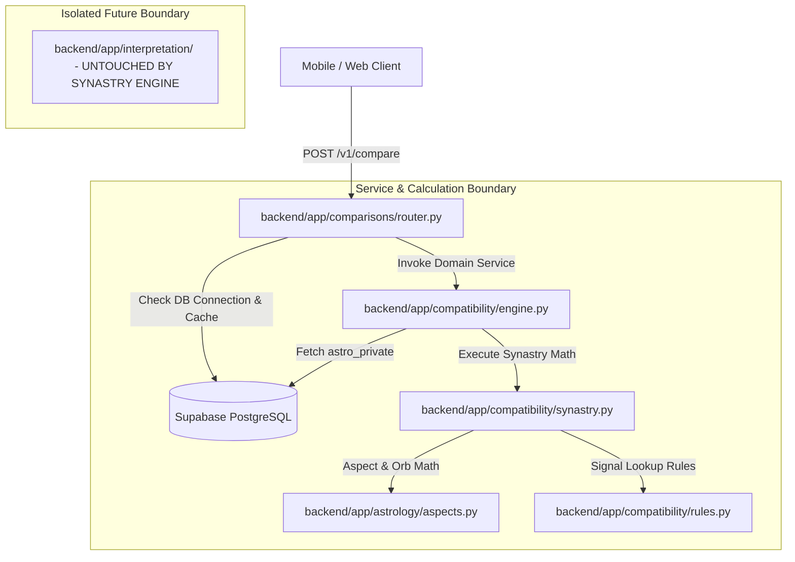
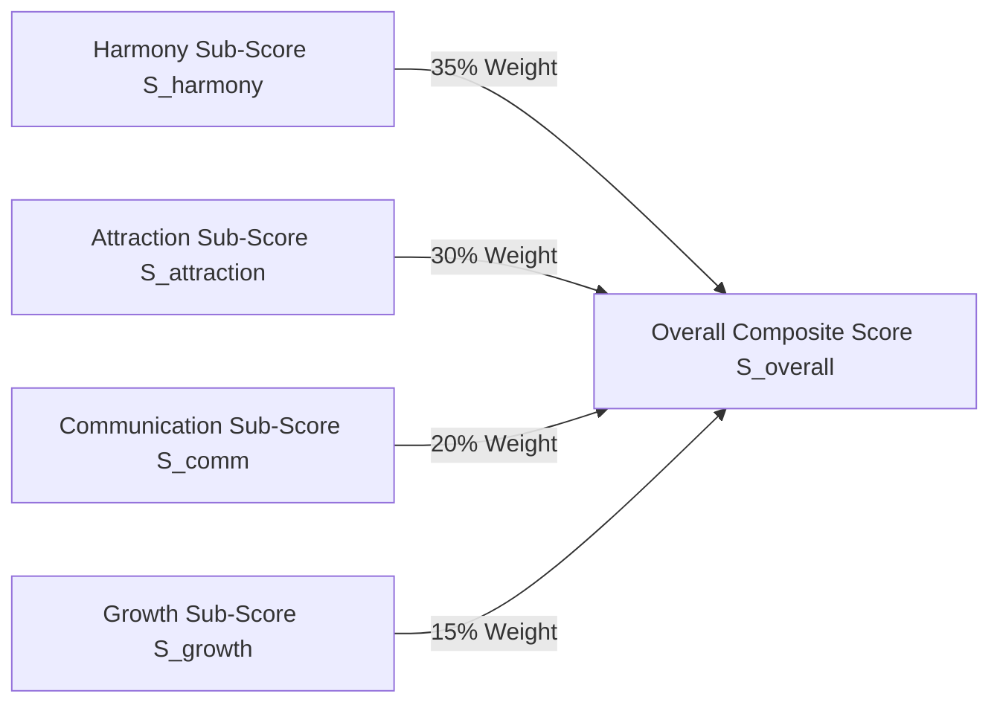

# Jester Synastry V1 — Technical Specification

## 1. Purpose

This specification defines the deterministic calculation engine, scoring model, data structures, and architectural boundaries for **Jester Synastry V1**. 

The goal of Synastry V1 is to analyze the astronomical natal charts of two users, calculate cross-chart planetary aspects and elemental/modality balances, and produce:
1. A composite overall compatibility score ($0.0 - 100.0$).
2. Four internal multidimensional sub-scores (Harmony, Attraction, Communication, Growth).
3. Structured, machine-readable relationship signals (e.g., `sun_trine_moon`, `venus_conjunction_mars`).
4. Recommended conversation topics and rule-based conversation starters.

All calculations must remain **100% deterministic** and **completely separate from future LLM / AI interpretation modules**.

---

## 2. Architectural Boundaries



### Subsystem Responsibilities:
- **`backend/app/astrology/aspects.py` (New)**: Pure astronomical aspect distance math, 360° circle wraparound, orb calculation, and aspect strength evaluation. Reusable across natal charts, synastry, and transits.
- **`backend/app/compatibility/synastry.py` (New)**: Synastry calculation engine. Consumes `NatalChartPlacements` for Person A and Person B, calculates inter-chart aspects, elemental/modality harmony, sub-scores, and overall composite score.
- **`backend/app/compatibility/rules.py` (New)**: Rule lookup definitions mapping active inter-chart aspects to structured signal categories, human-readable labels, best topics, and conversation starters.
- **`backend/app/compatibility/engine.py` (Modify)**: High-level domain service orchestrating database fetching, birth data version checking, and `SynastryEngine` calculation.
- **`backend/app/comparisons/router.py` (Modify)**: FastAPI router managing HTTP request validation, authentication, authorization (`public.has_active_connection`), cache checking/upserting, and returning `StructuredCompatibilityResponse`.
- **`backend/app/interpretation/` (Untouched)**: Future AI / LLM pipeline. The synastry engine MUST NOT call or depend on any code in `interpretation/`.

---

## 3. Astrological Inputs

Synastry V1 consumes natal placements for Person A and Person B stored in `public.astro_private`:

### Input Celestial Bodies (10 Planets + Ascendant):
- **Luminaries**: Sun (`sun_longitude`), Moon (`moon_longitude`)
- **Personal Planets**: Mercury (`mercury_longitude`), Venus (`venus_longitude`), Mars (`mars_longitude`)
- **Social Planets**: Jupiter (`jupiter_longitude`), Saturn (`saturn_longitude`)
- **Outer / Transpersonal Planets**: Uranus (`uranus_longitude`), Neptune (`neptune_longitude`), Pluto (`pluto_longitude`)
- **Angles**: Ascendant (`ascendant_longitude`, if birth time is known)

### Handling Unknown Birth Times:
- When `birth_time_precision == 'unknown'`, `ascendant_longitude` and `houses` are `None` in `astro_private`.
- **Requirement**: The aspect engine and synastry engine MUST compute all planetary cross-aspects using available longitudes. Ascendant and house-dependent overlays are safely skipped without error or penalty.

---

## 4. Aspect Engine Specifications (`backend/app/astrology/aspects.py`)

### 1. Angular Distance & Circle Wraparound
For any two celestial longitudes $\text{lon}_A$ and $\text{lon}_B$ in $[0^\circ, 360^\circ)$:
$$\Delta\theta = |\text{lon}_A - \text{lon}_B|$$
$$d = \min(\Delta\theta, 360^\circ - \Delta\theta)$$

### 2. Major Aspects & Proposed Default Orbs

| Aspect Name | Target Angle ($\theta_T$) | Default Max Orb ($\text{Orb}_{\text{max}}$) | Luminary Max Orb (Sun/Moon) | Aspect Polarity Type |
| :--- | :--- | :--- | :--- | :--- |
| **Conjunction** | $0^\circ$ | $8.0^\circ$ | $10.0^\circ$ | Dynamic / Variable |
| **Sextile** | $60^\circ$ | $6.0^\circ$ | $7.0^\circ$ | Harmonious |
| **Square** | $90^\circ$ | $7.0^\circ$ | $8.0^\circ$ | Dynamic / Tension |
| **Trine** | $120^\circ$ | $8.0^\circ$ | $9.0^\circ$ | Harmonious |
| **Opposition** | $180^\circ$ | $8.0^\circ$ | $10.0^\circ$ | Polarizing / Attraction |

### 3. Aspect Evaluation & Strength Calculation
An aspect between Planet $A$ and Planet $B$ is active if:
$$\text{orb\_diff} = |d - \theta_T| \le \text{Orb}_{\text{max}}$$

The normalized aspect strength $S_{\text{aspect}} \in (0.0, 1.0]$ is:
$$S_{\text{aspect}} = 1.0 - \left(\frac{\text{orb\_diff}}{\text{Orb}_{\text{max}}}\right)$$
*(An exact aspect with $0^\circ$ orb has strength $1.0$; an aspect at the maximum orb boundary has strength approaching $0.0$.)*

---

## 5. Planet Pair Weighting Framework (PROPOSED)

Not all planetary pairs carry equal significance in synastry.

### Proposed Weight Hierarchy ($W_{\text{pair}}$):

| Category | Planet Pairs | Proposed Weight ($W_{\text{pair}}$) | Astrological Rationale |
| :--- | :--- | :--- | :--- |
| **Tier 1: Core Attraction & Core Identity** | Sun-Moon, Sun-Sun, Moon-Moon, Venus-Mars, Sun-Venus, Moon-Venus | **3.0** | Core identity, emotional resonance, romantic attraction, and fundamental harmony. |
| **Tier 2: Personal Dynamics & Communication** | Mercury-Mercury, Sun-Mercury, Moon-Mercury, Venus-Venus, Mars-Mars, Sun-Mars, Moon-Mars | **2.0** | Mental rapport, conversational flow, sexual drive alignment, and conflict style. |
| **Tier 3: Social & Structural Growth** | Sun-Jupiter, Moon-Jupiter, Venus-Jupiter, Sun-Saturn, Moon-Saturn, Venus-Saturn | **1.0** | Growth, expansion, commitment, shared values, and long-term stability. |
| **Tier 4: Transpersonal Dynamics** | Outer planet cross-aspects (Uranus, Neptune, Pluto to Personal Planets) | **0.5** | Generational themes, intense transformation, spiritual ideals. |

---

## 6. Aspect Polarity & Multi-Dimensional Tension Model

Jester V1 rejects simplistic "Trine = Good, Square = Bad" binary scoring. Tension in synastry often generates passion, attraction, and personal growth.

### Polarity Classifications:
1. **Harmonious Aspects (Trine, Sextile)**:
   - Contribute heavily to **Harmony Sub-Score** ($S_{\text{harmony}}$).
   - Represent ease, natural agreement, and comfort.
2. **Attraction & Chemistry Aspects (Conjunction, Opposition)**:
   - Conjunctions blend energies intensely; oppositions create magnetic polarization.
   - Venus-Mars, Sun-Moon, and Venus-Pluto oppositions/conjunctions contribute heavily to **Attraction Sub-Score** ($S_{\text{attraction}}$).
3. **Dynamic / Tension Aspects (Square)**:
   - Squares create friction and challenge.
   - Rather than reducing compatibility to zero, squares contribute to **Growth & Tension Sub-Score** ($S_{\text{growth}}$) and generate high-engagement signals (e.g. *"Communication Pacing"*).

---

## 7. Element Compatibility Methodology

Calculates element balance between Person A and Person B using elemental counts (Fire, Earth, Air, Water):

### Proposed Compatibility Weights ($E_{\text{pair}}$):
- **Same Element** (Fire-Fire, Earth-Earth, Air-Air, Water-Water): **$0.95$** (High natural resonance)
- **Complementary Elements**:
  - Fire + Air: **$0.90$** (Mutual inspiration)
  - Earth + Water: **$0.90$** (Nurturing stability)
- **Challenging / Growth Elements**:
  - Fire + Water: **$0.60$** (Steam / Emotional intensity)
  - Earth + Air: **$0.60$** (Practical vs abstract friction)
  - Fire + Earth: **$0.65$** (Grounded action vs spontaneous drive)
  - Air + Water: **$0.65$** (Intellect vs emotion)

---

## 8. Modality Compatibility Methodology

Calculates modality alignment (Cardinal, Fixed, Mutable):
- **Same Modality**:
  - Cardinal + Cardinal: High initiation drive; potential power struggles.
  - Fixed + Fixed: Deep loyalty; potential stubbornness.
  - Mutable + Mutable: High flexibility; potential lack of grounding.
- Modality scores contribute modestly to the **Growth** and **Harmony** sub-scores.

---

## 9. House Overlays Status

- **Status in V1**: **EXCLUDED FROM CORE SCORING**.
- **Rationale**: House overlays require exact birth times for house cusps for *both* users. If either user has an unknown birth time (`birth_time_precision == 'unknown'`), house overlays are mathematically impossible.
- **Future Roadmap**: Reserved for V1.1 as an optional secondary narrative layer when exact birth times are available.

---

## 10. Compatibility Score Architecture (Deterministic 0–100 Model)

Jester V1 calculates **4 internal sub-scores** ($0.0 - 100.0$) before computing the public composite score:



### 1. Internal Sub-Scores:
1. **$S_{\text{harmony}}$ (Emotional Ease & Flow)**: Derived from Trines, Sextiles, Sun-Moon, and Earth/Water/Air/Fire element harmony.
2. **$S_{\text{attraction}}$ (Magnetic & Physical Chemistry)**: Derived from Venus-Mars, Sun-Venus, Moon-Venus conjunctions, oppositions, and fire/air dynamics.
3. **$S_{\text{communication}}$ (Mental & Conversational Rapport)**: Derived from Mercury aspects (Mercury-Mercury, Sun-Mercury, Mercury-Air elements).
4. **$S_{\text{growth}}$ (Dynamic Tension & Friction Development)**: Derived from Squares, Oppositions, Saturn aspects, and modality balances.

### 2. Composite Score Formula:
$$S_{\text{overall}} = \text{Clamp}\left(0.35 \times S_{\text{harmony}} + 0.30 \times S_{\text{attraction}} + 0.20 \times S_{\text{communication}} + 0.15 \times S_{\text{growth}}, 0.0, 100.0\right)$$

### 3. Missing Data Adaptation:
If birth time is unknown for either user, $S_{\text{overall}}$ is calculated cleanly using available planetary aspects and element/modality vectors without throwing errors or introducing arbitrary penalties.

---

## 11. Signal Model Specifications

Structured signals are machine-readable objects derived deterministically from top active aspects and elemental balances:

### Signal Schema:
```json
{
  "type": "sun_trine_moon",
  "category": "harmony",
  "strength": "high",
  "source_aspects": ["Sun Trine Moon"],
  "label": "Emotional Resonance"
}
```

### Signal Categories:
- `harmony`: Flowing, effortless alignment (Trines, Sextiles).
- `attraction`: Chemistry, magnetic pull (Venus-Mars, Sun-Moon).
- `communication`: Intellectual rapport, easy dialogue (Mercury aspects).
- `growth`: Friction, learning opportunities, productive tension (Squares).
- `stability`: Long-term grounding, commitment themes (Saturn aspects).

---

## 12. Best Topics Generation

Determined deterministically in `backend/app/compatibility/rules.py` by mapping Mercury aspects and dominant combined element pairs:

| Dominant Pair / Aspect | Derived Best Topics |
| :--- | :--- |
| **Air Dominant / Mercury-Air** | `["books", "philosophy", "creative_work", "technology"]` |
| **Fire Dominant / Mars-Sun** | `["travel", "fitness", "adventure", "entrepreneurship"]` |
| **Water Dominant / Moon-Venus** | `["art", "music", "psychology", "cinema"]` |
| **Earth Dominant / Saturn-Venus** | `["architecture", "food", "design", "nature"]` |

---

## 13. Conversation Starters Generation

Rule-based conversation starters generated deterministically from top active signals:

```python
STARTER_RULES = {
    "sun_trine_moon": [
        "What is something that instantly makes you feel understood?",
        "What is your favorite way to recharge after a long week?"
    ],
    "venus_conjunction_mars": [
        "What is your idea of a perfect spontaneous date?",
        "What art or music has inspired you recently?"
    ],
    "mercury_aspect_mercury": [
        "Have you read or listened to anything surprising lately?",
        "What topic could you talk about for hours without getting bored?"
    ]
}
```

---

## 14. Cache Model Specifications

- **Database Storage**: Table `public.compatibility_results` (Migration `008_compatibility_results.sql`).
- **Canonical Keying**: Always ordered `(user_a_id < user_b_id)`.
- **Cache Record Fields**: `user_a_id`, `user_b_id`, `user_a_birth_data_version`, `user_b_birth_data_version`, `engine_version`, `score`, `signals`, `best_topics`, `conversation_starters`, `calculated_at`.
- **Invalidation Check**:
  ```python
  if existing and existing["user_a_birth_data_version"] == ver_a and existing["user_b_birth_data_version"] == ver_b:
      return cached_response
  ```
- **Recalculation**: If missing or stale, recalculates synastry and executes SQL `UPSERT ON CONFLICT (user_a_id, user_b_id)`.

---

## 15. Privacy Boundary Rules

Adheres strictly to [`docs/SECURITY.md`](file:///c:/Users/fiord/OneDrive/Desktop/Jester/docs/SECURITY.md):

| Data Boundary | Accessible Internal Calculation Boundary | Public API Response (`StructuredCompatibilityResponse`) |
| :--- | :--- | :--- |
| **Exact Birth Date / Time** | 🟢 Internal calculation only | 🚫 **NEVER EXPOSED** |
| **Latitude / Longitude** | 🟢 Internal calculation only | 🚫 **NEVER EXPOSED** |
| **Raw Planet Longitudes** | 🟢 Internal calculation only | 🚫 **NEVER EXPOSED** |
| **Composite Score & Sub-scores**| 🟢 Internal calculation | 🟢 Exposed as `score: float` |
| **Categorized Signals** | 🟢 Derived in rules engine | 🟢 Exposed as `signals: list[dict]` |
| **Topics & Starters** | 🟢 Derived in rules engine | 🟢 Exposed as `best_topics`, `conversation_starters` |

---

## 16. API Contract Stability

The existing FastAPI router responses for `POST /v1/compare` and `GET /v1/people/{id}/why` **will not be changed**:

```python
class StructuredCompatibilityResponse(BaseModel):
    model_config = ConfigDict(from_attributes=True)

    id: uuid.UUID
    target_user_id: uuid.UUID
    score: float
    signals: list[dict[str, Any]]
    best_topics: list[str]
    conversation_starters: list[str]
    engine_version: str
    calculated_at: datetime
```

---

## 17. Test Specifications

### Required Test Modules & Categories:

1. **`tests/astrology/test_aspects.py` (New)**:
   - `test_angular_distance_wraparound`: Verifies $355^\circ$ to $5^\circ = 10^\circ$.
   - `test_aspect_orb_tolerances`: Verifies $120^\circ$ Trine at $127^\circ$ difference passes; at $129^\circ$ fails.
   - `test_aspect_strength_calculation`: Verifies $0^\circ$ orb difference yields strength $1.0$.

2. **`tests/compatibility/test_synastry.py` (New)**:
   - `test_synastry_scoring_known_charts`: Verifies deterministic score generation for known chart pairs.
   - `test_unknown_birth_time_resilience`: Verifies synastry calculation succeeds when `houses` and `ascendant_longitude` are `None`.
   - `test_signal_extraction_rules`: Verifies correct signals are generated for active aspects.

3. **`tests/database/test_database_security.py` (Modify)**:
   - `test_compatibility_access_rules`: Update test to assert that `/v1/compare` generates and stores a dynamically computed score rather than static mock data.

4. **Security Tests**:
   - Verify calling `/v1/compare` for a blocked user returns HTTP 404 (`PrivacySafeNotFoundException`).
   - Verify calling `/v1/compare` without an active connection returns HTTP 403 (`ForbiddenException`).
   - Verify raw longitudes never appear in JSON responses.

---

## 18. V1 Scope

- Deterministic inter-chart aspect calculation for 10 core celestial bodies (Sun to Pluto).
- Orb tolerance evaluation and aspect strength weighting.
- Elemental and modality harmony scoring.
- Multidimensional sub-score calculation ($S_{\text{harmony}}, S_{\text{attraction}}, S_{\text{communication}}, S_{\text{growth}}$).
- Deterministic composite overall score ($0.0 - 100.0$).
- Structured signal extraction, best topics, and conversation starters.
- Automatic cache invalidation on `birth_data.data_version` updates.

---

## 19. Out of Scope

- **AI / LLM Integration**: No OpenAI API calls or prompt generation.
- **House Overlays**: Deferred to V1.1.
- **Lunar Nodes, Chiron, Lilith**: Deferred to V2.
- **Midpoint Composite Charts**: Excluded from V1.
- **Minor Aspects**: Quincunx, Semi-Sextile, Quintile excluded from V1.

---

## 20. Open Questions (Requiring Human Approval)

1. **Sub-Score Weight Balancing**: Should the composite score weights ($35\%$ Harmony, $30\%$ Attraction, $20\%$ Communication, $15\%$ Growth) be configurable via `backend/app/config.py`?
2. **Maximum Displayed Signals**: Should the API cap the returned `signals` list to the top 5 highest-strength signals to keep mobile responses concise?
3. **Placidus Polar Fallback**: When birth locations are above $66.5^\circ$ latitude, should the synastry engine automatically proceed using planetary longitudes only?

---

## 21. Implementation Sequence

1. **Step 1**: Create `backend/app/astrology/aspects.py` and write `tests/astrology/test_aspects.py`.
2. **Step 2**: Create `backend/app/compatibility/rules.py` and `backend/app/compatibility/synastry.py`. Write `tests/compatibility/test_synastry.py`.
3. **Step 3**: Re-implement `backend/app/compatibility/engine.py` to connect DB fetching with `SynastryEngine`.
4. **Step 4**: Update `backend/app/comparisons/router.py` to remove hardcoded `82.5` score and invoke the real service layer.
5. **Step 5**: Update `tests/database/test_database_security.py` and run `python -m pytest`.
6. **Step 6**: Update `docs/PROJECT_STATE.md`, `docs/ASTROLOGY_ENGINE.md`, and `docs/API.md`.
